# **Introduction**

**Vision Numérique** 

Tarik Garidi & Adrien Lescourt

Haute école du paysage, d'ingénierie et d'architecture de Genève

### VISION NUMERIQUE 2025-2026

tarik.garidi@hesge.ch adrien.lescourt@hesge.ch

### LABO 1: Introduction

### 1 Objectifs

L'objectif de ce laboratoire est de prendre en main la manipulation d'images en **Python** avec les librairies **numpy** et **pillow**.

• Votre code Python 3 doit être typé:

https://docs.python.org/3/library/typing.html

• Vous utiliserez les environements virtuels pour installer les libraries:

https://docs.python.org/3/library/venv.html

#### 1.1 Librairies

Avant d'installer les librairies, assurez vous d'avoir activé un environment virtuel:

python -m venv .venv
source .venv/bin/activate

# Ressources

# Agenda

- Vision humaine
- Sources à l'origine d'une image
- Traitement d'une image
- Définitions

# Agenda

▪ Vision humaine

# La vision humaine - Le sens le plus développé

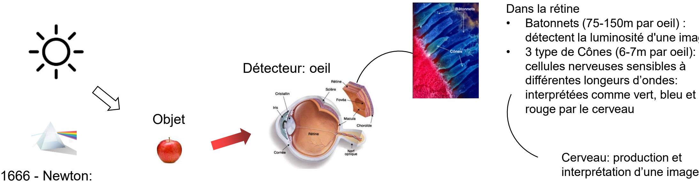

#### Dans la rétine

- Batonnets (75-150m par oeil) : détectent la luminosité d'une image
- 3 type de Cônes (6-7m par oeil): cellules nerveuses sensibles à différentes longeurs d'ondes: interprétées comme vert, bleu et rouge par le cerveau

Cerveau: production et

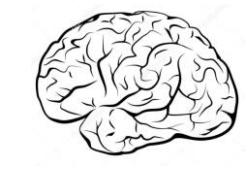

la partie visible des

# Chromatique et monochromatique

Lumière avec couleur: **chromatique**

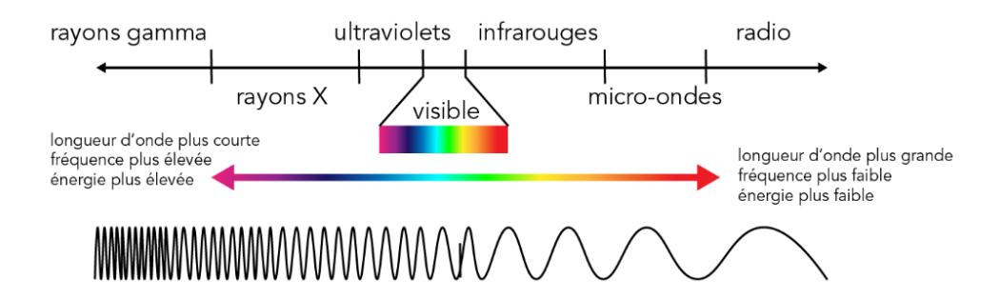

- Fréquence: la couleur d'un objet est déterminée par les longueurs d'ondes qu'il reflète versus celles qu'il absorbe.
- Radiance (Watt): quantité d'énergie émise (visible & non visible)
- Luminance (Lumens): quantité d'énergie perçue (mesurable)
- Brightness (non mesurable): perception subjective

Lumière sans couleur: **monochromatique**

▪ Attribut unique: l'intensité (niveaux de gris)

# Vision humaine est subjective

Illusions optiques: le cerveau complète les images en produisant du contenu

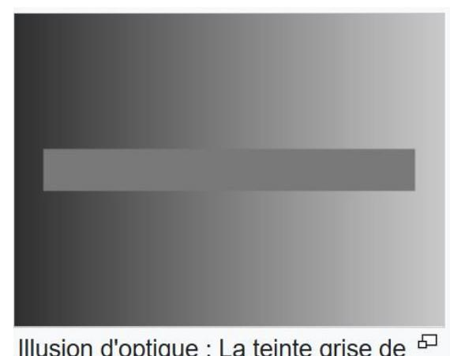

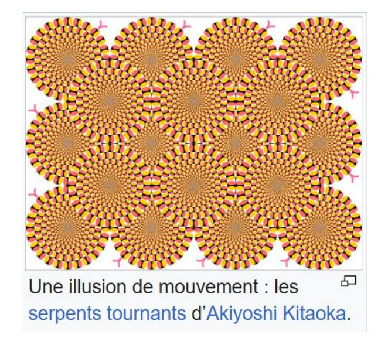

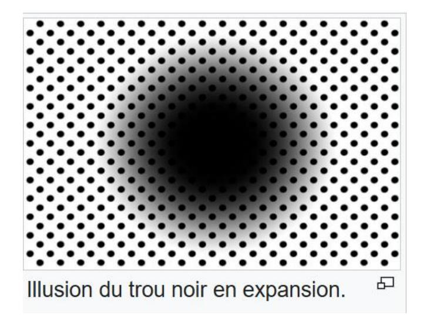

# Vision humaine - vision numérique

Idée: on s'inspire du dispositif humain (oeil et cerveau) pour construire des capteurs ainsi que des outils capables de traiter l'information (ex: réseaux neurones)

- l'oeil est un détecteur adapté pour l'humain. En vision numérique on peut construire des détecteurs plus variés, adaptés à des tâches spécifiques.
- le cerveau n'a pas que "cela" à faire : automatisation, reproduction, stockage, extraction de sens

# Vision numérique - processing et analyse

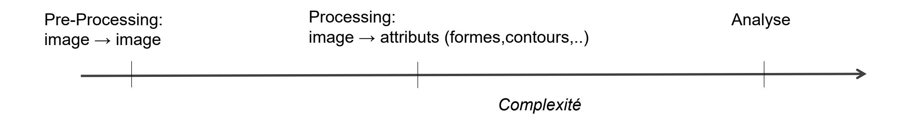

- Acquisition
- Amélioration
- Compression

- Morphologie
- Segmentation
- Extraction de caractéristiques

- Classification
- Donner un sens
- Equivalent d'une fonction cognitive, IA,..

# Agenda

▪ Sources à l'origine d'une image

# Classifier une image selon sa source d'énergie

### Sources d'énergie se distinguent par:

- le processus physique qui génère le signal,
- sa manière d'interagir avec la matière.

La *vision* correspond à la faculté de percevoir ces différentes sources d'énergie. La vision numérique étend la perception au delà de la partie visible humaine.

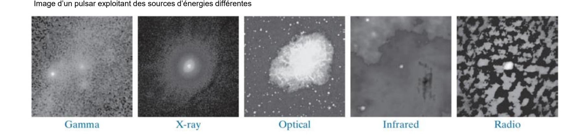

# Classifier une image selon sa source d'énergie

### **Energie électromagnétique (photon)**

- Le chat voit dans les infra-rouge (faible intensité)
- Un detecteur de rayon gamma *voit* les trous noir

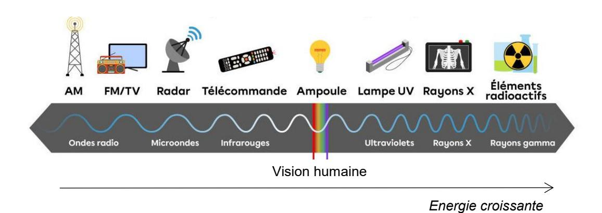

### **Energie acoustique (mécanique),..**

• Les chauves souris "voient" le son

### **Image synthétique générée par ordinateur**

# Exemples

**Rayon gamma**: transitions au sein du noyau atomique. En imagerie médicale on injecte des éléments pout stimuler la production de gammma. Astronomie: détection de gamma émis par les objets les plus énergétiques de l'univers: supernovas, pulsars, trous noirs

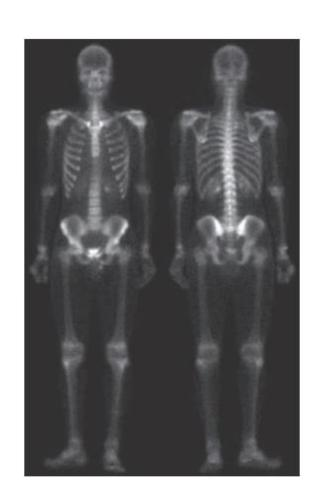

**Rayon x**: on bombarde un object qui est utilisé comme un filtre et on receuille les intensités de rayon x à la sortie. Les objets denses (os) absorbent/filtrent les rayons x et apparaissent blanc (moins energétiques).

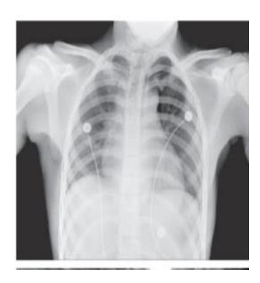

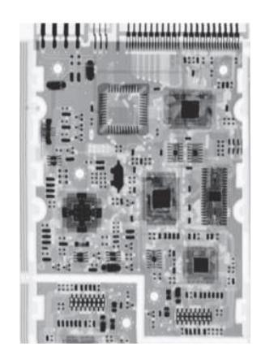

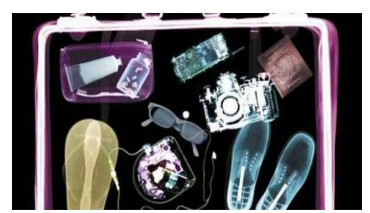

**Ultra violet:** La *fluorescence* est la propriété que certains corps ont à émettre une lumière après avoir été excités avec une lumière d'énergie supérieure (l'ultra violet pour faire apparaitre du visible par exemple).

Image de cellules

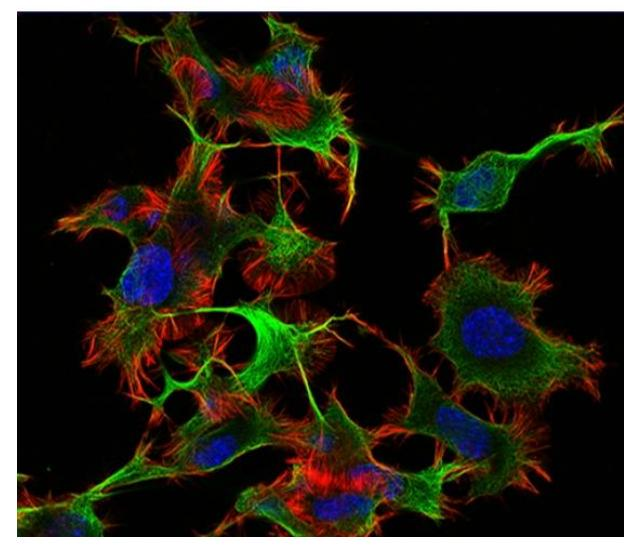

# Exemples

**Visible**: image multispectrale pour mettre en évidence différent aspect. Par exemple images satellite (Landsat po images de surveillance de l'environemment):

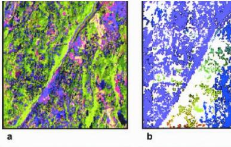

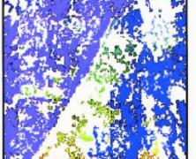

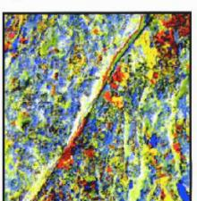

Images de NY dans les bandes (3,4,5)

Le but est modéliser le risque d'une transmission de la maladie de Lyme

#### **Infra Rouge**:

Permet de mettre en évidence les lieux colonisés par l'humain

Amérique du Nord:

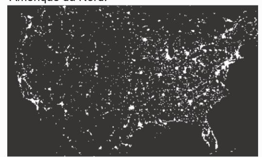

#### **Micro-ondes:**

Les radars surtout. Pulsation de micro onde. Une image est construite en enregistrant l'energie de retour vers l'antenne radar.

#### Montagnes au tibet:

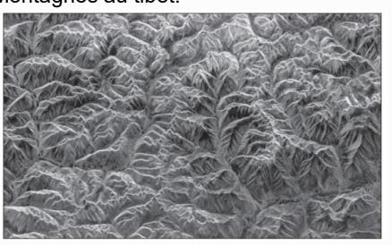

#### **Ondes radios:**

Pour une IRM, un champ magnétique aligne les protons dans la molécule d'hydrogène. Un signal radio modifie cet alignement, et lorsque le signal radio cesse la matière se realigne en emettant un signal radio que l'on capte.

IRM d'un genou:

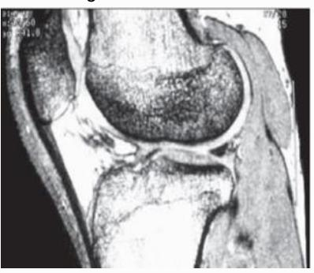

#### **Ultrasons:**

Le son rebondi sur des tissus plus dense. La machine calcule la distance (on connait la vitesse du son dans le tissu) et enregistre une l'intensité

#### Echographie:

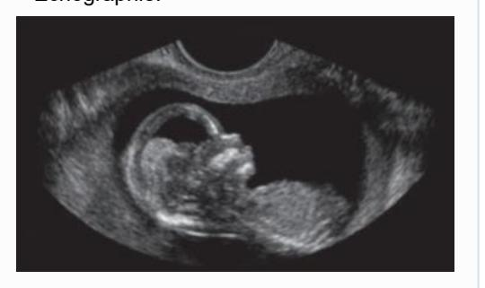

# Agenda

▪ Traitement d'une image

### Vision humaine/numérique

Vision humaine - Processus perceptif hiérarchique, contexte, mémoire, sémantique..

Une femme seule sur un quai de gare pluvieux (Edward Hopper)

→ perception/sens

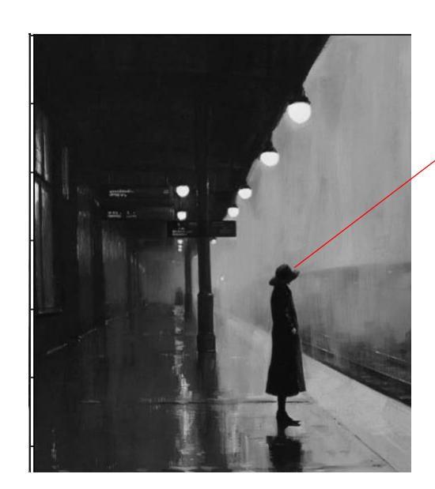

Vision numérique - Transformation mathématique d'une matrice par exemple vers une representation vectorielle

I(x,y)= Intensité

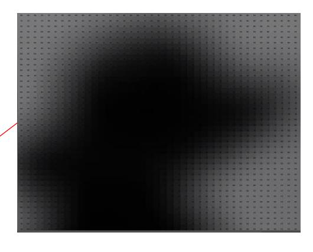

Textures, gradient, contours

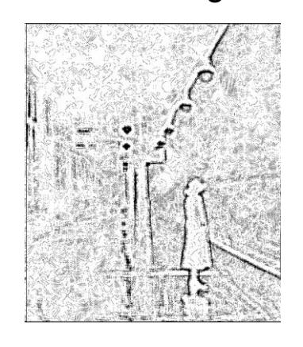

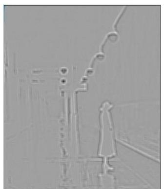

Deep learning → représentation vectorielle de l'image (embedding) (notion de distance entre chaque image)

# Origines - motivations

### Transmission d'images pour la presse:

- Dès 1920-1930 Echanges transatlantique d'images pour la presse
- Transmission type télégraphe par câble sous-marin (3h au lieu d'une semaine)
- Système *Bartlane* encode les images en 5 puis 15 niveaux de gris

### Dévelopment de la vision numérique:

- 1950-1960 Premiers ordinateurs et languages (COBOL, FORTRAN)
- 1960 Programme spatial US, Apollo 11 sur la lune en 1969
- 1970 Imagerie médicale, prix Nobel 79 pour l'invention de la tomography (utilise les rayons x pour générer des images en coupe)
- 1980 Essor de l'informatique (stockage, puissance de calcul,..) + Machine/Deep learning
- Véhicules autonomes
- Sécurité (reconnaissance iris, faciale, digitale, )
- Robotique
- Encoder → LLM

Ferdinand Foch. Image transmise en 1929 par cable sous-marin entre Londres et New York. Encodage en 15 niveaux de gris

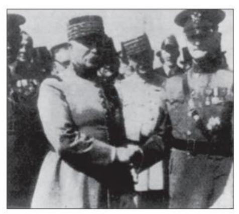

Ranger 7 - Première image d'un vaisseau US de la lune en 1964

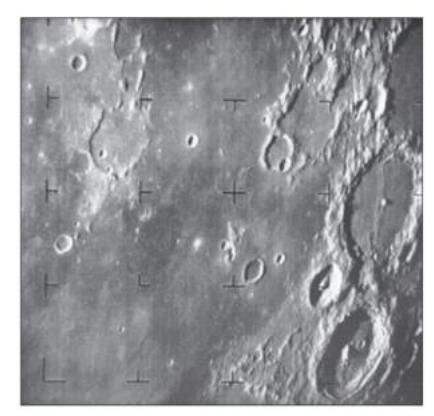

# Domaines d'applications

### Traitement de l'image en vue d'une interprétation humaine:

▪ Médecine, astronomie, géographie, sciences, archéologie (restoration), ..

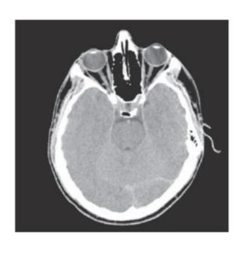

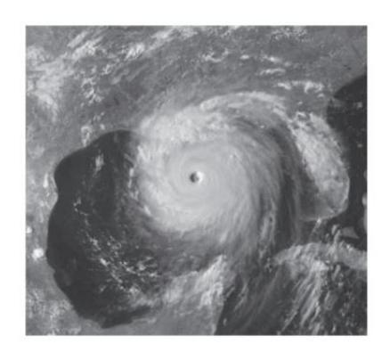

### Analyse, extraction d'informations exploitables par une machine:

▪ Assemblage industriel, contrôle qualité, commerce, reconnaissance d'objets, police, agriculture, robotique, administrations, modèles méteo, voitures autonomes,..

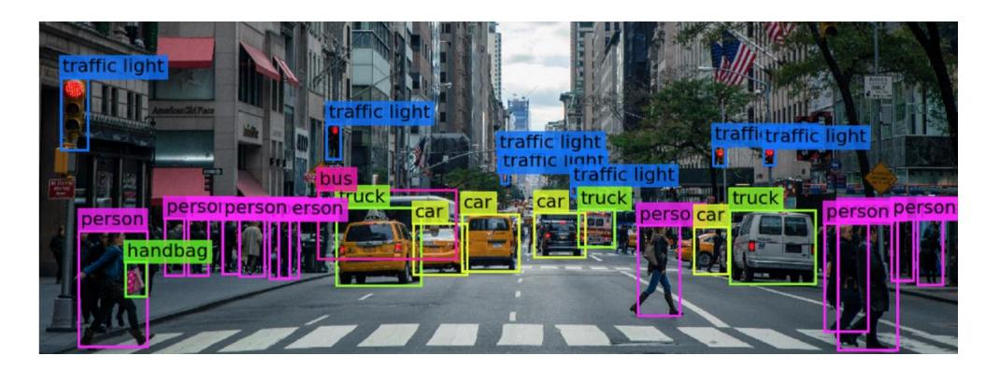

# Etapes

- Extraire ce qui compte, focus sur les contours, géométrie, inspiration neurosciences,
- 1959: expérience Hubel/Wiesel → neurons dans cortex visuel chez les chats répondent aux contours
- 1966, MIT Summer Vision Project: Link a camera to a computer and have it describe what it sees"
- 1970, transformation Hough

### Fondations: 1950 -1970 Feature engineering: 1980 - 2010 Deep learning 2000 - ..

- Extractions de caractéristiques et Machine learning
- 1980 Neocognitron K. Fukushima
- 1999 SIFT (Scale-Invariant Feature Transform) D. Lowe
- 2001 Viola/Jones Détecteurs facial (non pas reconnaissances)
- 2005 HOG (Histogram of Oriented Gradients) N. Dalal & B. Triggs, Human Detection

- Data, GPU et Réseaux profonds et CNN
- Y. LeCun Pionnier des CNN MNIST (1998)
- G. Hinton Y. Bengio Back propagation, ANN
- 2010 Image Net (14 millions d'images avec labels) – FeiFei Li
- AlexNet 2012
- LLM multimodal

# Algorithmes Classiques

#### Viola-Jones (2001) HOG - 2005

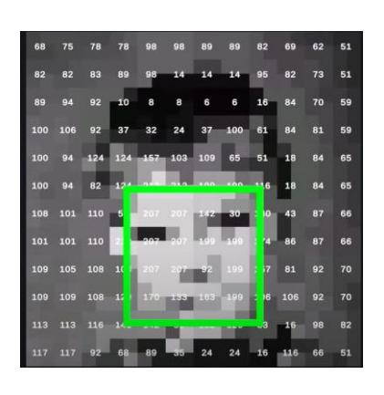

- Grayscale
- 24 x24 pixels
- *Feature* : représentation des contrastes d'intensité entre régions rectangulaires type Haar
- Test le pouvoir de classifications de ces éléments à diverses échelles
- Entrainement algo ML

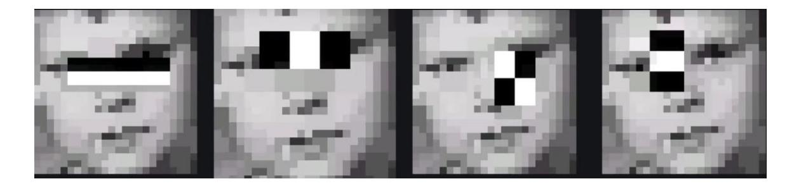

- *Feature*: représentation statistique des orientations des gradients
- Entrainement algo ML

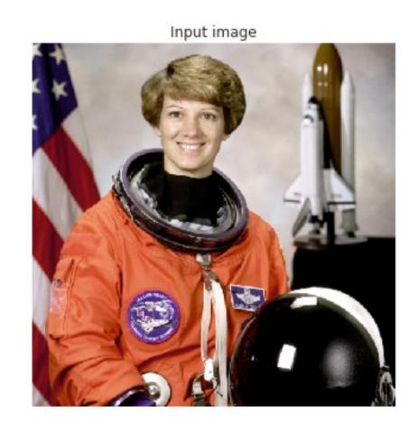

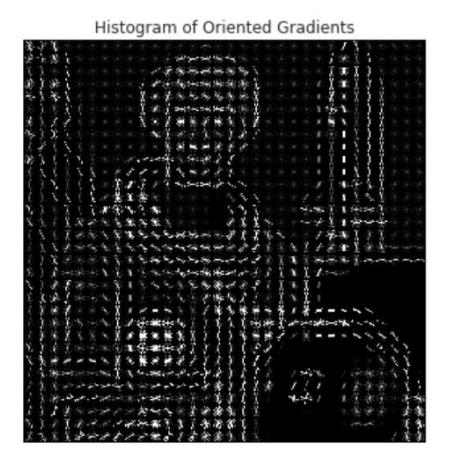

# Renouveau de l'apprentissage profond (deep learning)

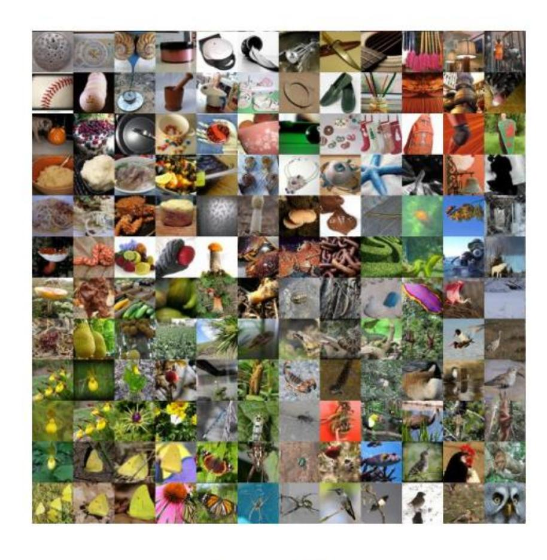

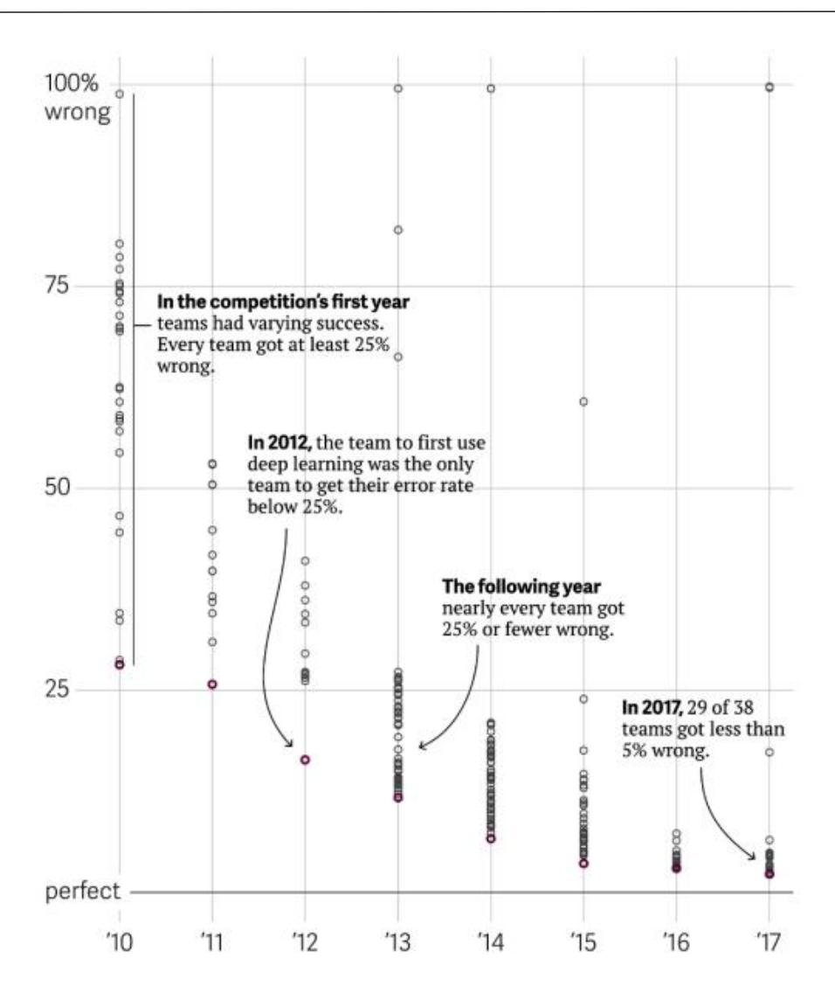

# AlexNet 2012

- Années 2000: deep learning difficile à entrainer
- ImageNet 2010, 2011: utilisation de techniques modernes sophistiquées spécifiques à la vision numérique mais résultats décevants
- AlexNet combine des idées anciennes (réseaux de convolution) avec plus de données et GPU
- Complexité accrue, perte d'interprétabilité au fur et a mesure de de l'apprentissage dans les couches..
- *Feature*: déterminé par le réseaux lui-même

### Approche *hiérarchique*:

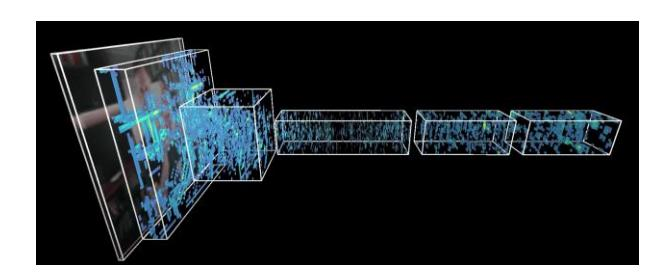

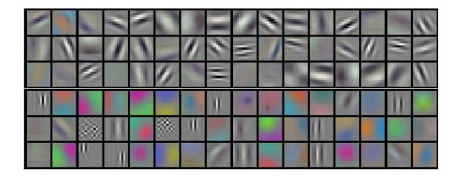

# Scaling up

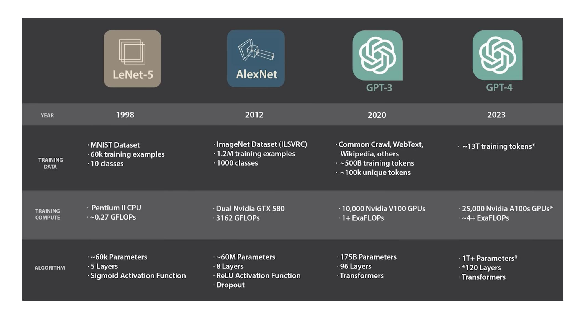

# Agenda

Définitions

# Définition d'une image numérique

Une image numérique peut-être définie par:

- Une fonction f(x,y) avec deux dimensions (coordonnées) spatiales (x,y) discrètes
- Les valeurs de f(x,y) sont finies et discrètes, elles correspondent à *l'intensité* de l'image
- Chaque élement est communément appelé *pixel*

# Représentation numérique

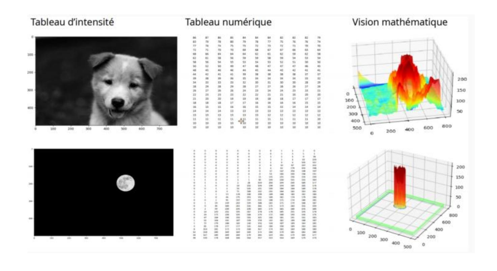

# Création d'une image numérique

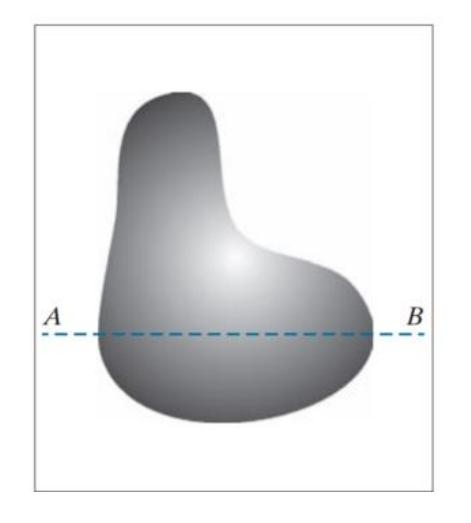

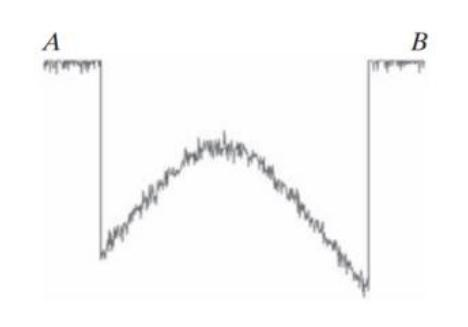

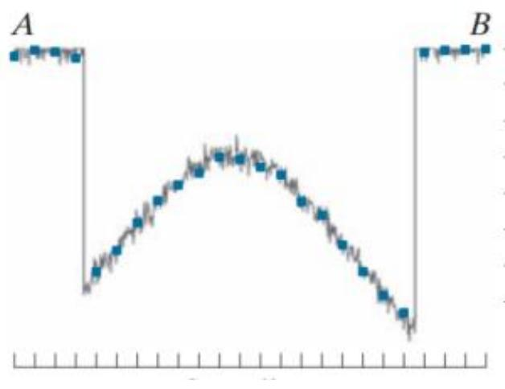

**Echantillonnage Discrétisation**

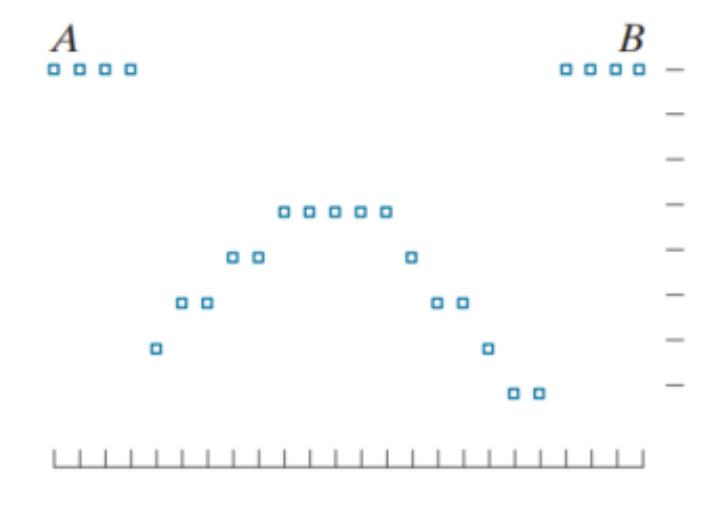

# Création d'une image numérique

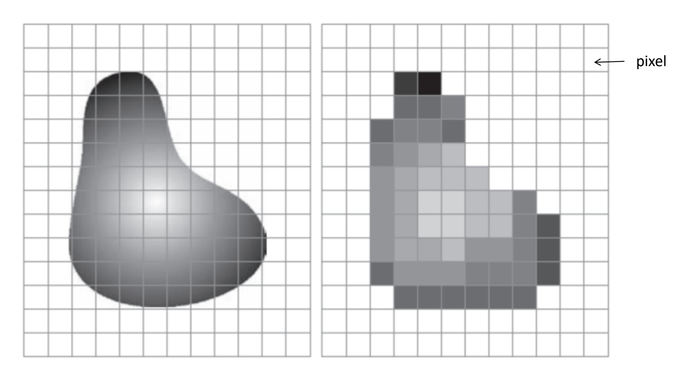

# Représentation d'une image

N = Largeur de l'image M = hauteur de l'image

L'image peut-être représentée par une matrice MxN :

$$\mathbf{A} = \begin{bmatrix} a_{0,0} & a_{0,1} & \cdots & a_{0,N-1} \\ a_{1,0} & a_{1,1} & \cdots & a_{1,N-1} \\ \vdots & \vdots & & \vdots \\ a_{M-1,0} & a_{M-1,1} & \cdots & a_{M-1,N-1} \end{bmatrix}$$

- Chaque élement de la matrice (pixel) correspond à une valeur d'intensité f(x,y). Par exemple, entre 0 et 255 si le pixel est codé sur 8 bits.
- Le plan engendré pas les coordonnées (x,y) est appelé le **domaine spatial**

# Taille des Images

Attention, lors de la numérisation: les choix d'échantillonnage (choix de M,N) et de discrétisation (range des intensités) ont un impact important sur la taille de l'image.

En effet, le nombres de bits b, nécessaire à la représentation d'une image en niveau de gris:

b = M × N × k où k = nombre de bits (8 bits = 1 byte) pour représenter l'intensité sur un pixel

Quand M = N on obtient:

$$b = N^2 \times k$$

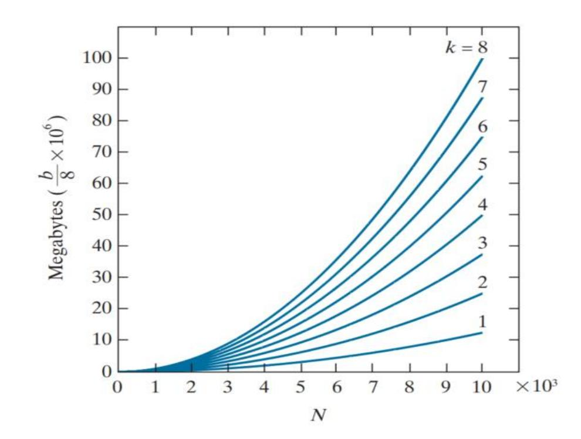

# Représentation numérique

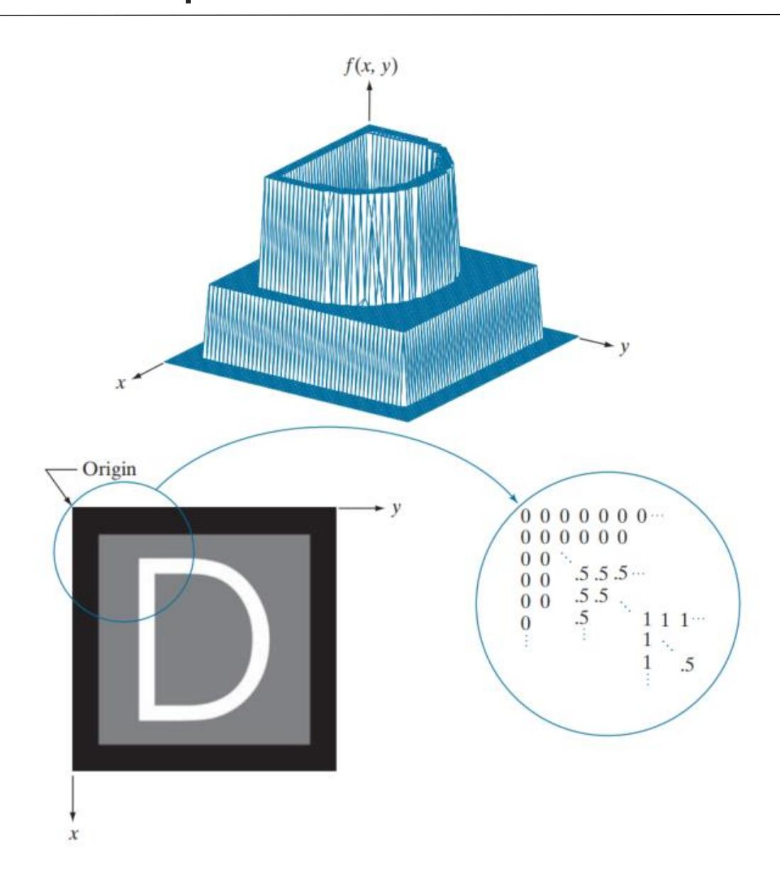

# Représentation d'une image en couleur

Différentes méthodes existent pour restituer la perception humaine colorée d'une image. RGB désigne un système d'affichage électronique qui reproduit la couleur par synthèse additive, à partir des trois couleurs primaires : rouge, vert et bleu (utilisé dans de nombreux dispositifs d'affichage, tels que les écrans d'ordinateur, les téléviseurs, les projecteurs, écrans de téléphone portable).

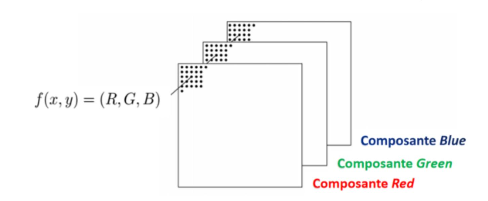

# Region Of Interest (ROI)

On parle de **region of interest** pour désigner un zone de l'image:

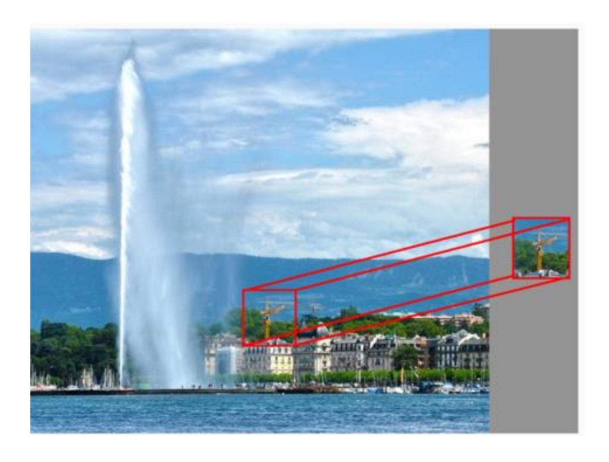

# Resizing

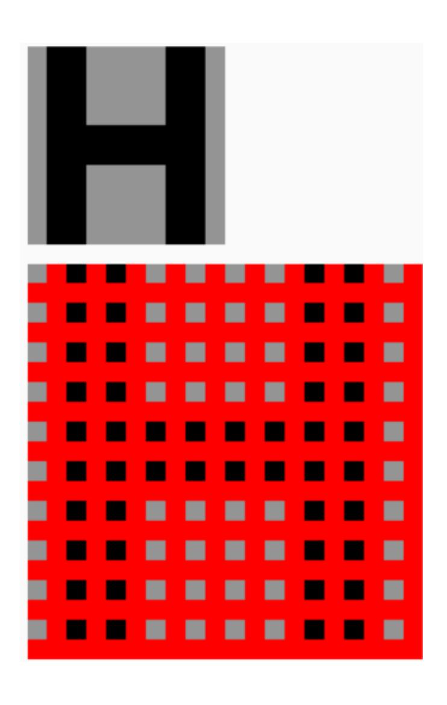

Quelles valeurs d'intensités pour les pixel en rouge?

# Interpolation

### **Plus proche voisin**:

on recherche dans l'image originale le pixel plus proche

### **Interpolation Bilinéaire**:

Interpolation linéaire pour obtenir P1 et P2 puis entre P1 et P2 pour la valeur du point P

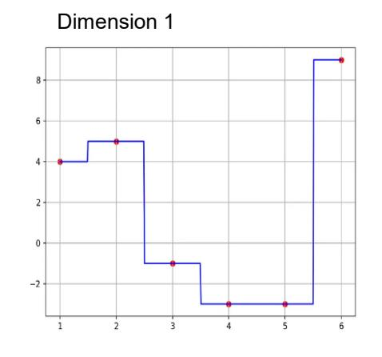

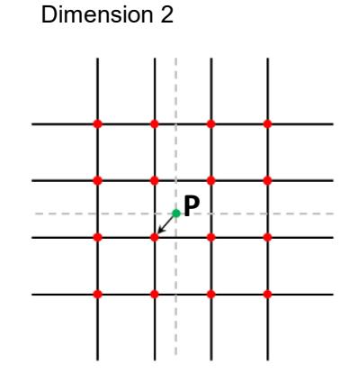

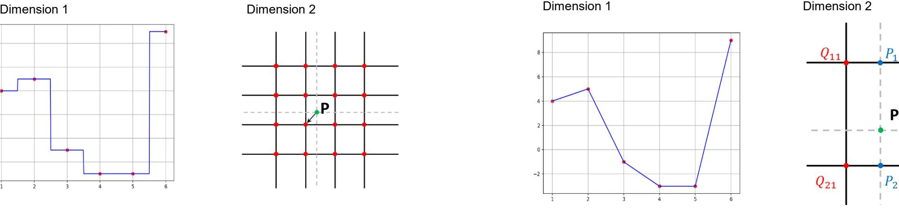

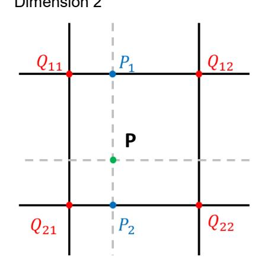

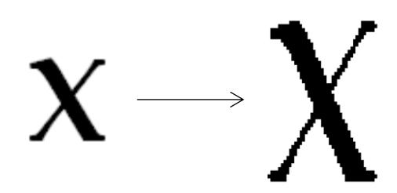