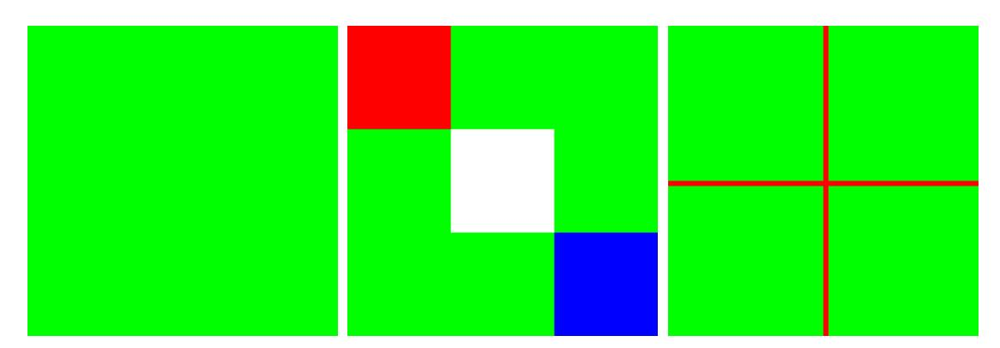
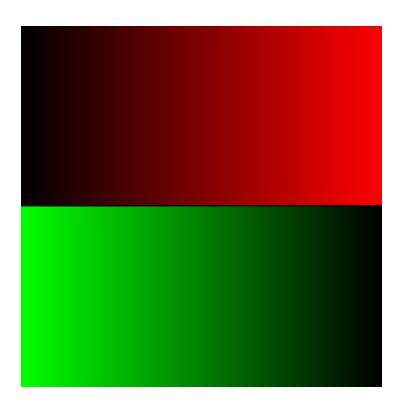

# VISION NUMERIQUE 2025-2026

<tarik.garidi@hesge.ch> <adrien.lescourt@hesge.ch>

## **LABO 1: Introduction**

## **1 Objectifs**

L'objectif de ce laboratoire est de prendre en main la manipulation d'images en **Python** avec les librairies **[numpy](https://numpy.org)** et **[pillow](https://python-pillow.github.io)**.

• Votre code Python 3 doit être typé:

**<https://docs.python.org/3/library/typing.html>**

• Vous utiliserez les environements virtuels pour installer les libraries:

**<https://docs.python.org/3/library/venv.html>**

#### **1.1 Librairies**

Avant d'installer les librairies, assurez vous d'avoir activé un environment virtuel:

python -m venv .venv source .venv/bin/activate

Puis installer les dépendances:

pip install numpy pillow

Les imports suivants ne devraient donc pas poser de problème:

```
import numpy
import PIL
```

#### **1.2 Typing**

Tout les prototypes de fonctions doivent être typés. Considérez l'alias suivant pour simplifier le type matrice numpy d'éléments 8 bits:

```
import numpy.typing as npt
Img = npt.NDArray[np.uint8]
```

Vous pourrez alors l'utiliser ainsi:

```
def compute_image(img_src: Img) -> Img:
 ...
```

### **2 Exercices**

#### **2.1 Lecture et affichage**

- Utilisez la librairie Pillow pour charger une image
- Créez une matrice numpy depuis l'image
- Affichez la taille de la matrice, ainsi que le type des éléments qui la compose
- Reconstituez une image depuis la matrice, et affichez la avec Pillow

```
def load_img(path: str) -> Img:
 ...
def show_img(img: Img) -> None:
 ...
```

Testez vos fonctions sur l'image gunslinger.png.

#### **2.2 Création d'image grayscale**

Créez une image de taille 256x256, similaire à l'image suivante:


#### **2.3 Création d'images couleurs**

Créez 3 images de tailles 256x256, similaire aux images suivantes:



#### **2.4 Création de dégradés**

Créez une image de taille 256x256, similaire à l'image suivante:



#### **2.5 Miroir et rotations**

A appliquer sur l'image en niveau de gris:

- Opération de miroir horizontal
- Rotation de 90° dans le sens trigonométrique
- Rotation de 180°

Utilisez les primitives numpy pour ces 3 fonctions.

#### **2.6 ROI**

• Créez une fonction roi() qui retourne une région d'intérêt de l'image source en utilisant le slicing numpy.

```
def roi(img: Img, top_left: Tuple[int, int], size: Tuple[int, int]) ->
Img:
 ...
```

- Appliquez cette fonction à l'image RGB chargée en Exo 1.
- Modifiez la ROI
- Affichez l'image source. Qu'observez vous?

#### **2.7 Resize**

A appliquer sur l'image en niveau de gris:

- Utilisez la fonction np.resize pour réduire l'image, que constatez vous?
- Utilisez la fonction np.resize pour agrandir l'image, que constatez vous?
- Écrivez une fonction resize\_smaller qui réduis une image d'un facteur entier en supprimant les pixels.

```
 def resize_smaller(img: Img, factor: int) -> Img:
 ...
```

• Écrivez une fonction resize\_larger qui agrandis une image en utilisant la méthode des plus proches voisins.

```
 def resize_larger(img: Img, factor: int) -> Img:
 ...
```

• Appliquez à l'image RGB de l'Exo 1 les transformations suivantes: (l'implémentation de resize\_larger devra peut-être être modifiée pour prendre en compte les composantes RGB):

```
 resized = resize_smaller(img, 4)
 back_to_original = resize_larger(resized, 4)
 show_img(back_to_original)
```

• (Bonus) Écrivez une fonction resize\_larger\_2 qui agrandis une image en utilisant l'interpolation bilinéaire.