## VISION NUMERIQUE 2025-2026

<tarik.garidi@hesge.ch> <adrien.lescourt@hesge.ch>

# **LABO 2 Transformations d'intensités**

## **1 Objectifs**

L'objectif de ce laboratoire est de vous familiariser avec les transformations d'intensités. En plus de numpy et pillow, vous utiliserez matplotlib pour l'affichage des images et les graphiques.

Lors du traitement des images, vous pourrez avoir besoin de matrices intermédiaires de float.

Img = npt.NDArray[np.uint8] ImgF = npt.NDArray[np.float64]

### **2 Exercices**

#### **2.1 Affichage avec Matplotlib**

• Réécrivez la fonction show\_img() pour qu'elle affiche la matrice numpy directement avec le package pyplot de matplotlib.

```
from matplotlib import pyplot as plt
def show_img(img: Img) -> None:
 ...
```

Testez vos fonctions sur les images radio\_dark.png (grayscale) et gunslinger.png (RGB).

#### **2.2 Negatif**

• Implémentez une fonction qui retourne l'image "négative".

```
def negatif(img: Img) -> Img:
 ...
negatif(forest_img)
```

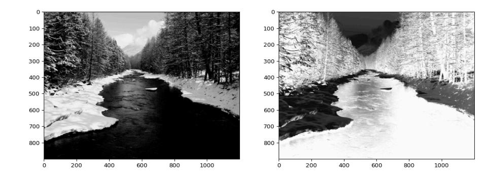

#### **2.3 Seuillage**

• Implémentez une fonction qui retourne une image seuillé selon un niveau d'intensité de gris. Intensité à 255 si le pixel est supérieur à valeur, 0 sinon.

```
def seuil(img: Img, valeur: int) -> Img:
 ...
seuil(forest_img, 150)
```

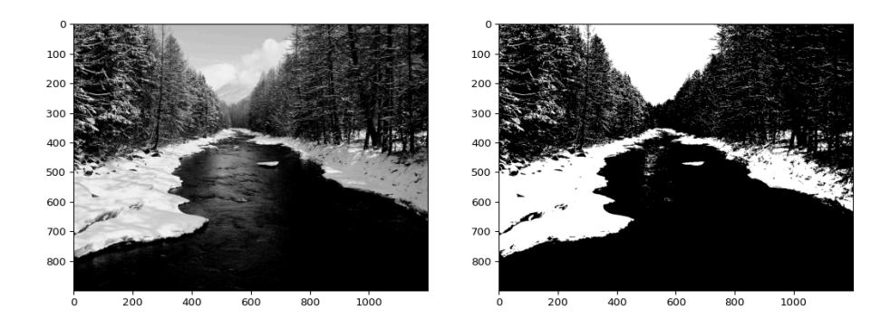

#### **2.4 Normalize**

• Implémentez une fonction qui normalise une image.

```
def normalize(
 img: Img | ImgF,
 new_range: Tuple[int, int] = (0, 255)
) -> Img:
 ...
normalize(radio_dark_img)
```

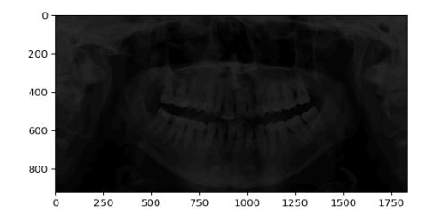

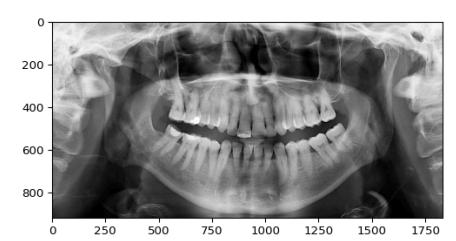

#### **2.5 Transformation logarithmique**

- Implémentez une fonction qui applique une transformation d'intensité logarithmique.
  - ‣ = ∗ log(1 + )
  - ‣ avec c comme constante
  - ‣ avec r comme l'intensité du pixel source

```
def log(img: Img, c: float) -> Img:
 ...
log(forest_img, 1.0)
```

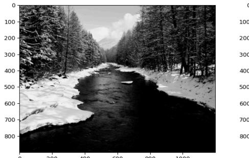

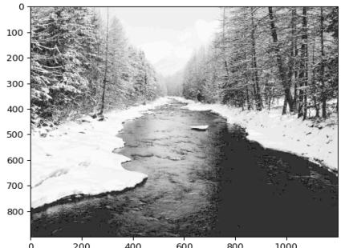

#### **2.6 Transformation gamma**

- Implémentez une fonction qui applique une transformation d'intensité gamma.
  - ‣ =
  - ‣ avec c comme constante
  - ‣ avec g comme constante
  - ‣ avec r comme l'intensité du pixel source

```
def gamma(img: Img, c: float, g: float) -> Img:
 ...
gamma(forest_img, 1.0, 4.0)
```

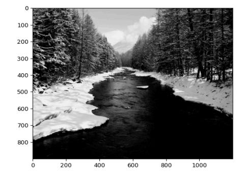

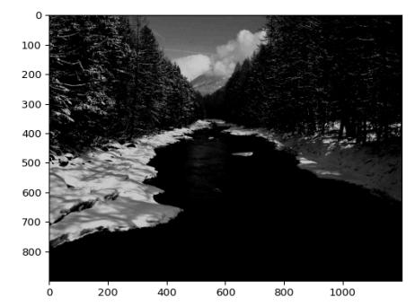

### **2.7 Histogrammes**

• Calculez un premier tableau de fréquence qui retourne une liste d'entier. La position de l'élément correspond à l'intensité, la valeur de l'élément le nombre de pixel ayant cette intensité.

```
def hist_1(img: Img) -> List[int]:
 ...
```

- Afficher cette histogramme avec pyplot.bar()
- Calculez de nouveau cet histogramme, en utilisant cette fois np.histogram(). Affichez le.

```
def hist_2(img: Img) -> List[int]:
 ...
```

- Ajouter à l'affichage de l'histogramme le cumul des intensités.
- Affichez les histogrammes des 7 images précédemment calculées, comme sur les images ci-dessous. Avec dans l'ordre:
  - ‣ forest\_img.png source
  - ‣ negatif
  - ‣ seuil
  - ‣ log
  - ‣ gamma
  - ‣ radio\_dark.png source
  - ‣ normalisée

plt.sublot permet l'affichage de plusieurs figure dans une même fenêtre.

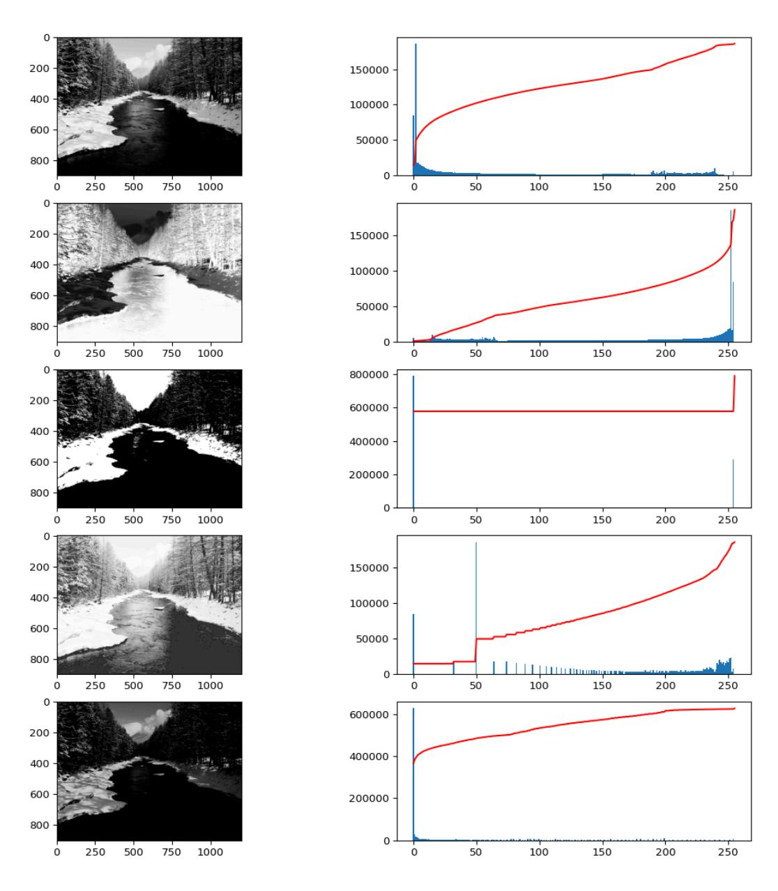

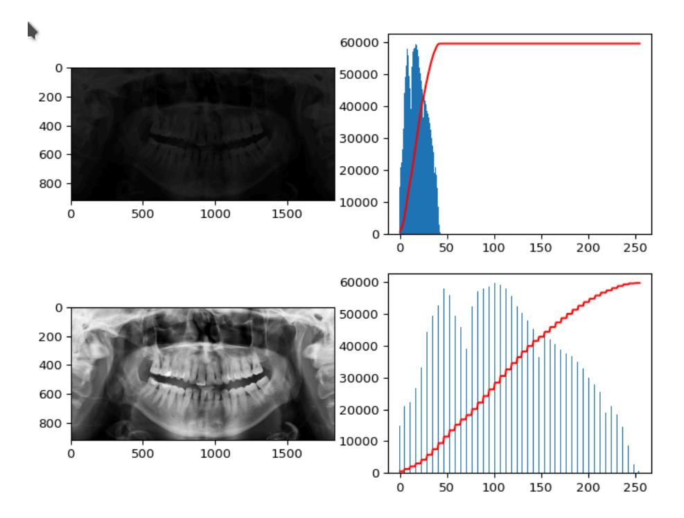

• Enfin, affichez l'image radio\_light.png ainsi que son histogramme, puis afficher l'image normalisée ainsi que son histogramme. Que constatez vous?

#### **2.8 Equalize**

- Afin d'égaliser l'image, vous devez implémenter une fonction equalize() qui effectue les opérations suivantes:
  - ‣ Calcul de l'histogramme normalisé sur la somme de ses valeurs
  - ‣ Calcul de sa somme cumulative
  - ‣ Établissement d'une Look Up Table basée sur la somme cumulative réarrangée entre 0 et 255.
  - ‣ Calcul de l'image égalisée: pour chaque intensité de chaque pixel source, mettre la valeur de la LUT correspondant.
- Testez votre fonction sur l'image radio\_light.png et affichez son histogramme.

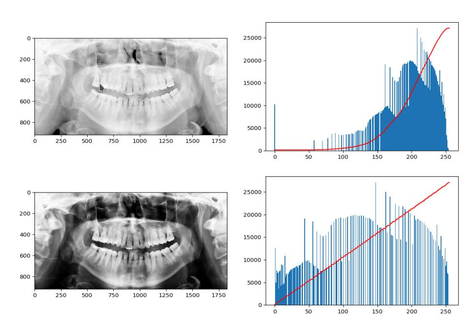

#### **2.9 Bitwise**

• Écrivez une fonction bitwise() qui retourne une image masquée sur un bit de l'intensité, et normalisée.

```
def bitwise(img: Img, bit_pos: int) -> Img:
 ...
```

• Appliquez la fonction sur forest.png, pour chaque bit de l'intensité et affichez les résultats.

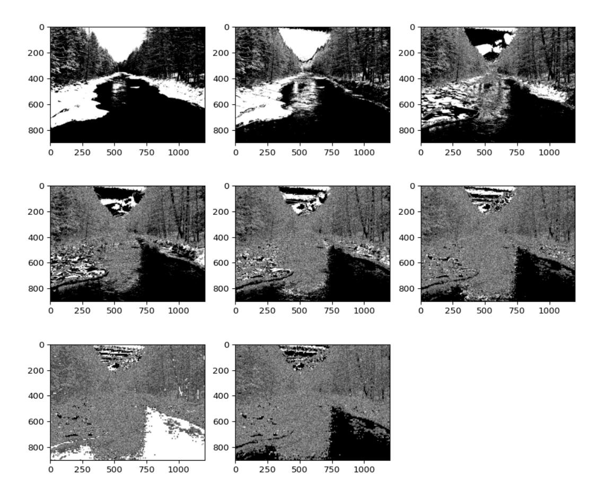