# **Filtrage spatial**

**Vision Numérique** 

Tarik Garidi & Adrien Lescourt

## La fréquence

La fréquence est souvent présentée comme une répétition dans le temps mesurée en Hertz = cycles par secondes. Elle correspond aux nombres de cycles par unité de temps. La période correspond à la durée (en secondes) pour un cycle.

$$Fréquence = \frac{Répétitions}{Unité de temps} = \frac{1}{T}$$

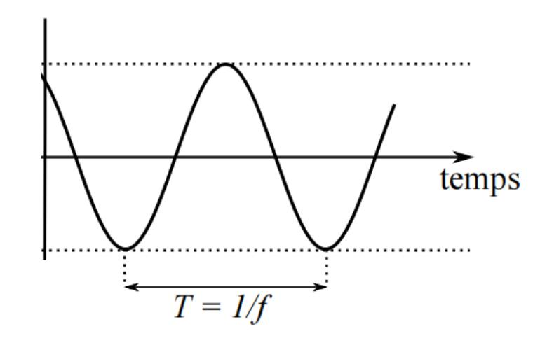

Exemple: le coeur bas 120 fois par minutes = 2 cycles par seconde = 2 Hertz et donc une période = 0.5 S

## La fréquence dans une image

Définition: La fréquence en vision numérique correspond au taux de variation d'une intensité par unité de pixel. Elle correspond aux nombres de cycles d'intensités par unité d'espace.

$$Fréquence Spatiale = \frac{Répétitions}{Unité de longueur} = \frac{1}{Période[pixel]}$$

Exemple: une période de 6 pixels indique que l'intensité est la même tout les 6 pixels. Dans ce cas, la fréquence = 1/6 (par unité de pixel) → un pixel est 1/6 du cycle d'intensité

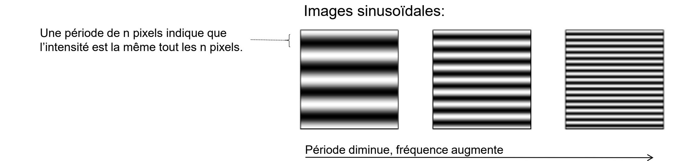

#### La fréquence dans une image

Les images peuvent être décrites comme un assemblage de hautes et basses fréquences.

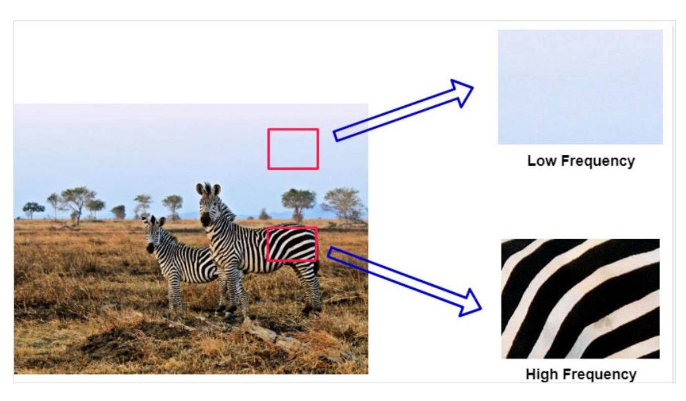

Zone de basses fréquences: variations lentes des intensités par unité de pixels.

Zone de hautes fréquences: variations rapides des intensités par unité de pixels.

## Filtrer une image en utilisant le contenu fréquenciel (spectral)

Le graphisme des lettres utilisées dans le mot ci-dessous fait appel qu'à des fréquences spatiales basses/moyennes. Pour mettre en évidence ce contenu, il est utile d'appliquer un filtre passe-bas (atténue les hautes fréquences et laisse passer les basses fréquences) tel que le *plissage* des yeux.

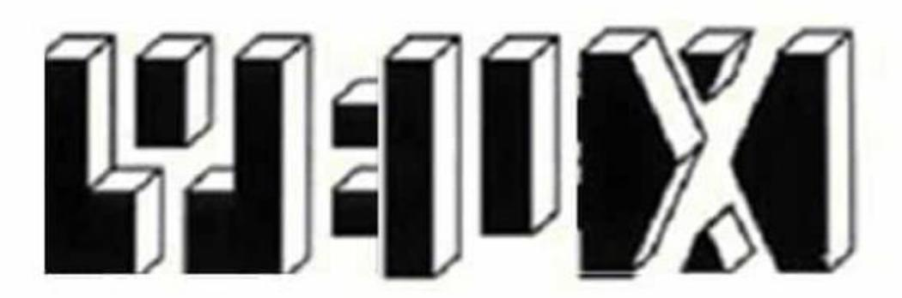

#### On atténue les hautes fréquences (réduction du bruit)

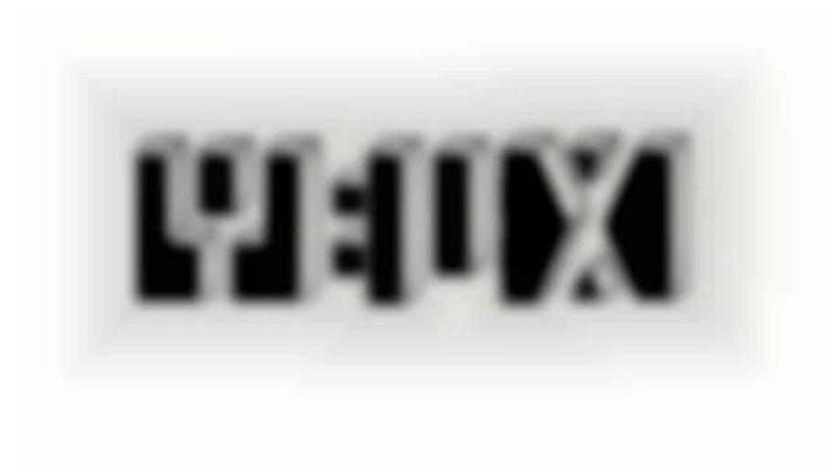

## Image = Assemblage de fréquence? Analyse de Fourier

L'analyse de Fourier permet de représenter un signal en terme de signaux périodiques de fréquence f

Séries de Fourier (fonctions périodiques):

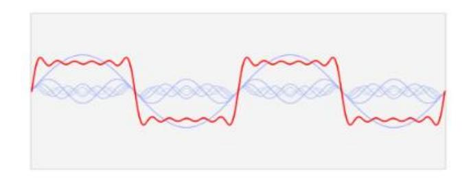

$$s(t) = a_0 + \sum_{k=1}^{\infty} \left( a_k \cdot \cos \left( 2\pi \cdot k \cdot f \cdot t \right) + b_k \cdot \sin \left( 2\pi \cdot k \cdot f \cdot t \right) \right)$$

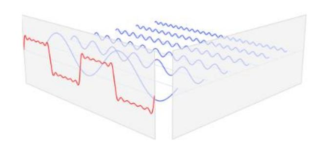

Généralisation, Transformée de fourier:

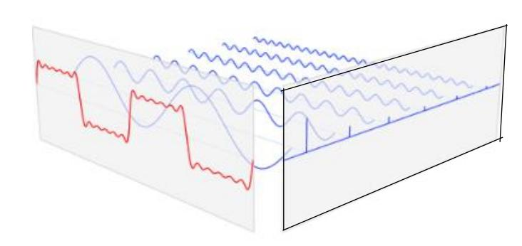

$$\hat{s}(f) = \int_{-\infty}^{\infty} s(t)e^{-ift}dt$$

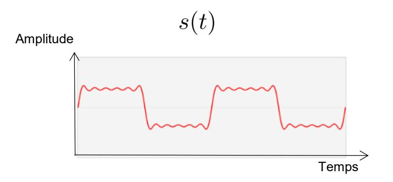

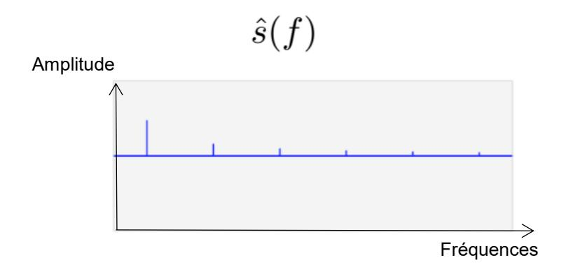

#### Contenu spectral **-** A quoi ca sert?

La transformée de Fourier (les séries de Fourier aussi en fait) donne les pondérations de chaque fréquence dans le signal

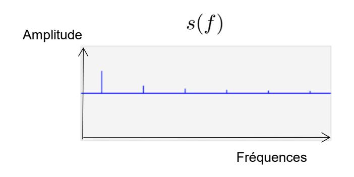

$$\sin(x) - \frac{1}{2} \times \sin(2x) + \frac{1}{3} \times \sin(3x) + \dots$$

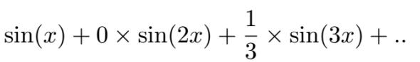

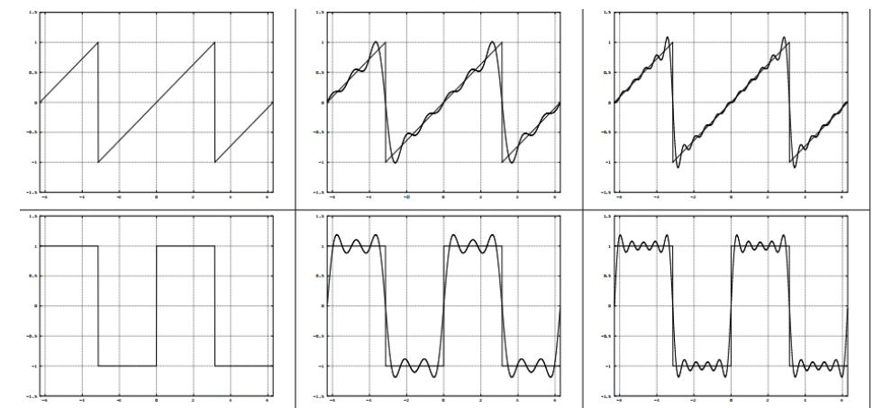

- Signature: permet de distinguer des signaux rapidement
- Compression (on ne garde que les fréquences plus importantes mp3, jpeg,..)
- Filtrer les fréquences qui ne nous interessent pas!

#### Une image comme superposition d'images sinusoïdale

On peut décomposer une image en somme d'images sinusoïdales et l'analyse de fourier nous donne accès aux coefficients

$$= a(0,0)x + a(0,1)x + ...+ a(11,11)x + ...+ a(11,11)x$$

Les coefficients a(u,v) et b(u,v) sont les coéficients de Fourier de fréquences (u,v) . Ils donnent la contributions de cette fréquence dans l'image.

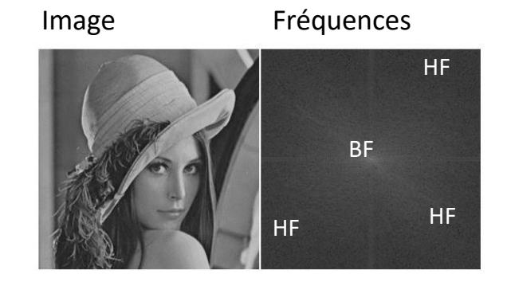

#### Filtrer les fréquences

Filtres passe-bas (low pass): lissage/floutage, on garde les fréquences basses

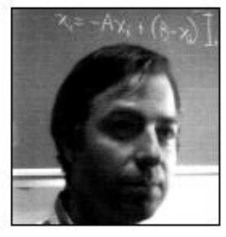

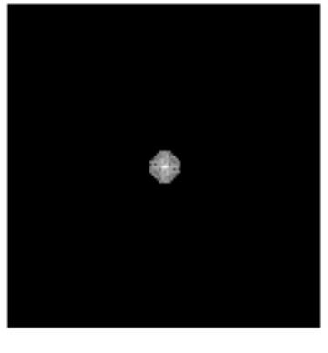

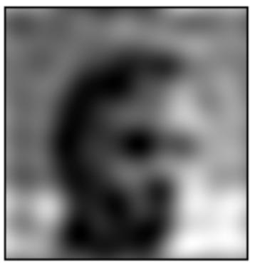

• Les hautes fréquences spatiales correspondent à un niveau de gris qui varie fortement sur quelques pixels, par exemple, dans une zone de l'image très texturée, sur les contours,..

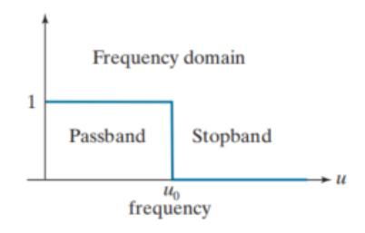

• Les basses fréquences spatiales correspondent à une variation lente du niveau de gris, par exemple dans une zone de dégradé.

Filtres passe-haut (high pass): détection de contours, on garde les fréquences hautes

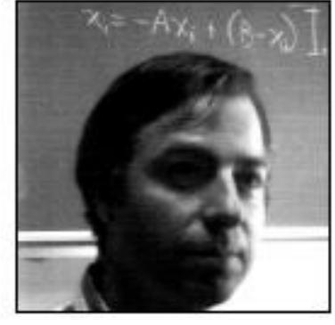

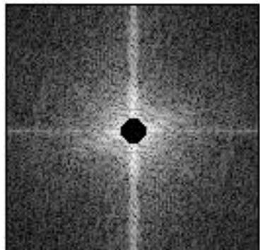

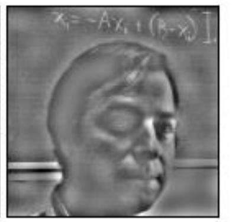

#### Retour vers le domaine spatial

Le **domaine de fréquences** correspond à la représentation de l'image en terme de fréquences spatiales du signal, le long des lignes ou le long des colonnes de l'image.

Le **domaine spatiale** correspond au plan (x,y) de l'image elle-même. Les transformations dans ce domaine se caractérisent par des manipulations sur les pixels de l'image.

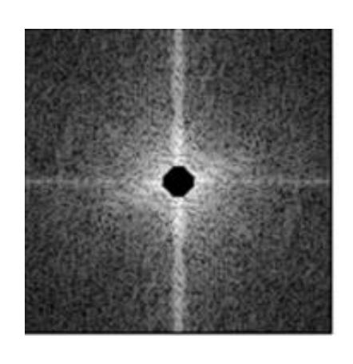

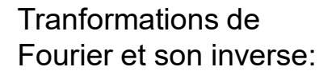

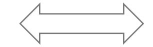

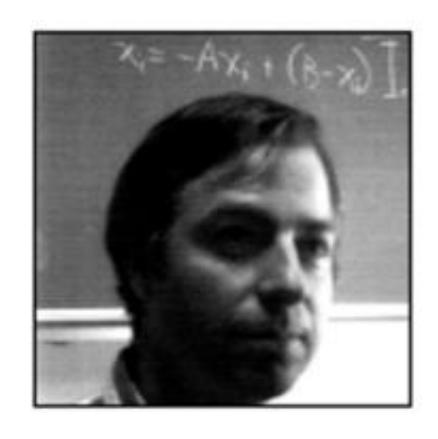

- Lissage/floutage
- Détection de contours

Les opération de filtrage sont souvent plus rapide dans ce domaine car les filtres sont des multiplications!

11 Les filtres sont implémentés par des correlations/convolutions. Opérations potentiellement couteuses qui impliquent le voisinnage du pixel que l'on manipule.

#### Opérations dans le domaine spatial

La forme générale de la transformation d'un point (x,y) dans le domaine spatiale est:

$$g(x,y) = T[f(x,y)]$$

**Filtrage spatial**: L'opérateur T est défini dans un voisinage *nxn* de chaque point

- Voisinage de dimension impaire
- Pour les bords on doit compléter l'image (Padding,..)
- Opérations linéaires ou non linéaires

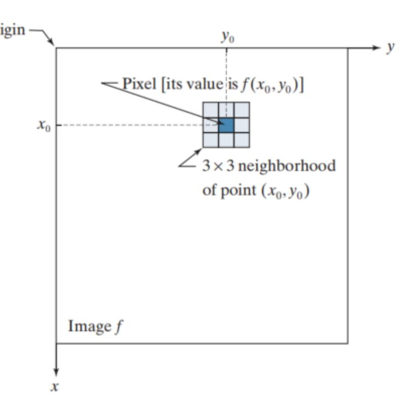

## Mécanisme de filtrage spatial - La convolution / corrélation

Chaque pixel de l'image f(x,y) est transfomé par une opération qui dépend du voisinage de x. Cette dépendance du voisinage est implémentée à l'aide d'un kernel ω(x,y). L'idée est d'utiliser la **convolution/corrélation** entre f et ω:

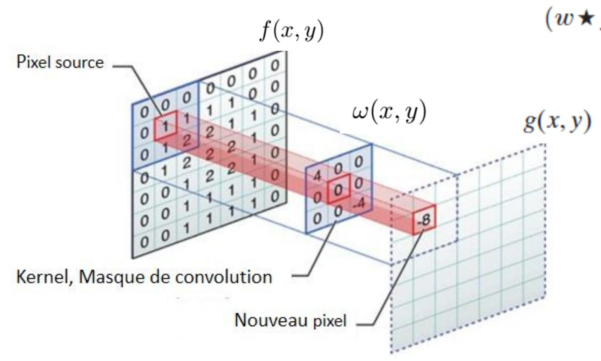

#### En mathématique:

$$(\omega \star f)(t) = \int \omega(x)f(t-x)dx$$

la convolution de deux fonctions f et ω permet de construire une troisième fonction qui exprime la facon dont la forme de l'une est influencée par la forme de l'autre.

Le résultat de la convolution est la somme des produits: (4x0) + (0x0)+..+(0x1)+(-4x2) = -8

En filtrage: on impose une forme au kernel afin d'influencer la forme de l'image originale

#### La convolution / corrélation - Exemple avec zéro *padding*

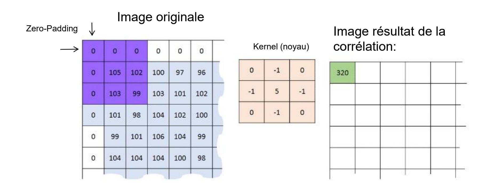

## Types de filtrages: choix du kernel

On aimerait supprimer les informations inutiles (donc on fait des moyennes pour lisser les différences)

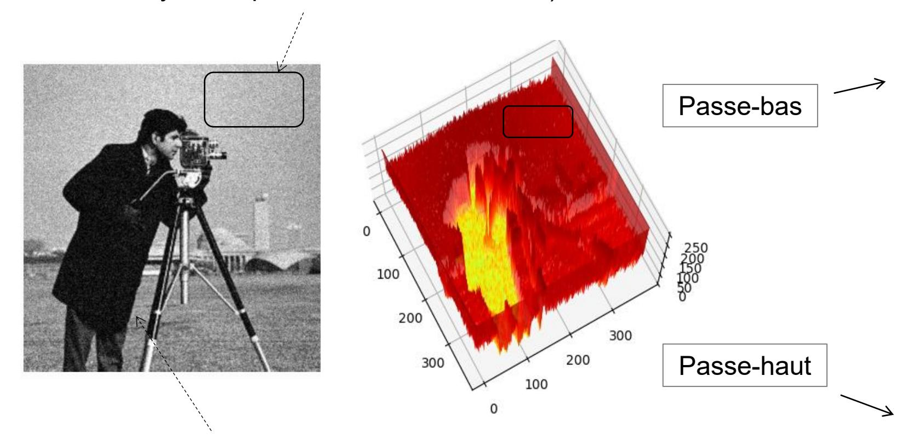

Contours: on aimerait faire apparaitre les zone ou les variations d'intensités sont importantes (donc on calcule des différences)

Kernel type moyenne (intégrale)

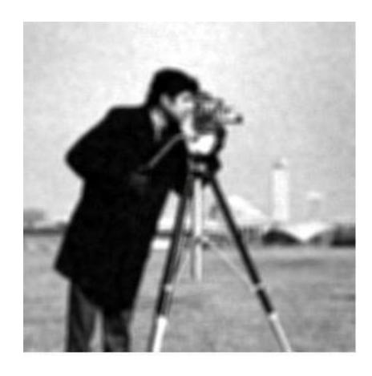

Kernel type dérivée

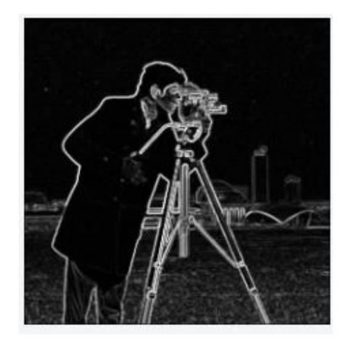

## Passe-bas - Kernel de type moyenne, lissage

**Objectif:** éliminer les détails de l'image

Détails = variations de pixels sur une zone *petite* par rapport à la taille du kernel. La taille du kernel détermine donc le degré de lissage

- Rendent l'image plus floue (Blurring) Généralement effectué en pré-traitement pour enlever les petits détails d'une image avant l'extraction de (grand) objects
- Réduisent le bruit de l'image (Denoising): La réduction de bruit peut également être effectuée par un filtrage non linéaire (filtrage fréquentiel) en filtrant les hautes fréquences.

#### Box (moyenne Gaussien: ou mediane):

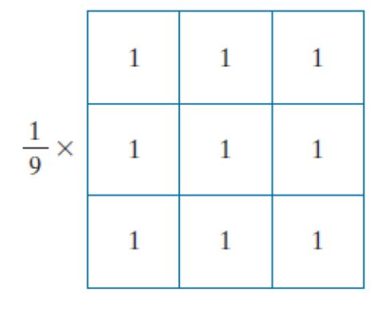

|               | 0.3679 | 0.6065 | 0.3679 |
|---------------|--------|--------|--------|
| 1 1.8976 × | 0.6065 | 1.0000 | 0.6065 |
|               | 0.3679 | 0.6065 | 0.3679 |

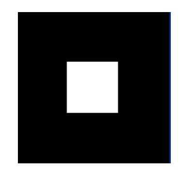

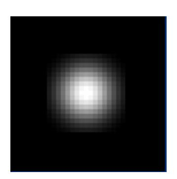

## Exemples Box

|                  | 1 | 2 | 1 |
|------------------|---|---|---|
| $\frac{1}{16}$ × | 2 | 4 | 2 |
|                  | 1 | 2 | 1 |

#### Filtre low pass (atténue le bruit) puis seuillage:

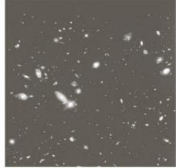

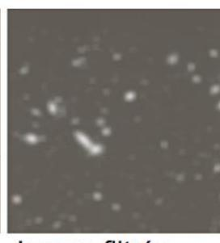

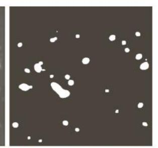

La taille du kernel détermine le degré de floutage

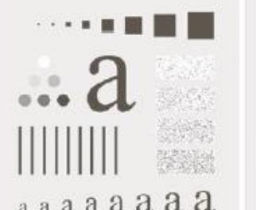

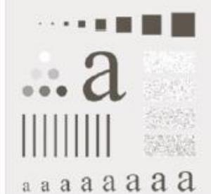

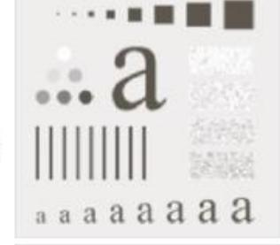

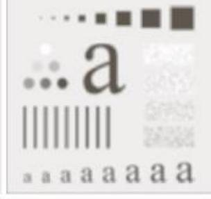

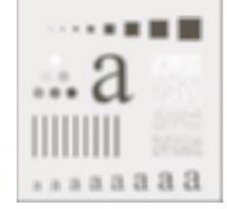

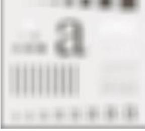

## Gaussien

#### Les coefficients du filtre Gaussien s'obtiennent

par:

Avec K=1 et sigma = 1, on obtient:

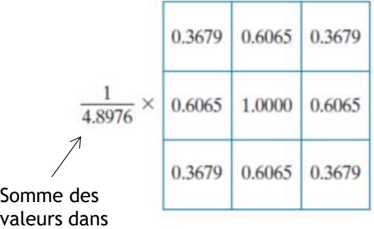

le filtres

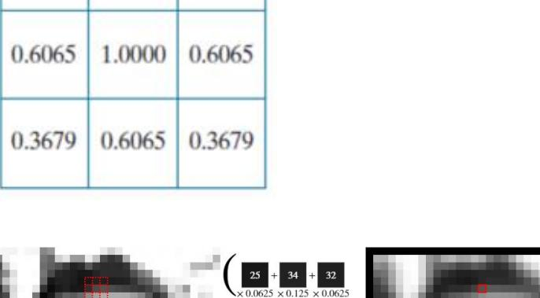

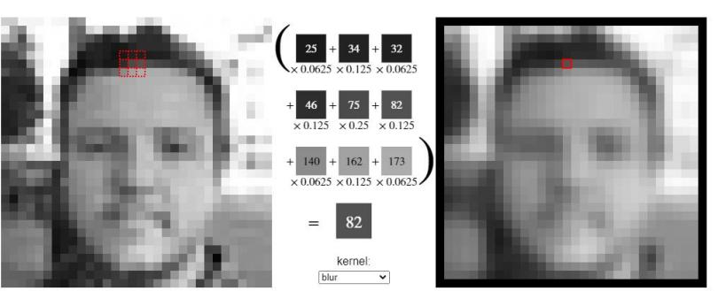

- 1. Isotropie (contrairement aux filtres Box simple). Lissage de meilleur qualité
- 2. Séparable
- 3. Besoin de kernels plus grand que box pour même blurring
- 4. Zone d'influence déterminée par le paramètre σ. Après 3σ on sait que le poids de la gaussienne est négligeable.

Exemple: 43 x 43 → σ ~ 7

On choisit 7 car on sait qu'après 3σ, le poids de la gaussienne est négligeable..

et 3 \* 7 = 21 pixels (poids négligeable après 21 pixels)

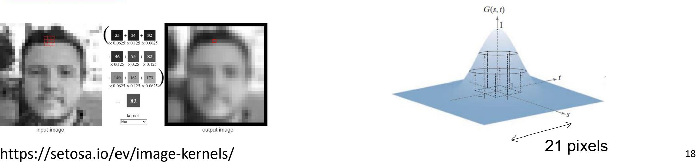

#### Médian

Le filtre médian est un filtre qui remplace la valeur d'un pixel par la valeur médiane des valeurs du voisinage de ce pixel.

Le filtre médian supprime le bruit, dès que les valeurs du bruit sont minoritaires sur le voisinage alors que le filtre moyenneur étale le bruit sur les pixels voisins.

Image avec bruit poivre et sel Moyenne 3x3 Moyenne 5x5 Médian 5x5

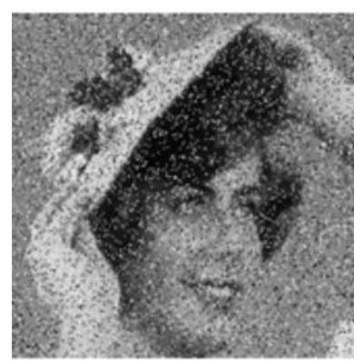

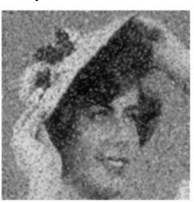

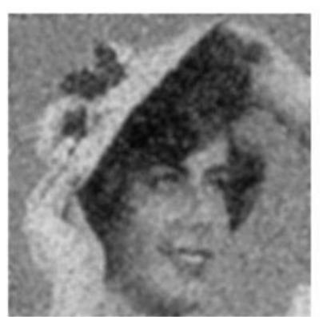

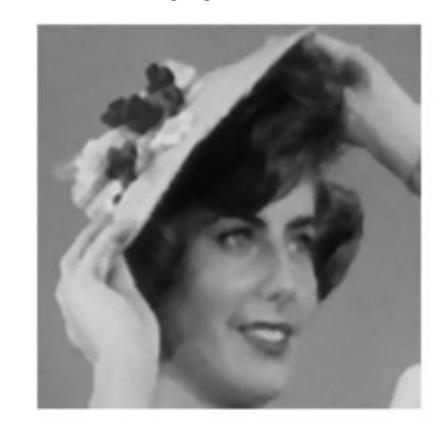

## Low pass - Filtrage Bilateral pour préserver les countours

#### Image originale:

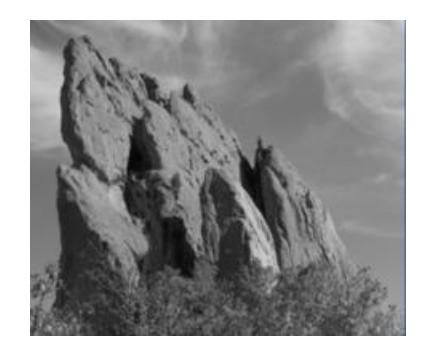

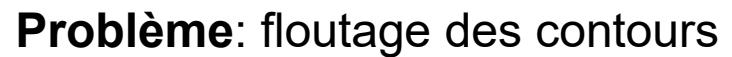

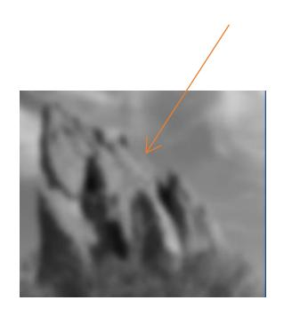

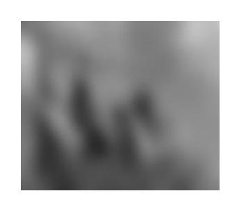

La paramètre σ détermine la taille de la fenêtre et le degré de floutage

$$g(x,y) \sim \text{Gauss(spatial)} \times \text{Gauss(intensité)}$$

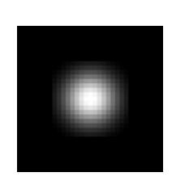

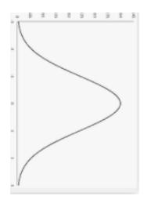

- Pondération spatiale: on laisse un pixel être influencé par le voisinage
- Pondération intensité: l'influence est plus forte pour les voisins qui ont une intensité "proche" du pixel (countours ne sont plus lissés)

#### Low pass - Filtrage Bilateral pour préserver les countours

#### Originale:

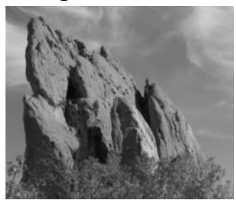

$$\sigma_{intensit\acute{\text{e}}}=0.1$$

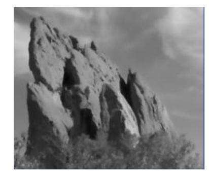

 $\sigma_{intensit\acute{\theta}}=0.25$ 

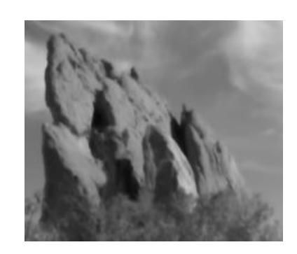

 $\sigma_{intensit\acute{\text{e}}} = \infty$ 

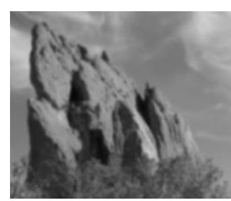

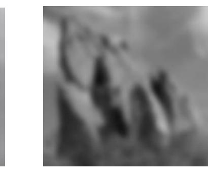

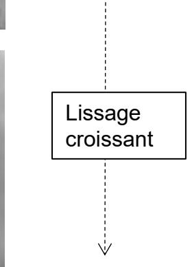

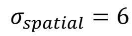

 $\sigma_{spatial} = 2$ 

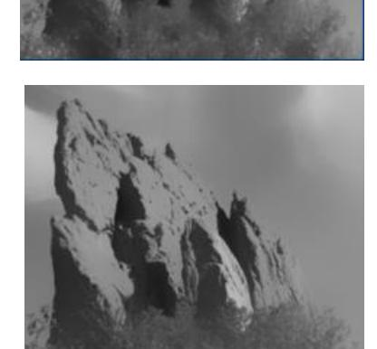

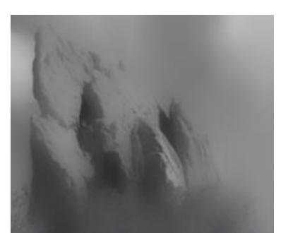

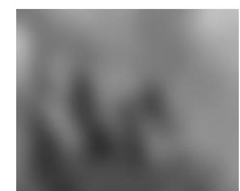

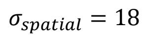