# **Filtrage spatial passe-haut**

**Vision Numérique** 

Tarik Garidi & Adrien Lescourt

### Filtre passe-haut (highpass)

**But:** mettre en évidence les zones de variations importantes (hautes fréquences):

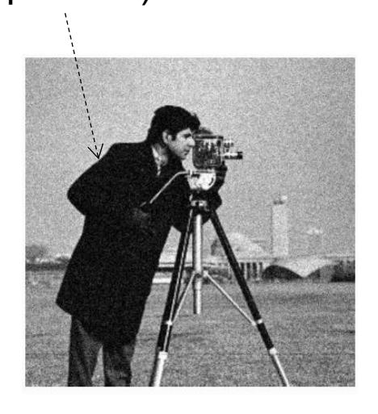

**Idée**: on calcule la dérivée de l'image pour accentuer les discontinuités. Par ex: le gradient de l'image:

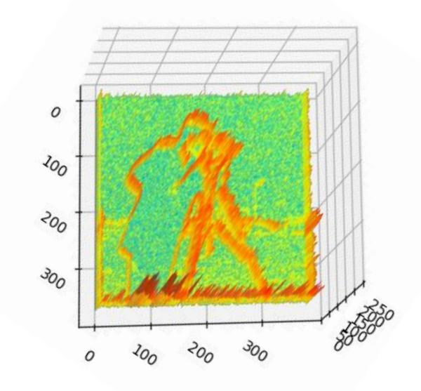

#### **Etapes clés**:

- 1. Lissage
- 2. Renforcement (dérivation)
- 3. Seuillage

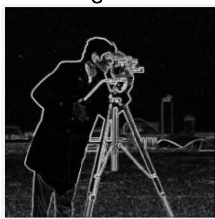

Attention: ces filtres détectent non seulement les contours mais aussi d'autres types de discontinuités comme celles dues au bruit (lissage puis seuillage souvent utilisé).

# On cherche à mettre en évidence les transitions d'intensités

Comment caractériser en termes mathématiques, les transitions d'intensités (zones de haute fréquence)?

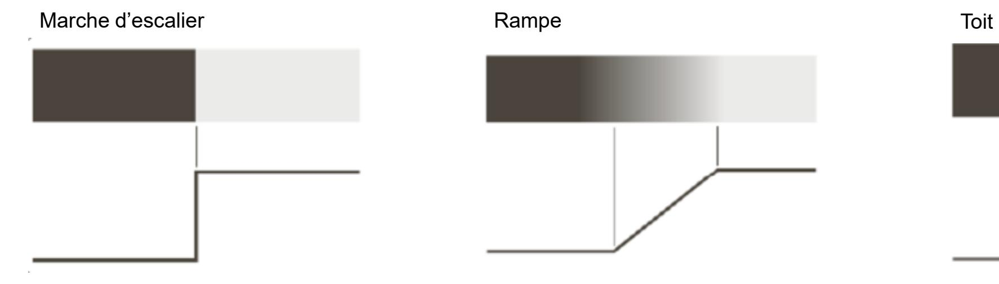

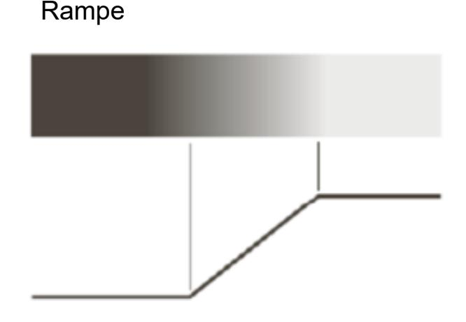

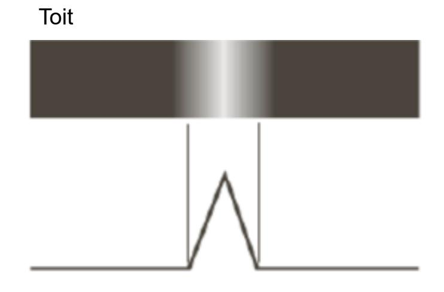

Approximation à l'aide de la fonction tangente hyperbolique:

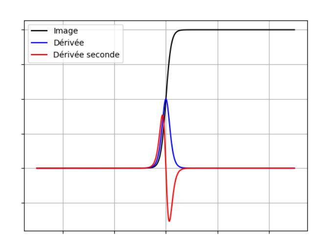

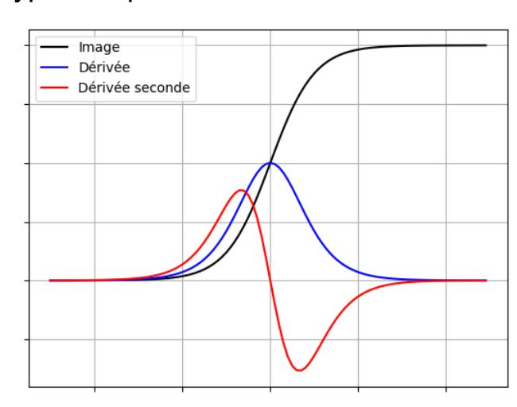

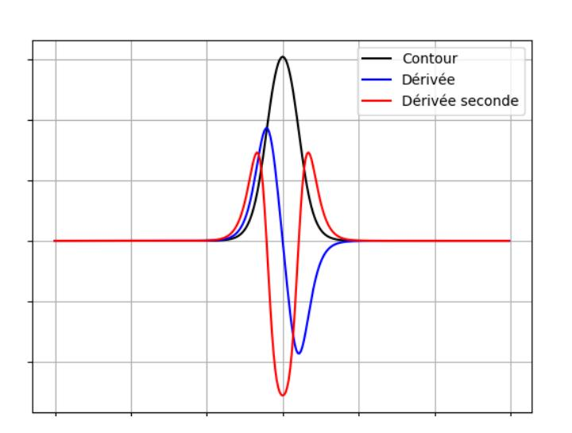

# Transitions d'intensités et dérivées

Les contours prennent souvent la forme de rampe, examinons cet objet (en dimension 1) du point de vue de ses dérivées premières et secondes:

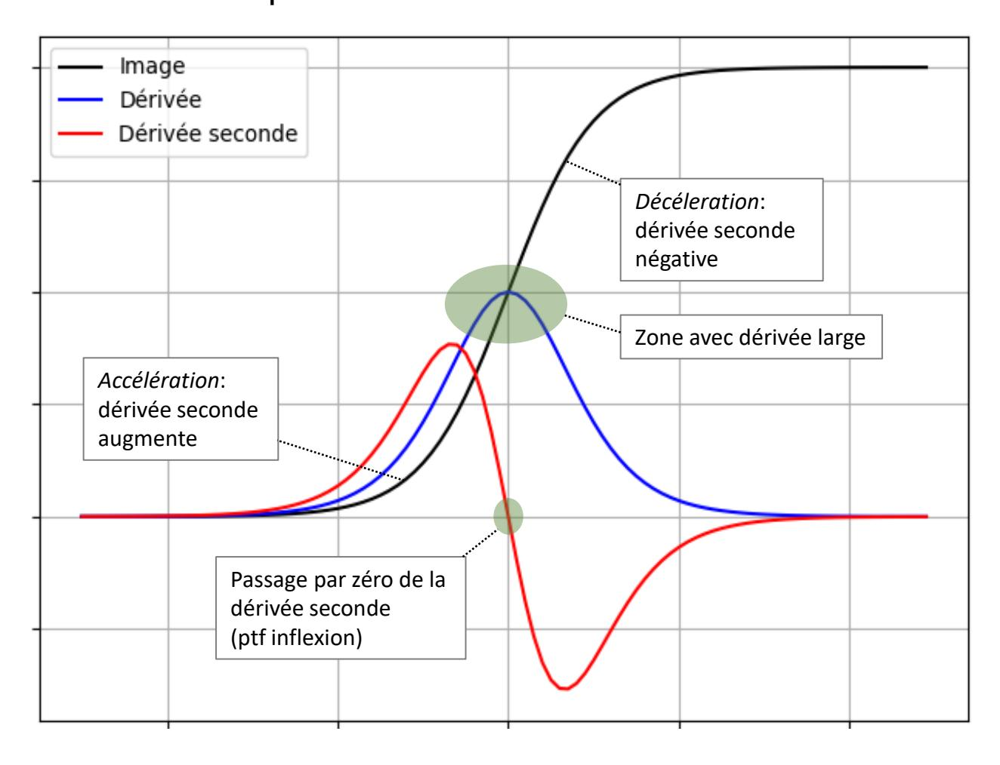

#### **Observations**:

- Dérivée première: on recherche des zones ou la dérivée est non nulle, idéalement grande (en valeur absolue)
- → les contours sont épais car la dérivée est non nulle dans toute la zone
- Dérivée seconde: sur une rampe on passe d'un plateau à un autre ce qui implique une accélération puis une décélération de la variation d'intensité. Donc un *passage par zéro* de la dérivée seconde.
- → Identification du passage par zéro de la dérivée seconde permet une localisation fine du contour

# Discrétisation - dimension 1

#### **Dérivée première**:

$$\lim_{h \to 0} \frac{f(x+h) - f(x)}{h} \quad \Rightarrow \quad f'(x) = f(x+1) - f(x)$$

**Dérivée seconde**: developement de Taylor au 2ième ordre autours de x:

$$f(x+h) = f(x) + f'(x)h + \frac{f''(x)}{2}h^2$$
$$f(x-h) = f(x) - f'(x)h + \frac{f''(x)}{2}h^2$$

On obtient:

$$f''(x) = f(x+1) + f(x-1) - 2f(x)$$

On observe les dérivées non nulle et le passage par zéro de la dérivée seconde:

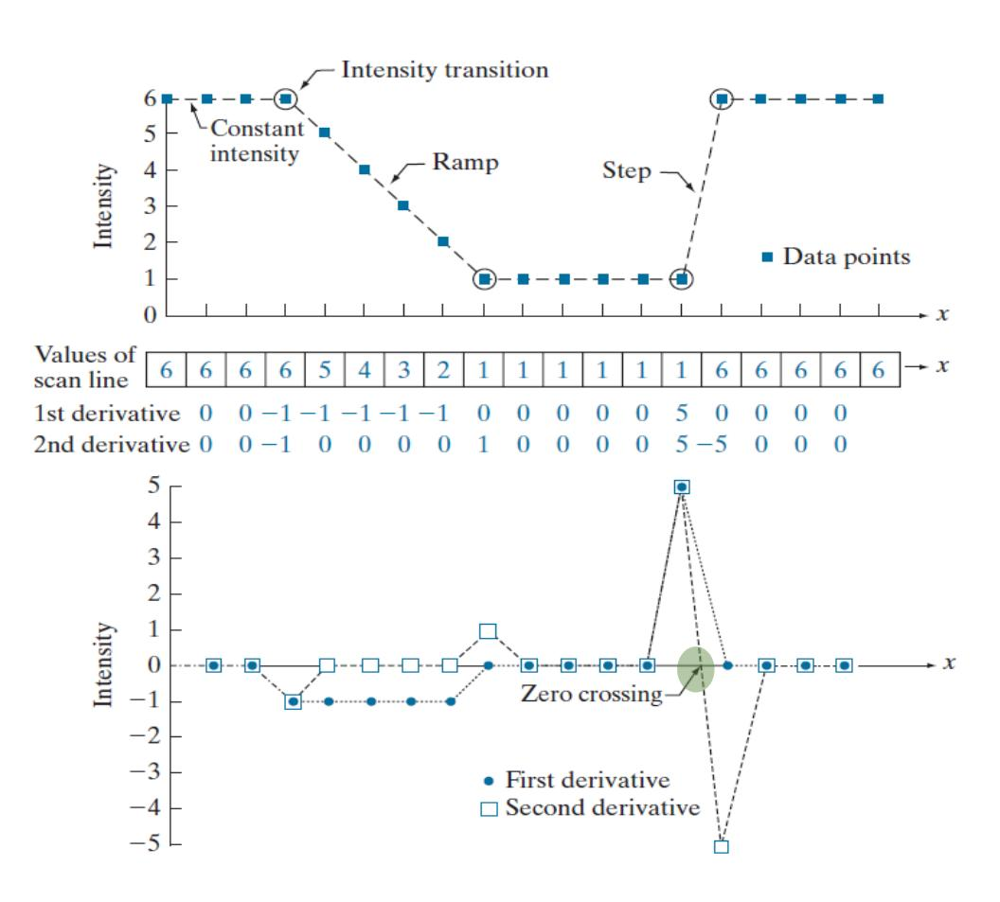

# Opérateurs differentiels en dimension 2 - Gradient et Laplacien

Le **Gradient** est un vecteur et sa norme représente son intensité:

$$\nabla f = \left(\frac{\partial f}{\partial x}, \frac{\partial f}{\partial y}\right)^{\mathrm{T}}, \qquad ||\nabla f|| = \sqrt{\left(\frac{\partial f}{\partial x}\right)^2 + \left(\frac{\partial f}{\partial y}\right)^2}$$

- Indique la direction de la plus grande pente en en point (x,y).
- La norme du gradient = plus grande pente en (x,y).
- Perpendiculaire en tout point à la ligne de niveau

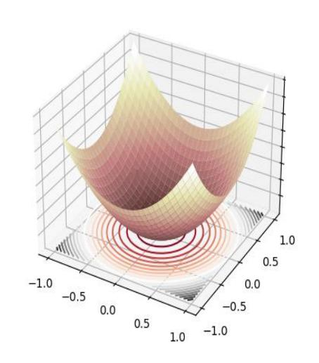

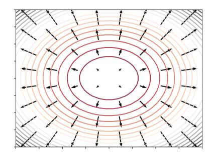

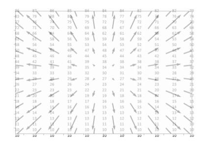

Le **Laplacien** (généralisation de la dérivée seconde) est l'opérateur isotropique le plus simple:

$$\nabla^2 f = \frac{\partial^2 f}{\partial x^2} + \frac{\partial^2 f}{\partial y^2}$$

- "Physiquement", le laplacien mesure la différence entre la valeur de la fonction en un point, et sa moyenne autour de ce point.
- → il sera donc proche de zéro dans les zones ou l'intensité varie sans à-coup et au contraire sera large dans les zones de fortes variations.

# Gradient - Masques de convolution

Approximation des composantes du gradient:

$$\nabla f = (f(x+1) - f(x), f(y+1) - f(y))^{\mathsf{T}}$$

Un masque de convolution correspond donc à une approximation de la dérivée simple:

En pratique les masques combinent fréquemment lissage et dérivation. Par exemple dans le cas 3x3, on obtient les masques classiques:

| +1 | 0 | -1 |
|----|---|----|
| +1 | 0 | -1 |
| +1 | 0 | -1 |

| -1 | -1 | -1 |
|----|----|----|
| 0  | 0  | 0  |
| +1 | +1 | +1 |

Prewitt direction x et y: Sobel direction x et y:

| -1 | 0 | +1 |
|----|---|----|
| -2 | 0 | +2 |
| -1 | 0 | +1 |

| +1 | +2 | +1 |
|----|----|----|
| 0  | 0  | 0  |
| -1 | -2 | -1 |

Lissage Dérivation

# Exemple Sobel

Attention valeurs hors scope 0, 255 à la suite de cette opération: traitement type égalisation/normalisation nécessaire. Par exemple on envoie les valeurs très négatives sur 0 et les plus grand sur 255:

#### Image

| 43  | 28                                                    | 54                                                                                    | 86                                                                                                                    |
|-----|-------------------------------------------------------|---------------------------------------------------------------------------------------|-----------------------------------------------------------------------------------------------------------------------|
| 61  | 109                                                   | 171                                                                                   | 228                                                                                                                   |
| 130 | 104                                                   | 105                                                                                   | 201                                                                                                                   |
| 75  | 171                                                   | 188                                                                                   | 196                                                                                                                   |
| 143 | 186                                                   | 245                                                                                   | 219                                                                                                                   |
| 192 | 189                                                   | 139                                                                                   | 107                                                                                                                   |
| 56  | 66                                                    | 67                                                                                    | 29                                                                                                                    |
| 28  | 31                                                    | 64                                                                                    | 40                                                                                                                    |
| 23  | 34                                                    | 30                                                                                    | 21                                                                                                                    |
| 38  | 14                                                    | 27                                                                                    | 19                                                                                                                    |
| 25  | 39                                                    | 88                                                                                    | 47                                                                                                                    |
|     | 61 130 75 143 192 56 28 23 38 | 61 109 130 104 75 171 143 186 192 189 56 66 28 31 23 34 38 14 | 61 109 171 130 104 105 75 171 188 143 186 245 192 189 139 56 66 67 28 31 64 23 34 30 38 14 27 |

#### Masque de Sobel

| +1 | +2 | +1 |
|----|----|----|
| 0  | 0  | 0  |
| -1 | -2 | -1 |

#### Image après Sobel

| -168 | -290 | -293 |
|------|------|------|
| -108 | -155 | -64  |
| -204 | -317 | -380 |
| -361 | -104 | 169  |
| 387  | 505  | 666  |
| 610  | 555  | 375  |
| 109  | 134  | 114  |
| -71  | 61   | 112  |
| -16  | -70  | -147 |
|      |      |      |

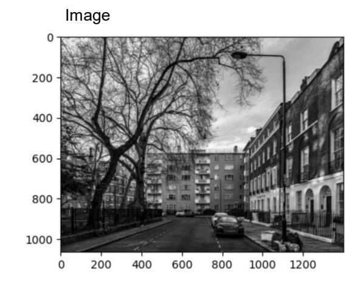

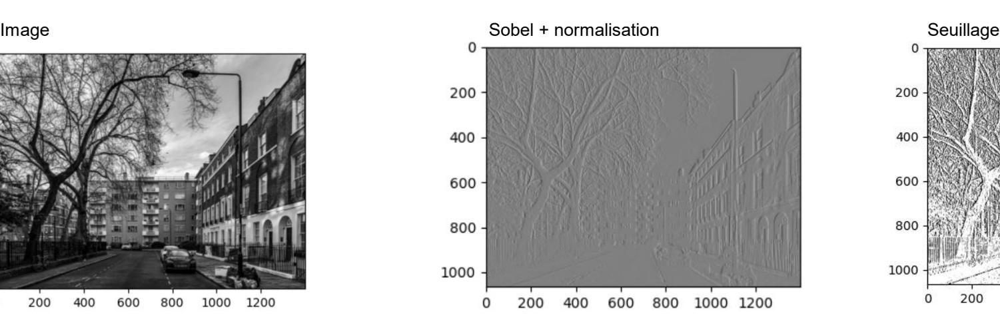

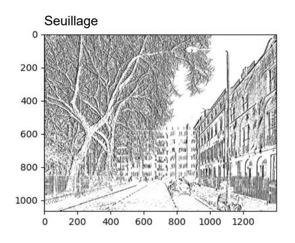

### Gradient - Sensibilité au bruit

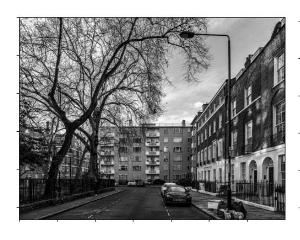

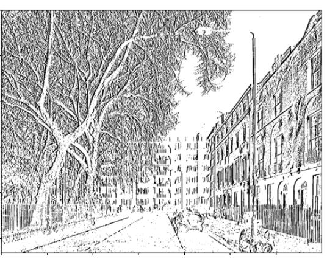

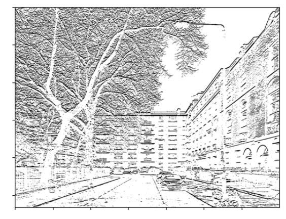

Sobel direction x Sobel direction y Sobel combiné x et y

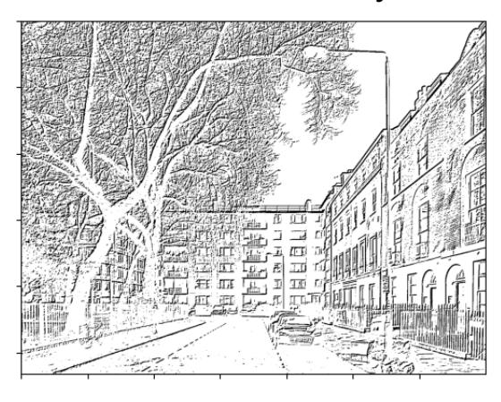

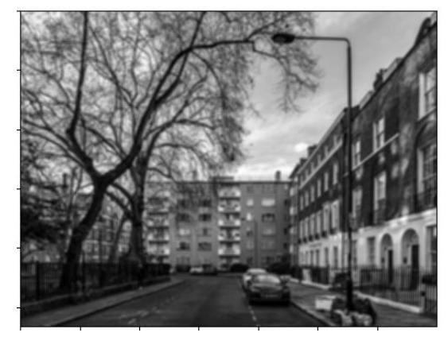

Lissage Gradient avant et après lissage (seuillage pour les 2)

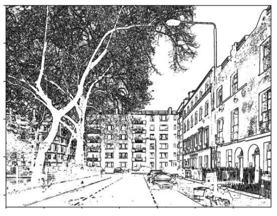

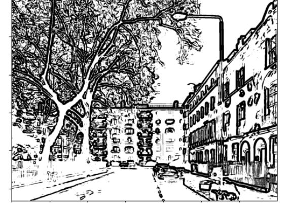

- Fort lissage : robustesse au bruit, mais contours épais (mauvaise localisation)
- Faible lissage : sensibilité au bruit, mais bonne localisation

Détection de hautes fréquences sensibles au bruit

# Laplacien - Masques de convolution

Pour l'approximation du Laplacien on utilise la version discrète de la dérivées seconde pour chaque coordonnée :

$$\frac{\partial^2 f}{\partial x^2} = f(x+1,y) + f(x-1,y) - 2f(x,y)$$

$$\nabla^2 f = \frac{\partial^2 f}{\partial x^2} + \frac{\partial^2 f}{\partial y^2}$$

$$\frac{\partial^2 f}{\partial y^2} = f(x,y+1) + f(x,y-1) - 2f(x,y)$$

$$= f(x+1,y) + f(x-1,y) + f(x,y+1) + f(x,y-1) - 4f(x,y)$$

- Mesure la différence entre la valeur de la fonction en un point, et sa moyenne autour de ce point
- On peut implémenter ce comportement dans un masque de convolution 3x3 de la manière suivante:

| 0 | 1  | 0 | 1 | 1  | 1 | 0  | -1 | 0  | -1 | -1 | -1 |
|---|----|---|---|----|---|----|----|----|----|----|----|
| 1 | -4 | 1 | 1 | -8 | 1 | -1 | 4  | -1 | -1 | 8  | -1 |
| 0 | 1  | 0 | 1 | 1  | 1 | 0  | -1 | 0  | -1 | -1 | -1 |

Laplacien avec termes diagonaux (isotropie 45°) Laplacien avec termes diagonaux (isotropie 45°)

# Laplacien - Exemple d'utilisation

- Met en évidence les discontinuités d'intensité de l'image (les contours)
- Atténue les régions avec de faibles variations d'intensité (Laplacien petit et donc couleurs sombres)

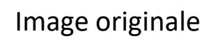

Laplacien: sombre avec contours plus clairs

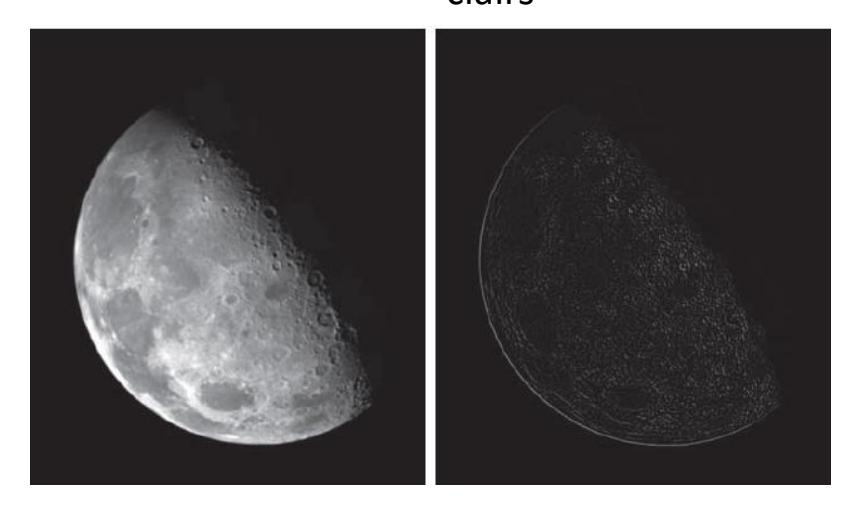

Pour rehausser les contours: Laplacien de l'image est simplement additionné à l'image origine

$$f(x,y) + c \left[ \nabla^2 f(x,y) \right]$$

c=1 ou -1 en fonction du choix des signes dans le masque

Isotropie rotations de 90°

| 0 | 1  | 0 |
|---|----|---|
| 1 | -4 | 1 |
| 0 | 1  | 0 |

Isotropie rotations de 45°

| otropie | 1 | 1  | 1 |
|---------|---|----|---|
| tations | 1 | -8 | 1 |
| 45°     | 1 | 1  | 1 |

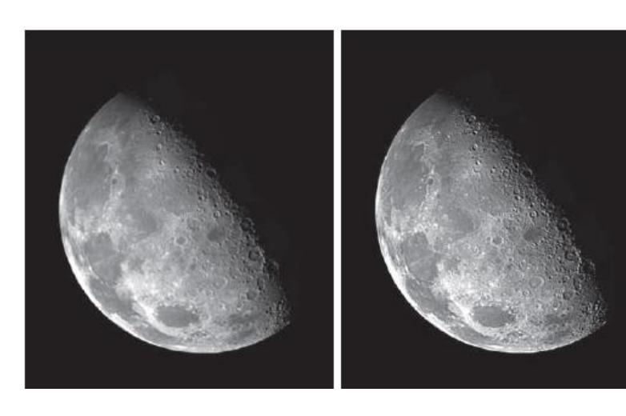

# Laplacien - Traitement des valeurs négatives

Image originale Laplacien: sombre car valeurs négative--> zéro

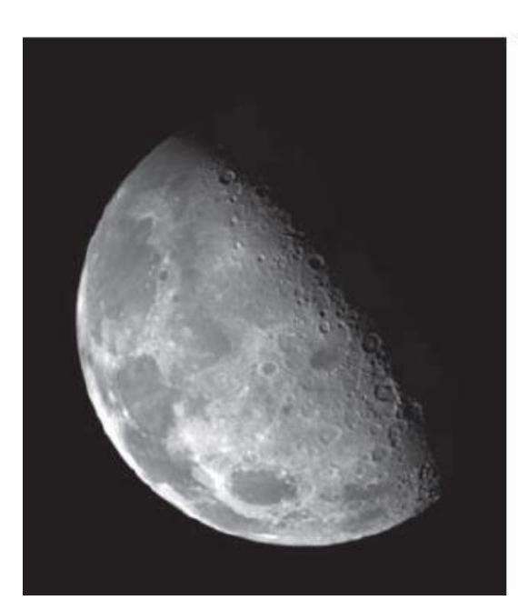

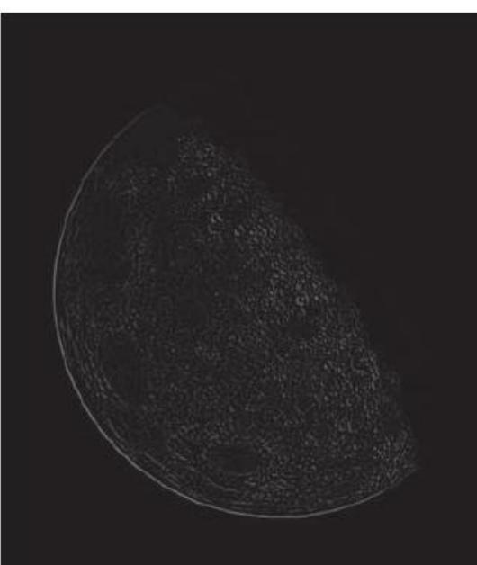

Si au lieu d'envoyer les valeurs négative sur zéro on *scale*  entre 0 et 255: les valeurs très négatives sur 0 et les plus grandes sur 255.

$$1) \quad g = I(x, y) - \min(I(x, y))$$

2) 
$$g\_scaled = K(g/max(g))$$
 avec K = 255 (8-bit)

On obtient l'image caractéristique du Laplacien (contours: noir et blanc)

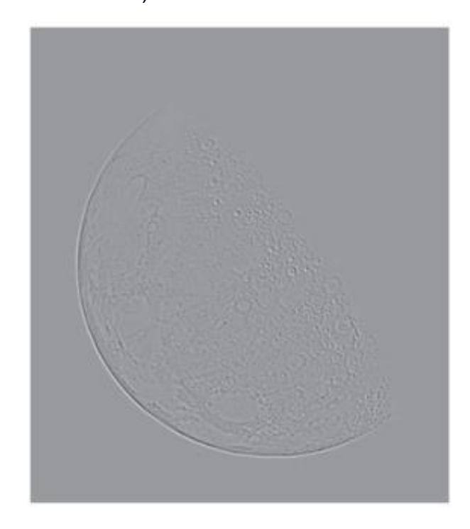

# Highboost filtering (utilisé depuis 1930)

L'idée du Laplacien est de comparer chaque pixel à la moyenne de son entourage. En moyenne est ce que le pixel est proche de son entourage?

On peut arriver au même type d'effet simplement en faisant:

1. On blur l'image, noté ) puis on soustrait ce blur à l'image (pour comprendre comment chaque pixel en moyenne diffère de son entourage)

$$g_{\text{mask}}(x, y) = f(x, y) - \overline{f}(x, y)$$

2. On ajoute le masque à l'image

$$g(x,y) = f(x,y) + kg_{\text{mask}}(x,y)$$

### Gradient et Laplacien sensiblent au bruit, à la texture

Les masques de convolution de type dérivée sont sensibles au bruit, attention aux faux positifs dans les zones texturées ----> lissage nécessaire

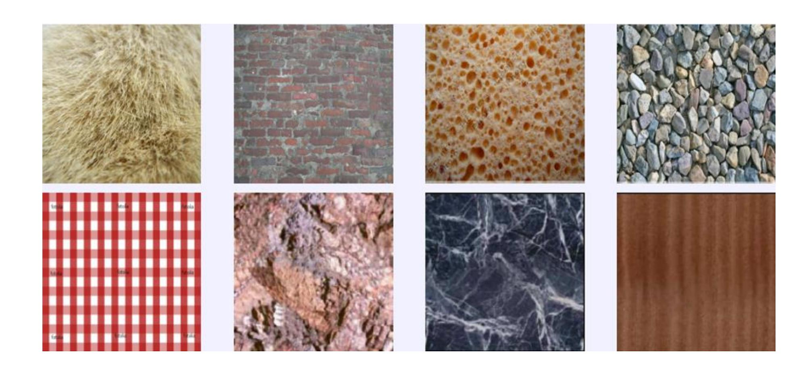

# Laplacien lissé par une gaussienne - LoG kernel

La sensibilité au bruit/texture est exacerbée lorsqu'on utilise le Laplacien avec le critère *passage par zéro* car chaque maximum local de la dérivée occasionnera un signal! Le lissage est systématique avec le Laplacien.

En pratique comme le produit de convolution est associatif:

$$Laplacien \star (Gaussien \star Image) = (Laplacien \star Gaussien) \star Image$$

- Option 1: on lisse l'image puis on applique le Laplacien
- Option 2: on applique le Laplacien sur la Gaussienne = LoG

Cette option est plus efficace puisque l'opérateur LoG est pré-calculé et donc une unique convolution (avec l'image) est nécessaire.

$$LoG(x,y) = -\frac{1}{\pi\sigma^4}[1-\frac{x^2+y^2}{2\sigma^2}]\cdot e^{-\frac{x^2+y^2}{2\sigma^2}}$$

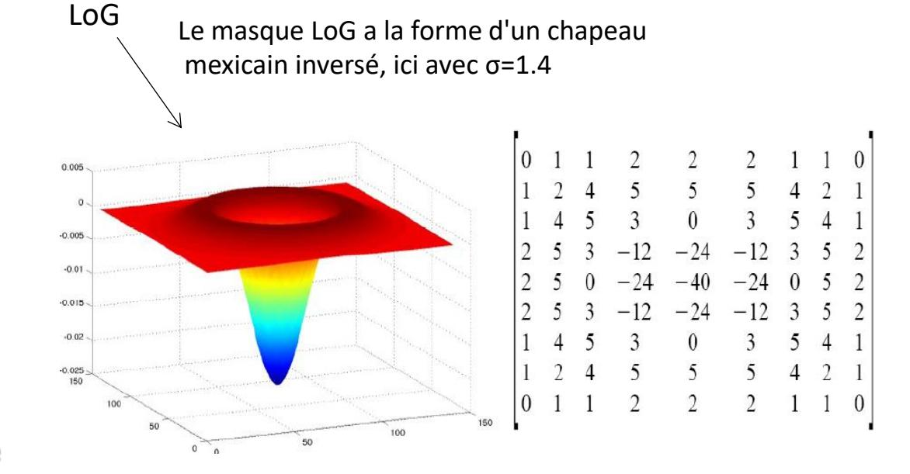

# Détection de contours (Laplacien) - LoG et passages par zéro

Image originale Image lissée

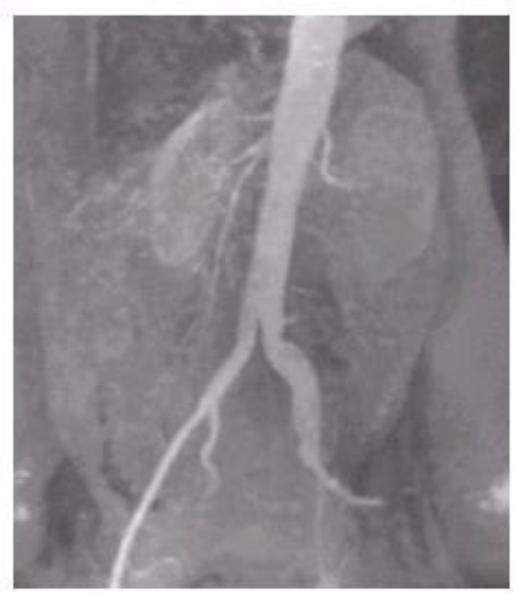

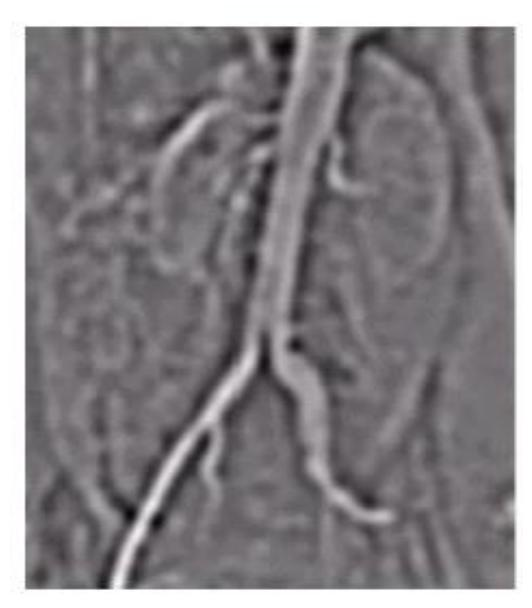

Laplacien avec passage par zéro + seuil sur l'amplitude

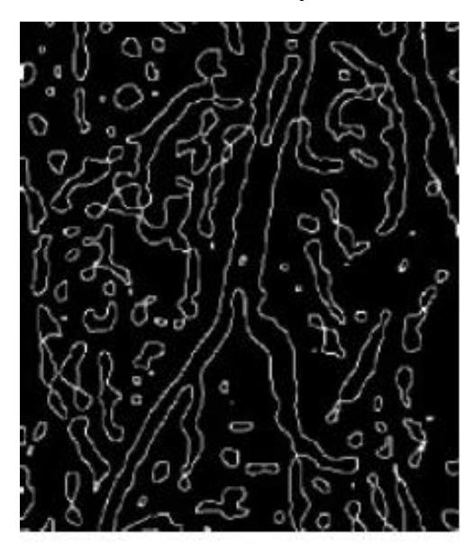

#### **Etapes:**

- 1. Lissage (Gaussien)
- 2. Renforcement (Laplacien)
- *Convolution de l'image avec le filtre LoG*
- 3. Localisation= détection des passages par zéro de l'image résultante
- 4. Seuillage = afin de ne considérer que les passages par zéro d'amplitude suffisante

# Détection de contours (Gradient) - Filtre de Canny

#### **Etapes** :

- 1. Lissage par filtre Gaussien
- 2. Calcul des Gradients sur toute l'image (avec masques de Prewitt): magnitudes et directions!
- *3. Non maxima suppression*: pour chaque pixel avec gradient non nul on cherche dans la direction du gradient les pixels qui sont des max locaux:

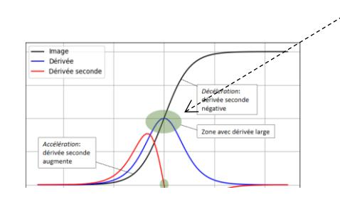

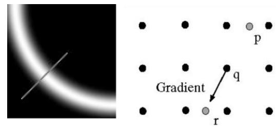

Si norme du gradient en p et r plus petit que norme du gradient en q alors on déclare q= contour

- 4. Seuillage avec deux valeurs S1 et S2 pour identifier les Gradients que l'on souhaite conserver:
  - a. Contour fort = un pixel avec gradient au dessus de S1 est retenu
  - b. Pas un contour = un pixel avec gradient au dessous de S2 est rejeté
  - c. Contour faible = un pixel avec gradient entre S1 et S2 est un contours faible. Un contours faible est retenu si l'un des 8 pixels voisins est connecté à un contour fort (gradient > S1)

### Filtre de Canny - Exemple

Image originale Gradient

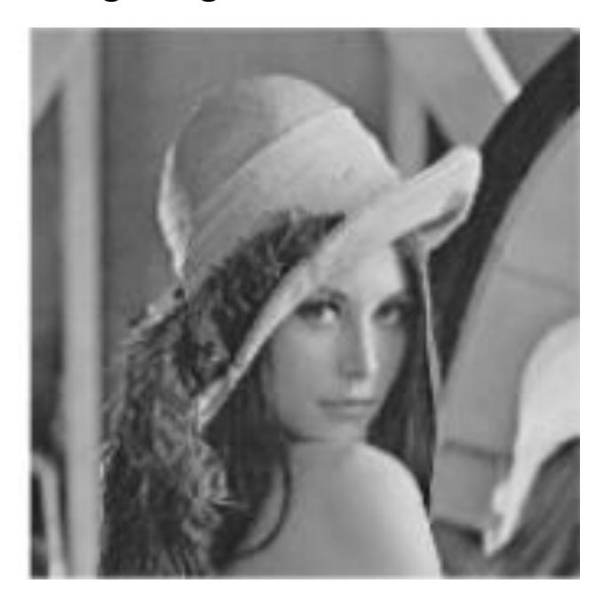

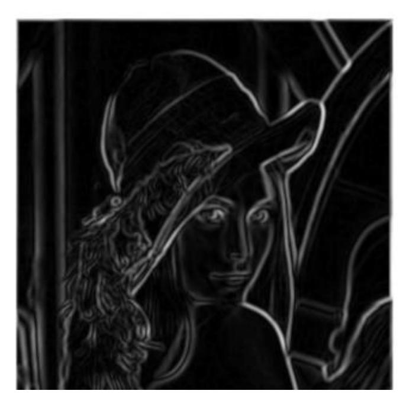

Canny (gradients amincis et seuillés, contours mieux localisés):

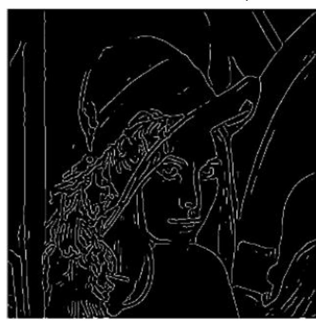

### Filtre de Canny - Exemple

#### Algorithme de Canny en Image:

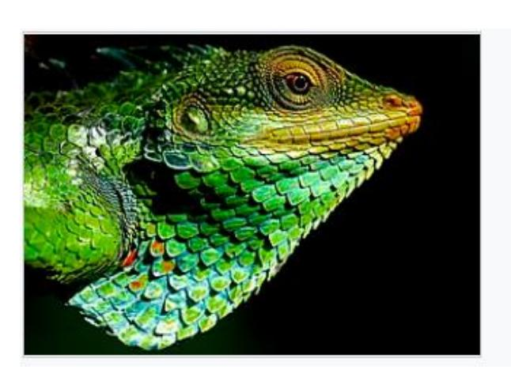

Grayscale + lissage Gradient

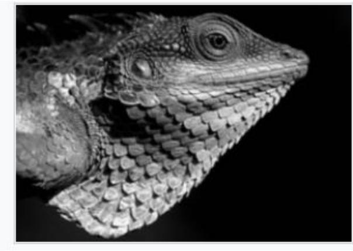

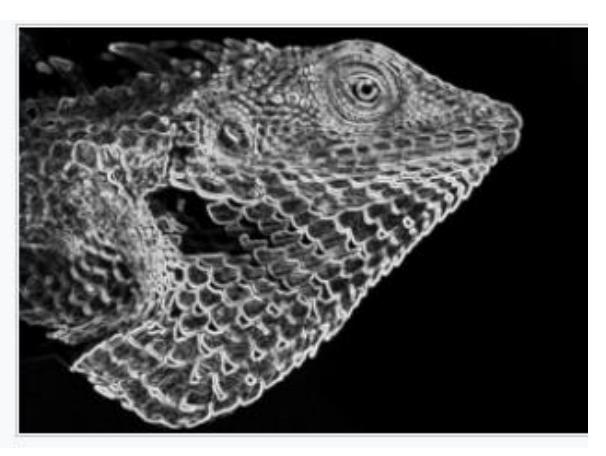

Non-maxima suppression: Seuillage double:

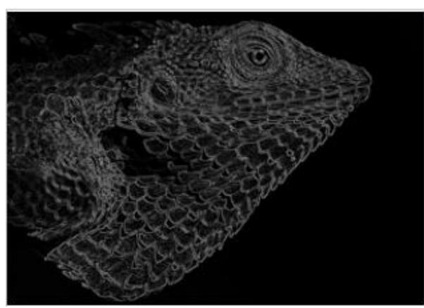

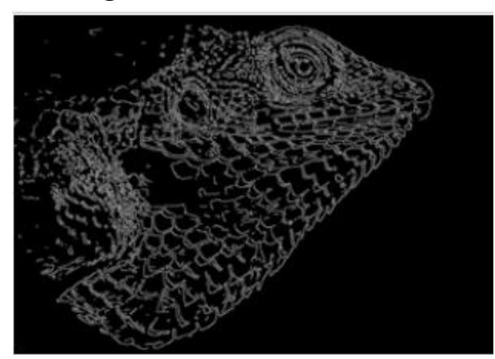

Le non maxima suppression selectionne les max locaux alors que le seuillage permet de filtrer encore pour ne garder que ceux au dessus d'un certain seuil