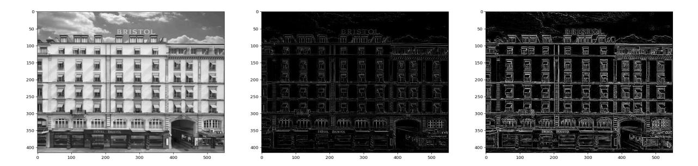
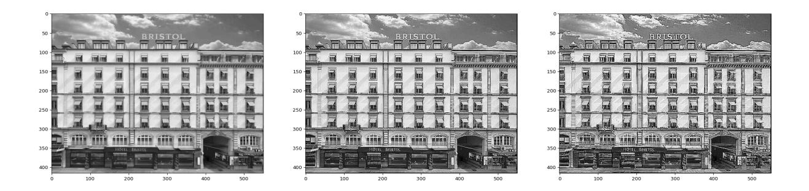
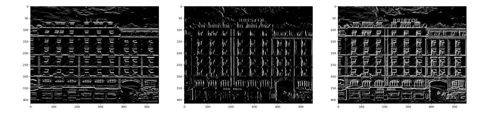
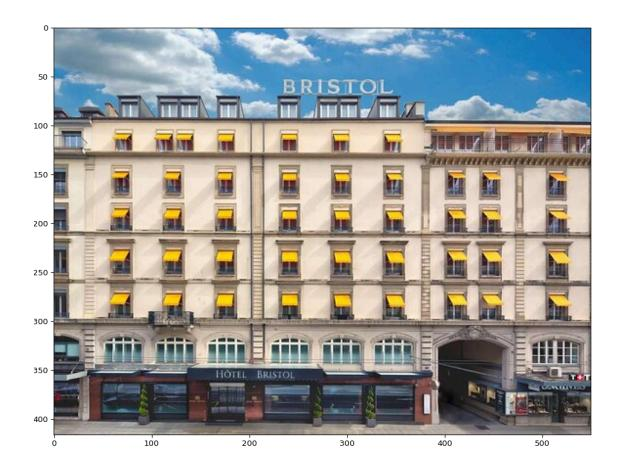
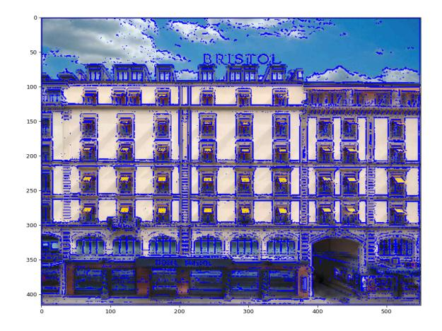

# VISION NUMERIQUE 2025-2026

<tarik.garidi@hesge.ch> <adrien.lescourt@hesge.ch>

# **LABO 4 Filtrage spatial / part 2**

## **1 Objectifs**

Ce laboratoire est la deuxième partie sur le filtrage spatial. Vous aborderez les filtres passes hauts: détections de contours.

## **2 Exercices**

### **2.1 Conversion en niveau de gris**

Écrivez une fonction numpy qui convertie une image RGB en image en niveau de gris. Vous utiliserez une approximation linéaire pour calculer l'intensité, tel que: I=0.2989\*R + 0.5870\*G + 0.1140\*B

```
def rgb_to_gray(img: Img) -> Img:
 ...
```

### **2.2 Filtre de Laplace**

Implémentez une détection de contours à l'aide du filtre de Laplace.

**Avec une isotropie de 90° et un kernel de taille 3** Avec une isotropie de 45° et un kernel de taille 3

```
class Isotropy(Enum):
 ISO_90 = 1
 ISO_45 = 2
def laplace(img: Img, isotropy: Isotropy) -> Img:
 ...
```

Appliquez vos fonctions sur l'image hotel.png, préalablement convertie en niveaux de gris.



Appliquez ensuite un seuillage pour essayer de renforcer les contours de l'image.

#### **2.3 Image sharpening**

Utilisez les deux filtres de Laplace précédent pour renforcer les contours de l'image, en sommant le filtre et l'image en niveau de gris.

```
def sharpen(img: Img, isotropy: Isotropy) -> Img:
 ...
```



#### **2.4 Détection de contours sur une image bruitée**

Ré-appliquez les détections de contours et les renforcements des exercices 2 et 3 sur l'image noisy\_hotel.png. Que constatez vous?

Prétraitez l'image avec un filtre passe bas Gaussien, puis réalisez de nouveau les traitements précédents.

La fonction suivante génère un kernel Gaussien:

```
def gauss_kernel(length: int=3, sigma: float=1.0) -> Img:
 half = (length - 1) / 2
 x_axis = np.linspace(-half, half, length)
 gauss = np.exp(-0.5 * np.square(x_axis) / np.square(sigma))
 kernel = np.outer(gauss, gauss)
 return kernel / np.sum(kernel)
```

#### **2.5 Filtre de Sobel**

Implémentez une détection de contours à l'aide du filtre de Sobel sur l'image hotel.png. Premièrement avec une détection verticale, puis horizontale, et enfin en combinant les deux.

```
def sobel(img: Img, orientation: Orientation) -> Img:
 ...
```



#### **2.6 Dessin de contours**

En reprenant la détection de contour qui vous parait la plus pertinente, dessinez les contours détectés en bleu sur l'image RGB originel.



