# **Filtrage dans le domaine fréquenciel**

**Vision Numérique** 

Tarik Garidi & Adrien Lescourt

#### La fréquence

La fréquence est une répétition dans le temps mesurée en Hertz = cycles par secondes. Elle correspond aux nombres de cycles par unité de temps. La période correspond à la durée (en secondes) pour un cycle.

$$Fréquence = \frac{Répétitions}{Unité de temps} = \frac{1}{T}$$

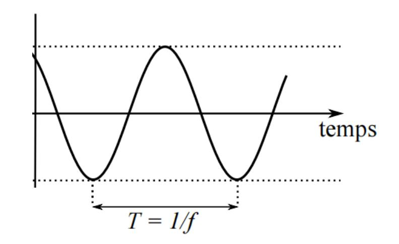

Exemple: le coeur bas 120 fois par minutes = 2 cycles par seconde = 2 Hertz et donc une période = 0.5 S

### La fréquence dans une image

Définition: La fréquence en vision numérique correspond au taux de variation d'une intensité par unité de pixel. Elle correspond aux nombres de cycles d'intensités par unité d'espace.

Fréquence Spatiale = 
$$\frac{\text{Répétitions}}{\text{Unité de longueur}} = \frac{1}{\text{Période[pixel]}}$$

Exemple: une période de 6 pixels indique que l'intensité est la même tout les 6 pixels. Dans ce cas, la fréquence = 1/6 → un pixel est 1/6 du cycle d'intensité

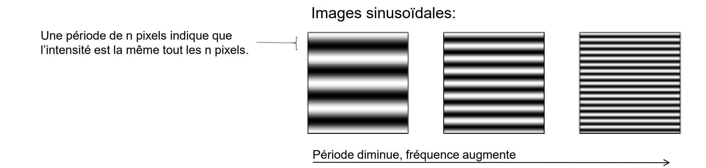

### Les fréquences dans une image en 2 D

Les sinusoïdes horizontales et verticales ont des fréquences différentes (3 cycles horizontalement et 2 verticalement). Les phase diffèrent aussi puisque les points de départ sont dé-phasés (en vert pour les cycles verticaux)

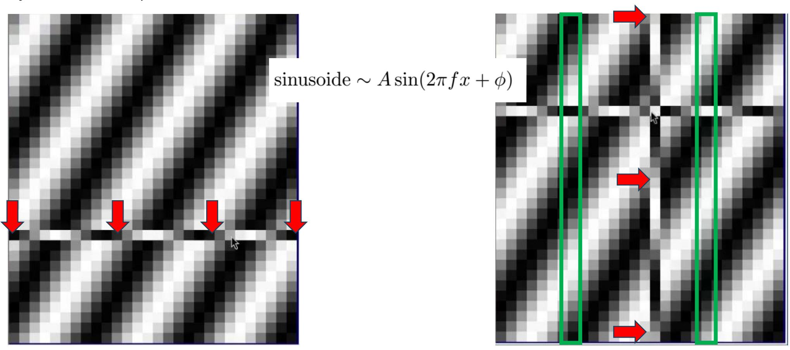

#### La fréquence dans une image

Les images peuvent être décrites comme un assemblage de hautes et basses fréquences.

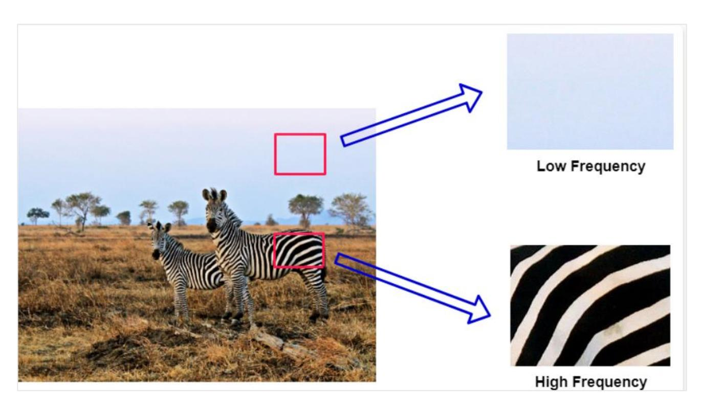

Zone de basses fréquences: variations lentes des intensités par unité de pixels.

Zone de hautes fréquences: variations rapides des intensités par unité de pixels.

#### Une image comme superposition d'images sinusoïdale

On peut décomposer une image en somme d'images sinusoïdales et l'analyse de fourier nous donne accès aux coefficients

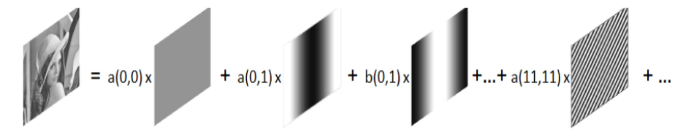

Les coefficients a(u,v) et b(u,v) sont les coéficients de Fourier de fréquences (u,v) . Ils donnent la contributions de cette fréquence dans l'image.

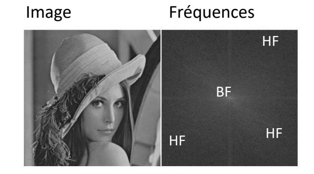

## Une image est une fonction f(x,y)

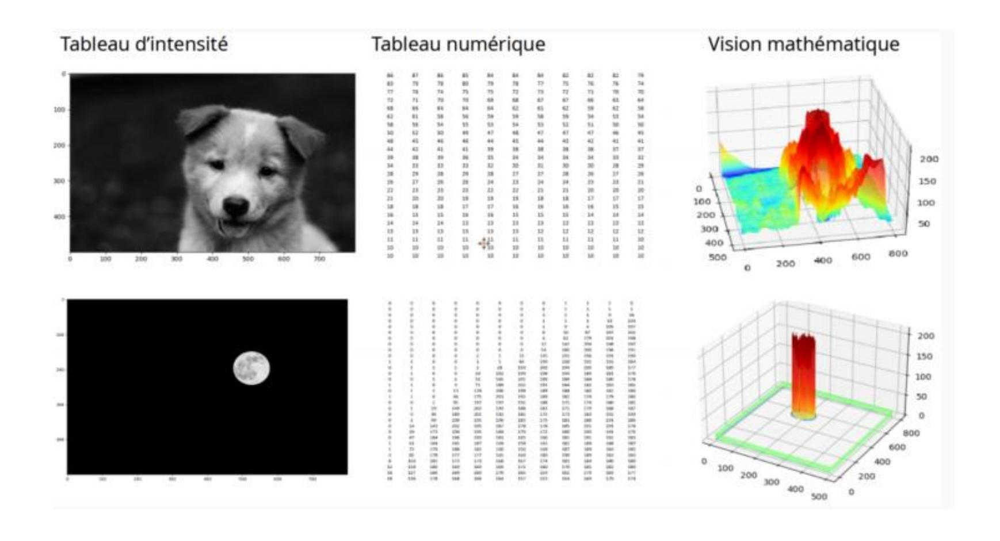

#### Séries de Fourier

Les séries de Fourier permettent de décomposer (sous certaines conditions) une fonction périodique de période T et fréquence f = 1/T en une somme infinie de signaux sinusoides dont les fréquences sont des multiples entiers de la fonction s(x)

sinusoide 
$$\sim A\sin(2\pi fx + \phi)$$

- A = amplitude
- T = période
- phi = phase

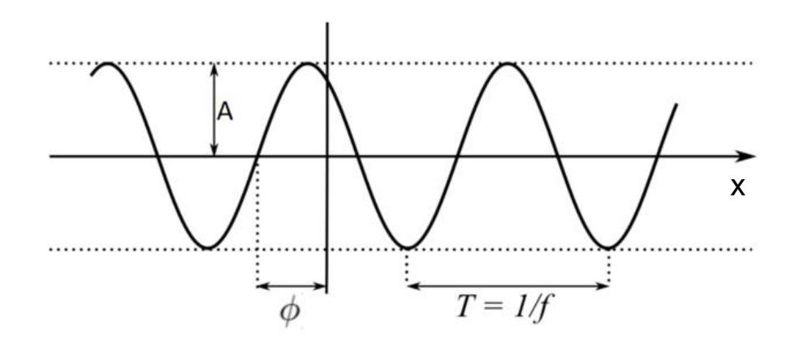

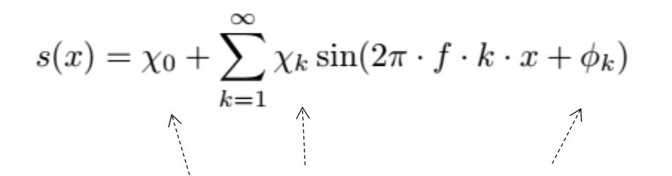

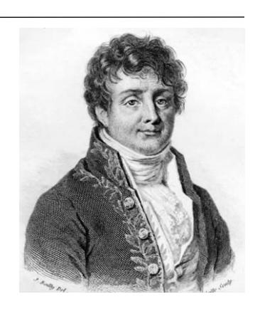

Joseph Fourier 1768-1830

- Amplitudes et phases sont donnés par la théorie de Fourier
- Ces coefficients *encodent* la quantité de chaque fréquence contenu dans le signal
- Le succès de l'utilisation de cette base (sinusoide) due en partie à l'existence de la FFT (début des années soixantes)
- On peut décrire complètement f(x) à travers amplitude et phase: c'est le domaine fréquenciel

## Séries de Fourier - Formules dans le cas réel

$$s(t) = a_0 + \sum_{k=1}^{\infty} \left( a_k \cdot \cos \left( 2\pi \cdot k \cdot f \cdot t \right) + b_k \cdot \sin \left( 2\pi \cdot k \cdot f \cdot t \right) \right)$$

$$a_0 = f \cdot \int_{-T/2}^{T/2} s(t)dt,$$

$$b_0 = 0,$$

$$a_k = 2f \cdot \int_{-T/2}^{T/2} \cos\left(2k\pi \cdot f \cdot t\right) \cdot s(t)dt,$$

$$b_0 = 0,$$

$$b_k = 2f \cdot \int_{-T/2}^{T/2} \sin\left(2k\pi \cdot f \cdot t\right) \cdot s(t)dt.$$

$$s(t) = \chi_0 + \sum_{k=1}^{\infty} \chi_k \cdot \sin(2\pi \cdot k \cdot f \cdot t + \phi_k),$$

$$\chi_0 = a_0, \qquad \chi_k = \sqrt{a_k^2 + b_k^2}$$
$$\cos(\phi_k) = \frac{b_k}{\chi_k}, \quad \sin(\phi_k) = \frac{a_k}{\chi_k}$$

*Tiré du polycopié M. Baillif*

Exemple pour la fonction dents de scie. Comme celle-ci est impaire, seul les coefficients b\_k sont non nuls:

$$s(x) = 0.636619\sin(x) - 0.318309\sin(2x) + 0.212206\sin(3x) - 0.159154\sin(4x) + 0.127323\sin(5x) - 0.10610\sin(6x) + 0.090945\sin(7x)$$

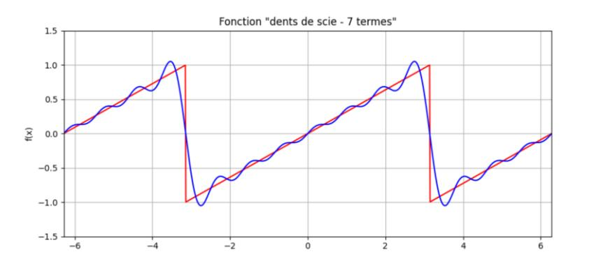

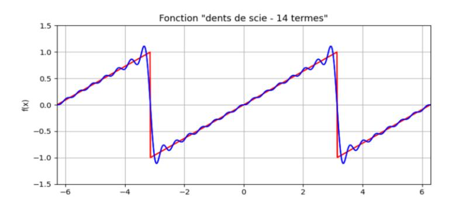

### Information dans le domaine fréquenciel

- Pour passer dans le domaine fréquentiel on a besoin d'outils pour extraire le contenu fréquenciel du signal f
- On veut également pouvoir reconstruire la fonction à partir de l'information fréquentielle

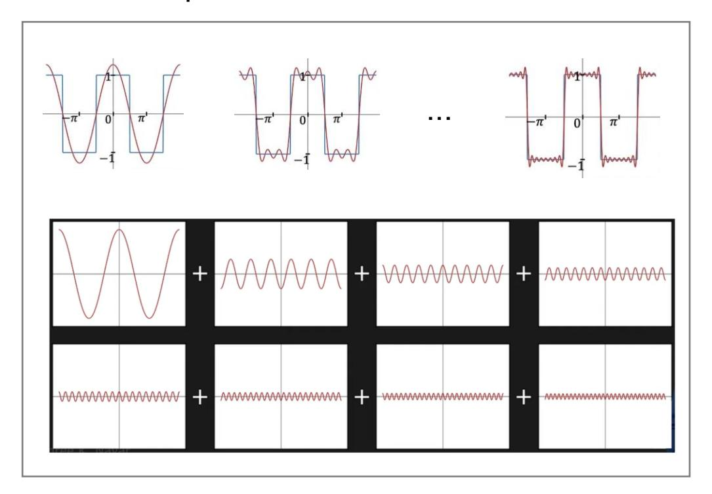

### Pas de perte d'information

#### Domaine spatial Domaine fréquentiel

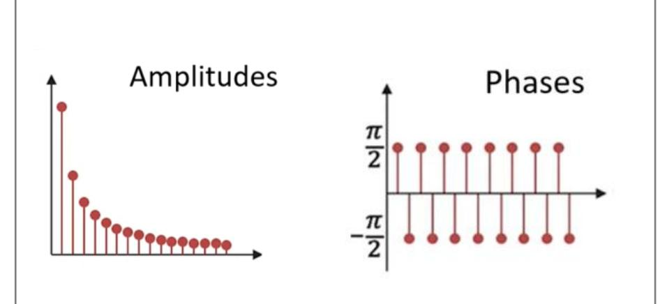

- Signature: permet de distinguer des signaux rapidement
- Compression (garde que les fréquences plus importantes
- Filtrer les fréquences qui ne nous interessent pas!

### Domaine spatial - domaine fréquenciel

Lequel des deux signaux comporte une contribution importante dans la fréquence 60Hz?

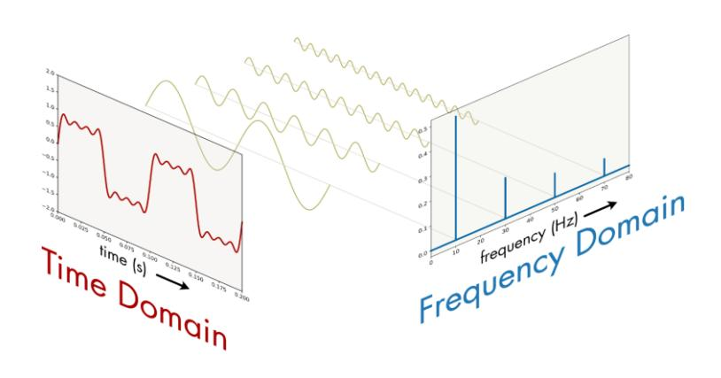

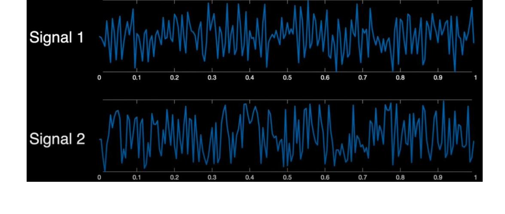

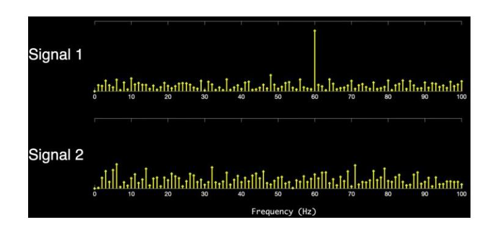

#### Outils pour extraire le contenu fréquentiel:

#### Pour des fonctions périodiques - Séries de Fourier

$$s(t) = \chi_0 + \sum_{k=1}^{\infty} \chi_k \cdot \sin(2\pi \cdot k \cdot f \cdot t + \phi_k)$$

$$s(t) = a_0 + \sum_{k=1}^{\infty} \left( a_k \cdot \cos(2\pi \cdot k \cdot f \cdot t) + b_k \cdot \sin(2\pi \cdot k \cdot f \cdot t) \right)$$

$$s(t) = \sum_{n=-\infty}^{\infty} c_n \cdot e^{i2\pi n \cdot f \cdot t},$$

*Tiré du polycopié M. Baillif*

#### Contenu spatial Contenu fréquentiel (avec phase)

$$a_k = 2f \cdot \int_{-T/2}^{T/2} \cos(2k\pi \cdot f \cdot t) \cdot s(t)dt$$

$$b_k = 2f \cdot \int_{-T/2}^{T/2} \sin(2k\pi \cdot f \cdot t) \cdot s(t)dt$$

$$c_n = f \int_{-T/2}^{T/2} e^{-i2\pi n \cdot f \cdot t} s(t)dt$$

Pour des fonctions non périodiques (plus certaines conditions) on prend la limite T → ꝏ pour obtenir la transformée de Fourier

FT: IFT:

$$s(x) = \frac{1}{2\pi} \int_{-\infty}^{\infty} \hat{s}(f) e^{i2\pi x f} dx$$

$$\hat{s}(f) = \int_{-\infty}^{\infty} s(x)e^{-i2\pi xf}dx$$

Contenu fréquentiel (avec phase) Contenu spatial

La transformée de Fourier est en général en nombre complexe. Elle contient l'information sur la phase ainsi que l'amplitude de la sinusoïde de fréquence f.

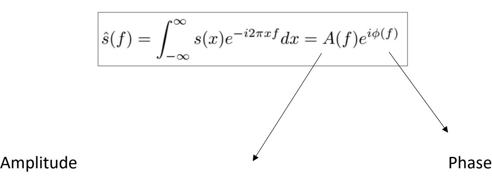

$$A(f)=|\hat{s}(f)|=\sqrt{R(f)^2+I(f)^2}$$

$$\phi(f) = \arg(\hat{s}(f)) = \tan^{-1}\bigg(\frac{I(f)}{R(f)}\bigg)$$

La transformée de Fourier est en général en nombre complexe. Elle contient l'information sur la phase ainsi que l'amplitude de la sinusoide de fréquence f.

$$s(x) = \cos(2\pi kx)$$

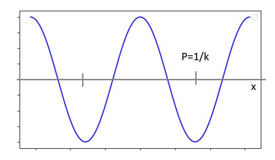

$$s(x) = \cos(2\pi k_1 x) + \cos(2\pi k_2 x)$$

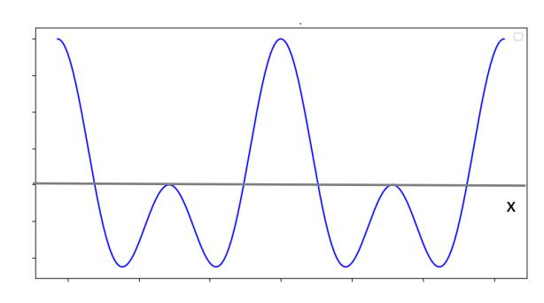

$$s(x) = 1$$

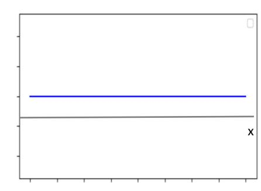

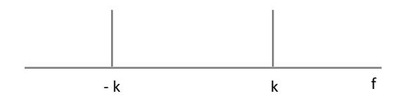

$$\hat{s}(f) = \frac{1}{2} \left( \delta(f - k) + \delta(f + k) \right)$$

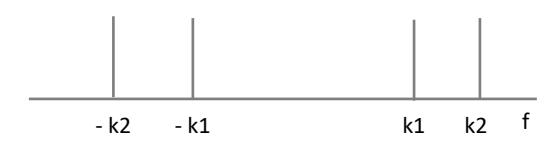

$$\hat{s}(f) = \frac{1}{2} \left( \delta(f - k_1) + \delta(f + k_1) + \delta(f - k_2) + \delta(f + k_2) \right)$$

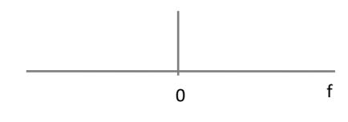

$$\hat{s}(f) = \delta(f)$$

Fonction "box" avec largeur variable: les contours abruptes nécessitent une superposition de beaucoup de fréquences:

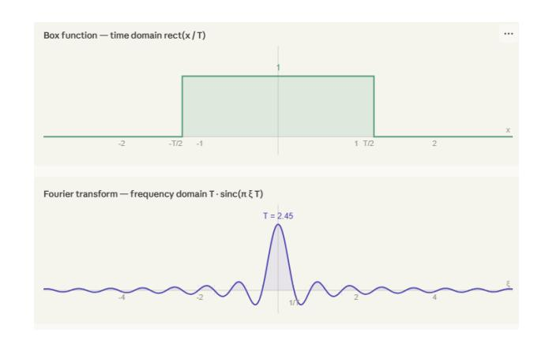

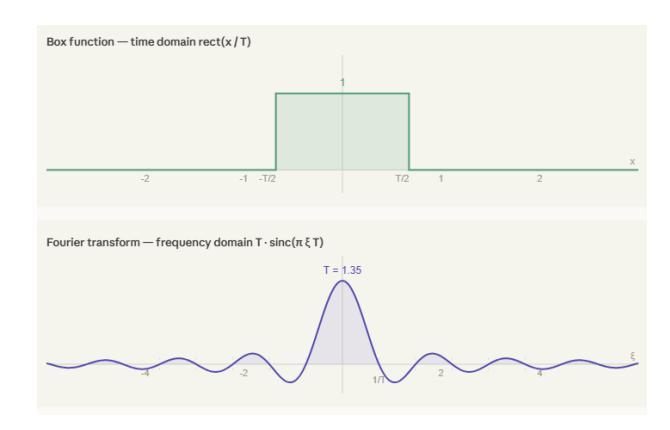

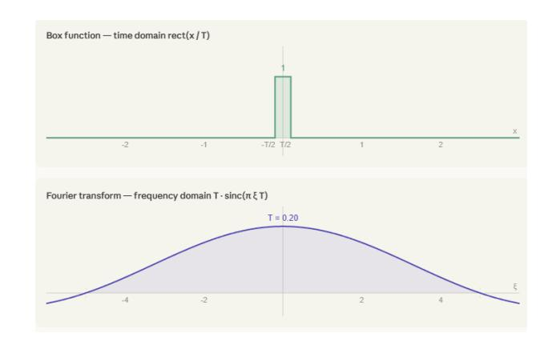

Fonction "delta" nécessite une superposition de toutes les fréquences:

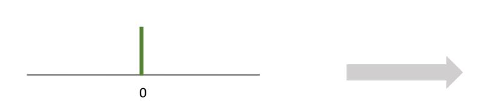

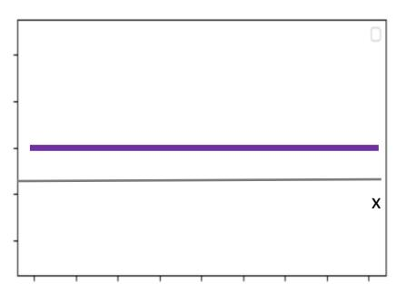

Fonction "box" avec largeur variable: la transformée de Fourier est "comprimée" lorsque la box est plus large

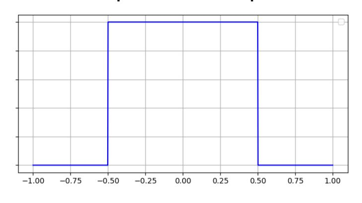

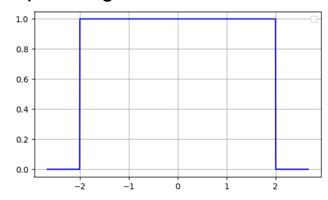

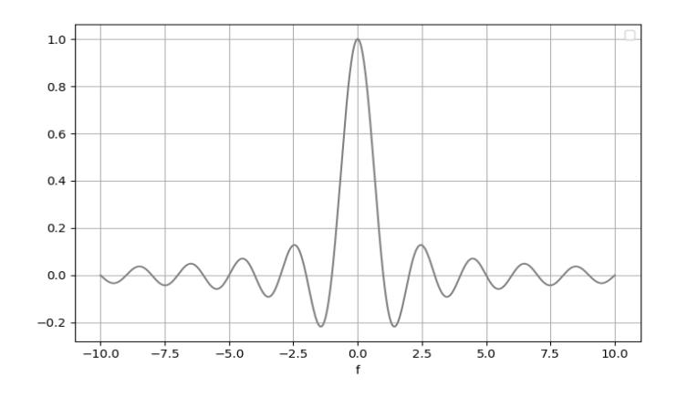

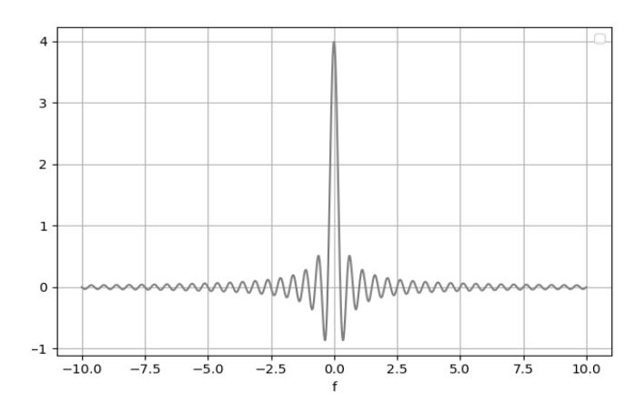

#### La transformée de Fourier de la Gaussienne est une Gaussienne

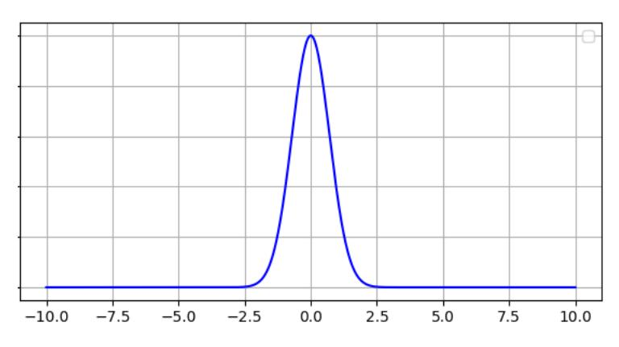

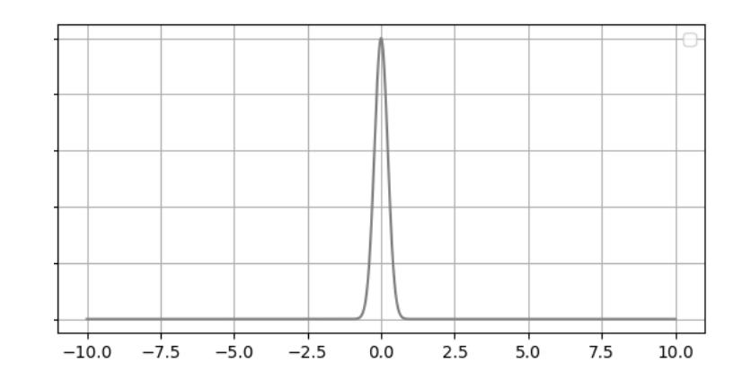

#### Convolution

La convolution de s(x) avec h(x) est une fonction de x:

$$g(x) = (s * h)(x) = \int_{-\infty}^{\infty} s(\tau)h(x - \tau)d\tau$$

Permet de construire une troisième fonction qui exprime la facon dont la forme de l'une est influencée par la forme de l'autre.

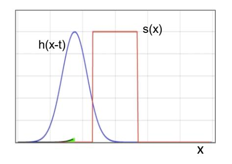

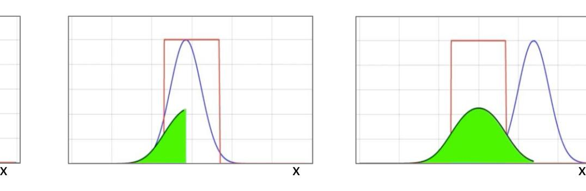

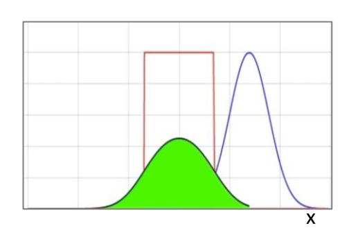

#### Etapes pour construire g(x):

- 1. Prendre h(τ) → flip h(-τ)
- 2. Placer en x → h(x-τ)
- 2. Calcul du produit s(τ) h(x-τ)
- 3. Integration
- 4. Recommencer pour un nouveau x

#### Théorème de la convolution

On calcule la transformée de Fourier de la convolution:

$$\hat{g}(f) = \int_{-\infty}^{\infty} g(x)e^{-i2\pi xf}dx = \int_{-\infty}^{\infty} \int_{-\infty}^{\infty} s(\tau)h(x-\tau)d\tau e^{-i2\pi xf}dx$$

$$= \int_{-\infty}^{\infty} s(\tau)e^{-i2\pi \tau f}d\tau \int_{-\infty}^{\infty} h(x-\tau)e^{-i2\pi(x-\tau)f}dx$$

$$= \hat{s}(f)\hat{h}(f)$$

| Domain spatial | Domaine fréquentiel |
|----------------|---------------------|
|                |                     |
|                |                     |

En particulier, pour filtrer un signal:

- 1) Applique FT: on passe en fréquenciel
- 2) La convolution est un produit en fréquenciel
- 3) Applique IFT : retour domaine spatial

#### Théorème de la convolution - exemple

#### Lissage Gaussien en domaine fréquenciel

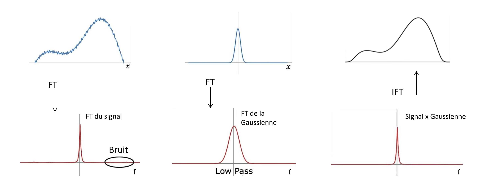

### Digitalisation - Transformée de Fourier discrète

Soit un signal de longueur (spatiale) L. On considère que L est la période du signal qui se répète ensuite à l'infini. On travaille avec un échantillon de M éléments avec période d'échantillonnage , .

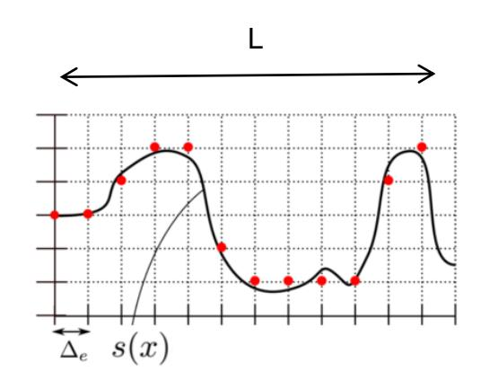

$$f = \frac{1}{L}$$
 mais comme  $L = \Delta_e M$   $\Longrightarrow f = \frac{1}{L} = \frac{1}{M\Delta_e} = \frac{f_e}{M}$ 

$$\hat{s}(f) = \int_{-\infty}^{\infty} s(x)e^{-i2\pi xf}dx$$

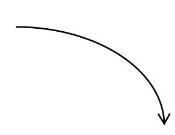

- 1. Intégrale devient une somme:
- 2. Variable spatiale devient discrète:

$$x \text{ continu} \longrightarrow x\Delta_e \quad \text{avec } x = 0, ..M - 1$$

3. Fréquences possibles comme k multiples de la fréquence du signal

$$f \text{ continu} \longrightarrow f_k = \frac{kf_e}{M} \quad \text{avec } k = 0, ..M - 1$$

DFT = discrete Fourier transform

$$\hat{s}(f_k) = \sum_{x=0}^{M-1} s(x)e^{-i2\pi \frac{xk}{M}}$$

### Transformée de Fourier discrète - remarques

On peut écrire la DFT comme un changement de base (multiplication de matrices)

$$\hat{s}(f_k) = \sum_{x=0}^{M-1} s(x)e^{-i2\pi \frac{xk}{M}}$$

$$\begin{pmatrix} \hat{s}_0 \\ \hat{s}_2 \\ \vdots \\ \hat{s}_{M-1} \end{pmatrix} = \begin{pmatrix} k = 0 & \longrightarrow \\ k = 1 & \longrightarrow \\ \vdots \\ k = M-1 & \longrightarrow \end{pmatrix} \begin{pmatrix} s_0 \\ s_2 \\ \vdots \\ s_{M-1} \end{pmatrix}$$

Matrice MxM de Sinusoides en version discrète avec pour chaque ligne la sinusoide avec fréquences k =0,1,..

Lorsque M est petit, ce calcul est rapide. La FFT permet de faire ce calcul de manière efficace lorsque M est grand en exploitant les symmétries du problème. Notamment en utilisant le fait que la DFT est périodique (période M = taille échantillonnage)

$$\hat{s}(f_k) = \hat{s}(f_{k+M})$$

### Transformée de Fourier discrète en 2D

Pour une image de dimension MxN, la transformée de Fourier et la transformée inverse sont donné par:

$$\hat{s}(p,q) = \sum_{x=0}^{M-1} \sum_{y=0}^{N-1} s(x,y) e^{-i2\pi \left(\frac{px}{M} + \frac{qy}{N}\right)} \qquad s(x,y) = \frac{1}{MN} \sum_{p=0}^{M-1} \sum_{q=0}^{N-1} \hat{s}(p,q) e^{i2\pi \left(\frac{px}{M} + \frac{qy}{N}\right)}$$

Le spectre ainsi que la phase sont calculés de la manière suivantes:

$$|\hat{s}(p,q)| = \left[ Re^2(p,q) + Im^2(p,q) \right]^2$$
  $\phi(p,q) = tan^{-1} \left( \frac{Im(p,q)}{Re(p,q)} \right)^2$ 

### Spectre d'une image - Représentation des amplitudes

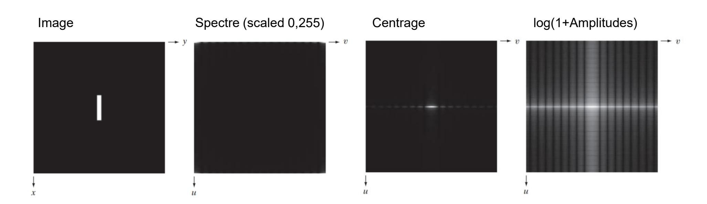

#### Invariance par translation:

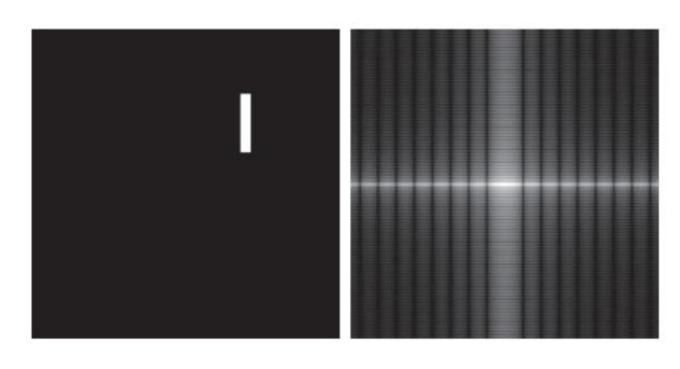

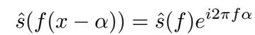

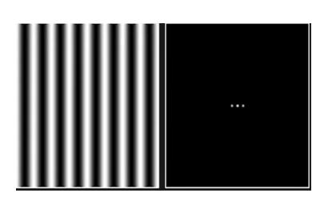

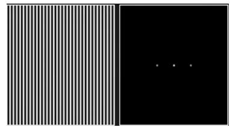

Linéarité (deux cosinus avec fréquences k1 et k2)

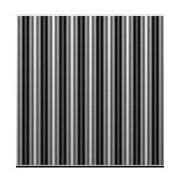

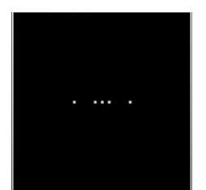

#### Spectre d'une image - Représentation des amplitudes

*Certain exemples sont tiré du cours en ligne de Shree Nayar,* 

*Columbia University*

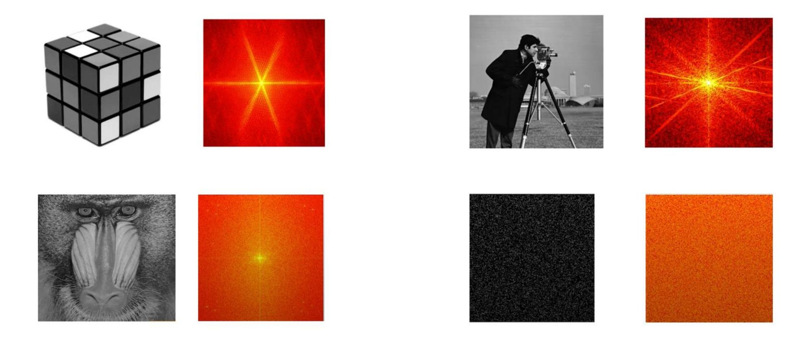

### Filtrage fréquentiel - Exemple Gaussien

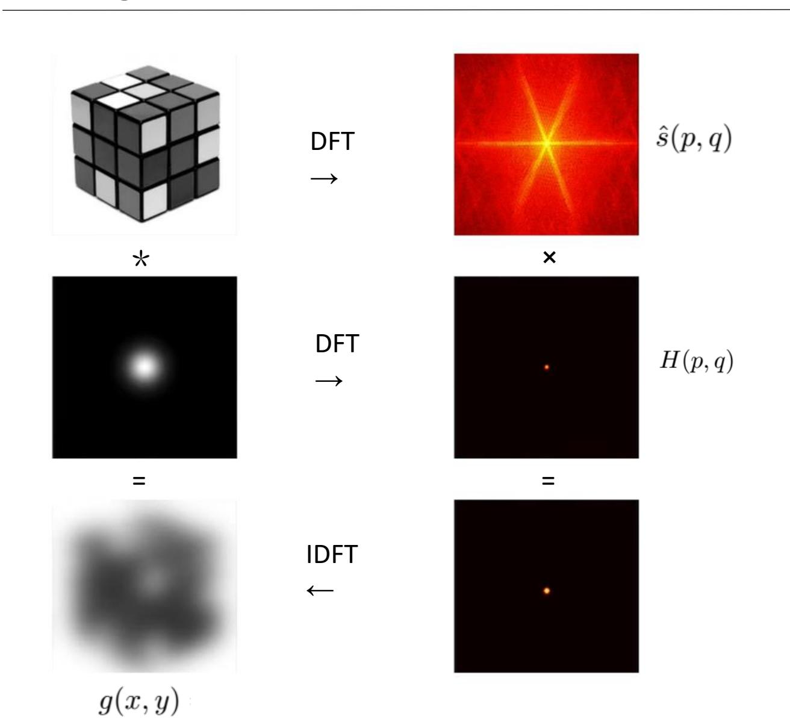

Les étapes fondamentales pour filtrer dans le domaine de fréquence:

$$g(x, y) = \text{Real} \left[ \text{ IDFT} \left( H(p, q) \hat{s}(p, q) \right) \right]$$

Comme dans le domaine spatial, la variété de filtres possibles est donné par les formes de H(p,q): le filtre, fonction de transfert

#### Passe-Bas

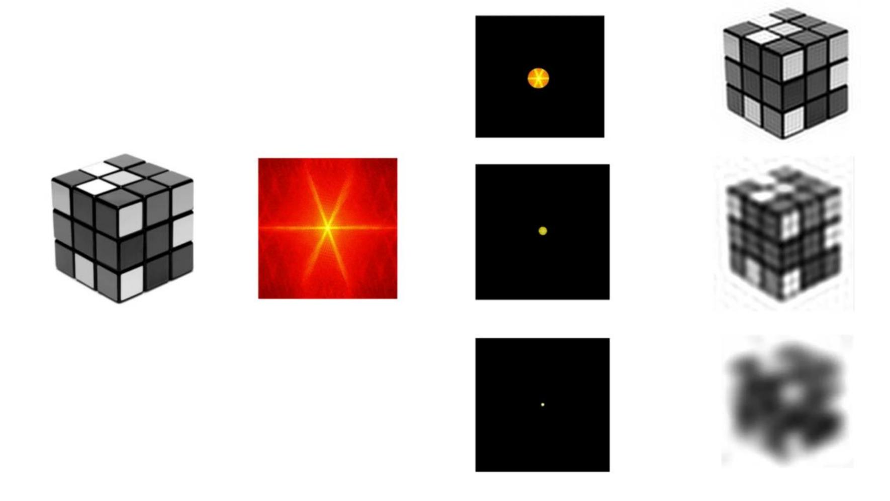

#### Passe-Haut

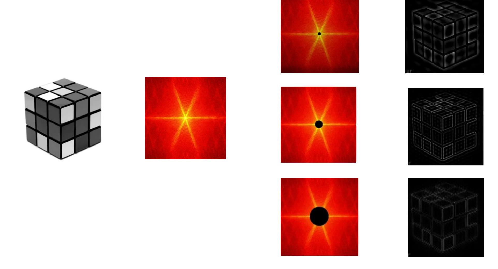

#### Quelques filtres dans le domaine fréquenciels:

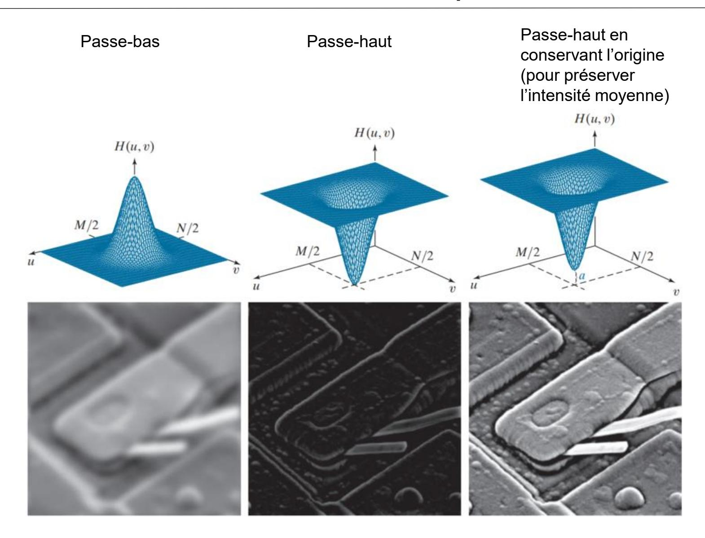

#### Quid de la phase?

Le contenu en terme de phase dans le domaine fréquentiel porte l'essentiel de la forme reconnaissable!

$$\hat{s}(f) = \int_{-\infty}^{\infty} s(x)e^{-i2\pi xf} dx = A(f)e^{i\phi(f)}$$

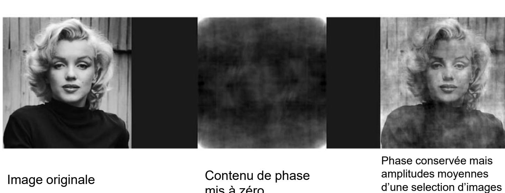

mis à zéro

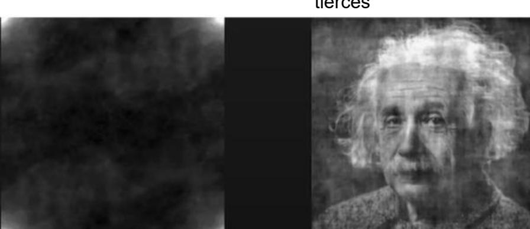

tierces

Phase

#### Annexes

### Filtrer les fréquences

Filtres passe-bas (low pass): lissage/floutage, on garde les fréquences basses

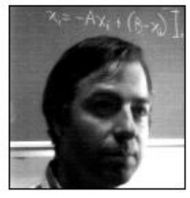

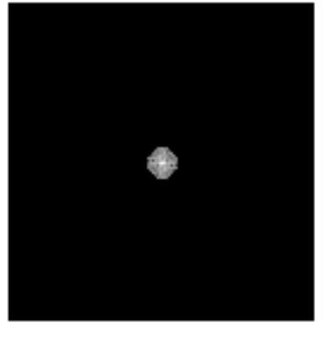

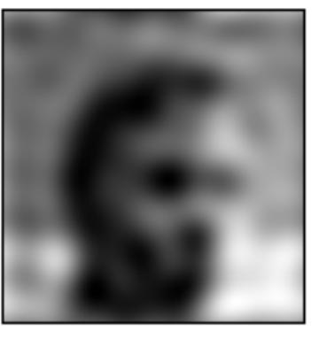

• Les hautes fréquences spatiales correspondent à un niveau de gris qui varie fortement sur quelques pixels, par exemple, dans une zone de l'image très texturée, sur les contours,..

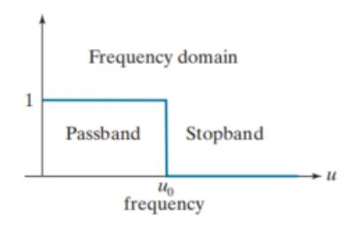

• Les basses fréquences spatiales correspondent à une variation lente du niveau de gris, par exemple dans une zone de dégradé.

Filtres passe-haut (high pass): détection de contours, on garde les fréquences hautes

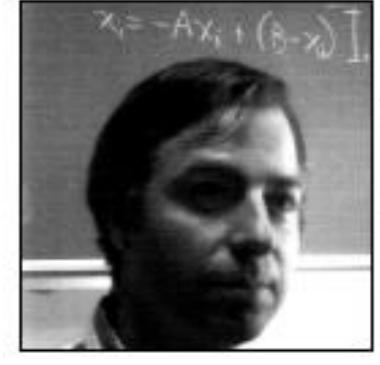

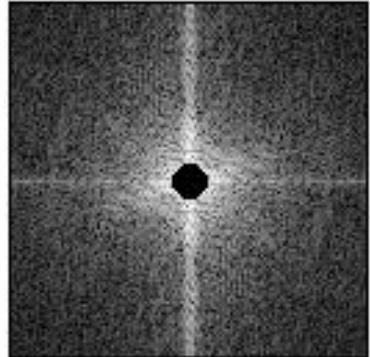

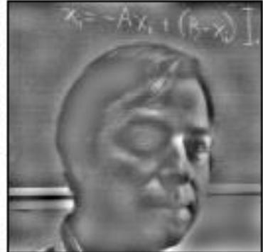

### Retour vers le domaine spatial

Le **domaine de fréquences** correspond à la représentation de l'image en terme de fréquences spatiales du signal, le long des lignes ou le long des colonnes de l'image.

Le **domaine spatiale** correspond au plan (x,y) de l'image elle-même. Les transformations dans ce domaine se caractérisent par des manipulations sur les pixels de l'image.

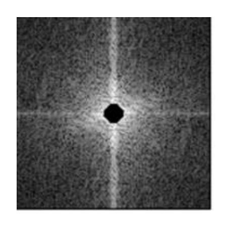

Tranformations de Fourier et son inverse:

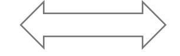

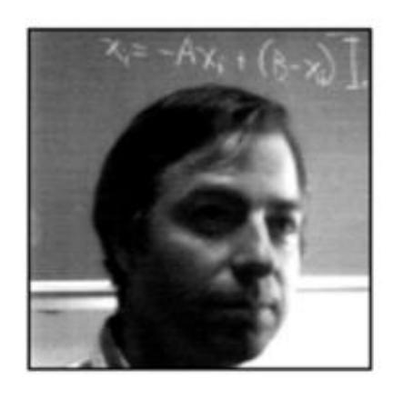

- Lissage/floutage
- Détection de contours

Les filtres sont implémentés par des correlations/convolutions. Opérations potentiellement couteuses qui impliquent le voisinnage du pixel que l'on manipule. Les opération de filtrage sont souvent plus rapide dans ce domaine car les filtres sont des multiplications!

### Digitalisation - *Aliasing* (une fausse identité)

Les signaux sont différents mais leurs versions digitalisés sont identiques:

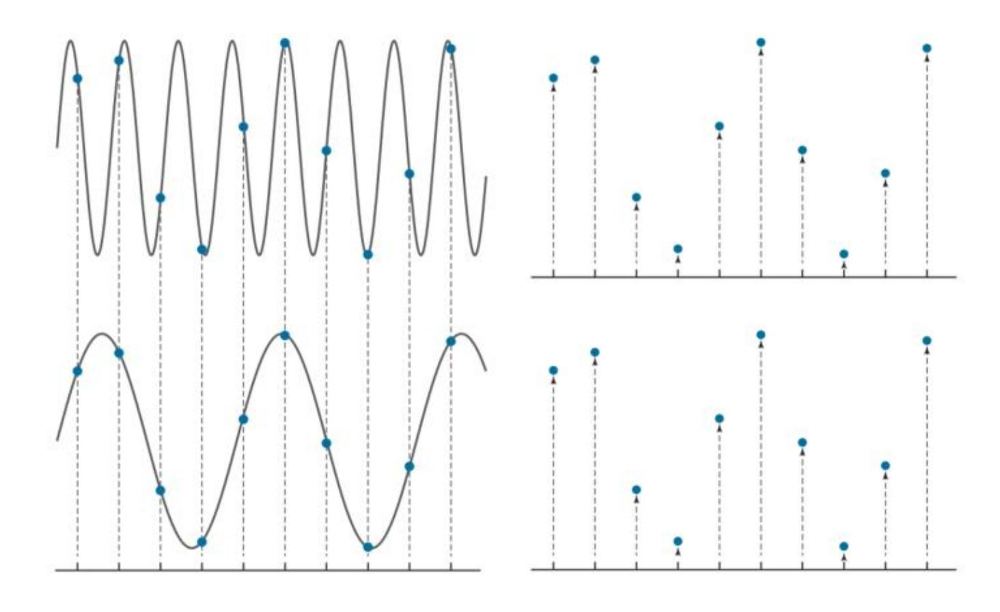

#### Digitalisation - Sampling

A quelle fréquence doit-on sampler le signal (l'image) afin de ne pas perdre de l'information (équivalent à dire que la transformée de Fourier ne change plus)?

#### Echantillonnage adéquat:

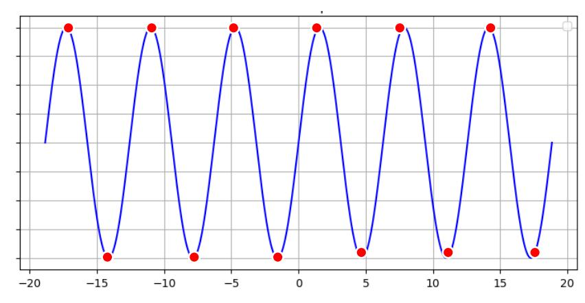

#### Sous-échantillonnage:

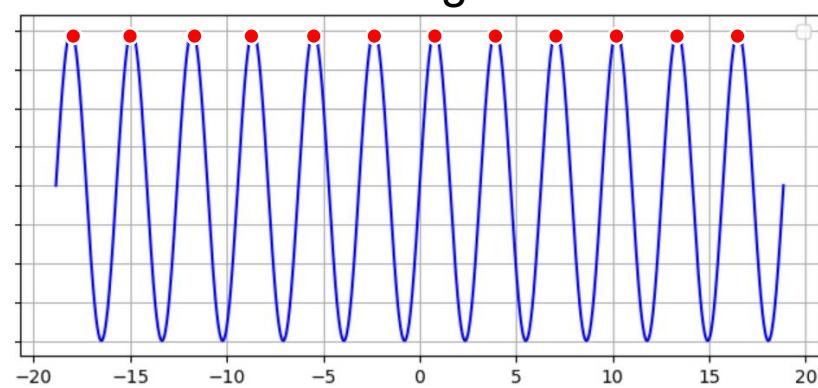

Théorème d'échantillonnage de *Nyquist-Shannon* : La représentation discrète d'un signal exige des échantillons régulièrement espacés à une fréquence d'échantillonnage supérieure au double de la fréquence maximale présente dans ce signal.

Echantillonnage à la fréquence de Nyquist (1/2 Fmax) éxactement peut-être problématique

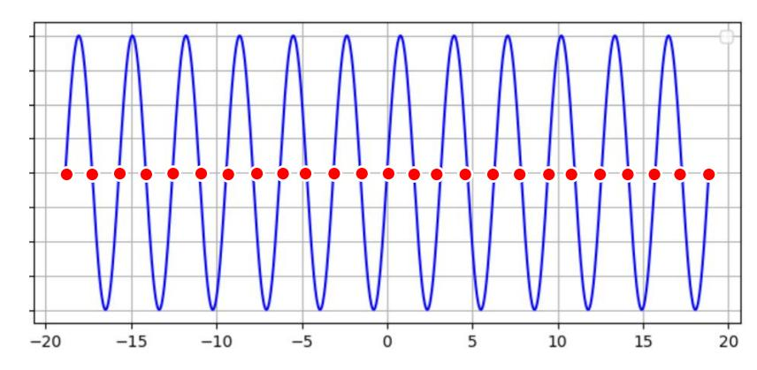