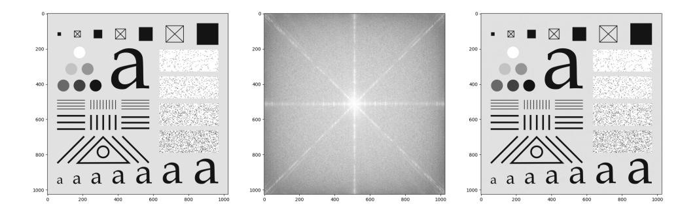

# VISION NUMERIQUE 2025-2026

<tarik.garidi@hesge.ch> <adrien.lescourt@hesge.ch>

# **LABO 5 Filtrage dans le domaine fréquenciel**

### **1 FFT, spectres d'amplitudes et iFFT**

En vous basant sur le laboratoire du cours de TSI, écrivez les fonctions suivantes:

```
# Retourne la FFT de l'image img
def get_fft(img: Img) -> Fft:
 ...
```

```
# Retourne une représenation visuel des spectres d'amplitudes d'une 
image
def get_fft_spectrum(fft: Fft) -> Img:
 ...
```

```
# Retourne une image depuis sa FFT
def get_img(fft: Fft) -> Img:
 ...
```

avec le type Fft définit ainsi:

```
Fft = npt.NDArray[np.complex128]
```

Utilisez vos fonctions sur l'image testpattern1024.png afin d'effectuer une FFT, d'afficher le spectre d'amplitudes et de revenir dans le domaine spacial.



#### **2 Observations**

Affichez et observez les spectres d'amplitures pour les images suivantes:

- horizontal.png
- vertical.png
- diag.png
- square.png
- noise.png
- testpattern1024.png
- testpattern1024.png après un median blur
- hotel.png
- hotel.png après un filtre de Laplace

### **3 Filtres**

Concevez et mettez en œuvre un filtre passe-bas ainsi qu'un filtre passe-haut dans le domaine fréquentiel. Ensuite, procédez à une comparaison des résultats obtenus avec ceux issus de vos filtres spatiaux, en évaluant à la fois la qualité du filtrage et les performances computationnelles. Expérimentez en ajustant les paramètres de ces filtres afin de mettre en évidence les avantages et inconvénients des filtres fréquentiels par rapport à leurs homologues spatiaux.