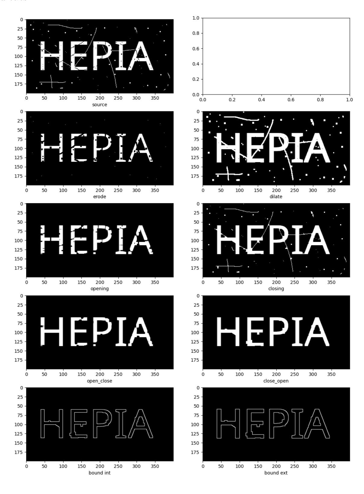

# VISION NUMERIQUE 2025-2026

<tarik.garidi@hesge.ch> <adrien.lescourt@hesge.ch>

# **LABO 6 Morphologies**

## **1 Objectifs**

Prise en main d'OpenCV et morphologies binaires.

### **2 Exercices**

### **2.1 Mise en place**

Installez OpenCV <https://opencv.org>sur votre machine ou dans votre environnement virtuel puis testez avec:

```
import cv2 as cv
print(cv.__version__)
```

### **2.2 Morphologies binaires**

Utilisez les méthodes erode, dilate, morphologyEx, getStructuringElement d'OpenCv pour appliquer les transformations suivantes:

- Erosion
- Dilatation

- Ouverture
- Fermeture
- Ouverture puis fermeture
- Fermeture puis ouverture
- Contours exterieurs (appliqué à 'fermeture puis ouverture')
- Contours interieurs (appliqué à 'fermeture puis ouverture')

Vous devez choisir la taille, la forme de l'élément structurant ainsi que le nombre d'itération de leur application à l'image source qui donneront les meilleurs résultats.

