# **Morphologie Vision Numérique**

Tarik Garidi & Adrien Lescourt

## Morphologie Mathématique

**Morphologie Mathématique** (du grec: -logie => étude, morpho => formes):

- Étude des formes à l'aide d'outils mathématiques (1964 Matheron/Serra, Ecole des Mines de Paris).
- Permet d'extraire des composants d'une image, décrire la forme d'une région: applications en terme de filtrage, segmentation, contour, squelette, …

**Idée de base:** étudier un ensemble à l'aide d'un autre ensemble, appelé **élément structurant**, qui sert de sonde. Il est promené sur l'image à traiter, et à chaque position on étudie la relation des deux ensembles.

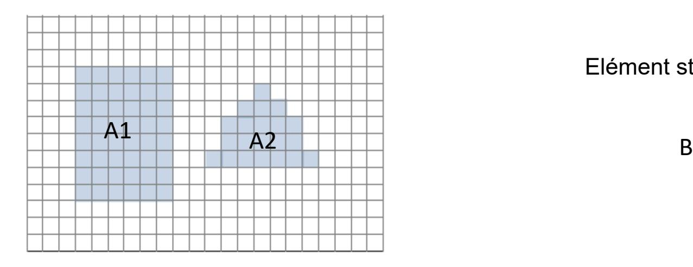

Elément structurant et son origine

## Opérations Morphologiques

Construction d'ensembles qui décrivent la relation entre l'élément structurant et l'ensemble à étudier. On utilise la **translation** pour déplacer (à la manière d'une convolution) l'élément structurant:

$$(B)_z = \{c|c = b + z, \text{ pour } b \in B\}$$

Voici un nouvel ensemble:

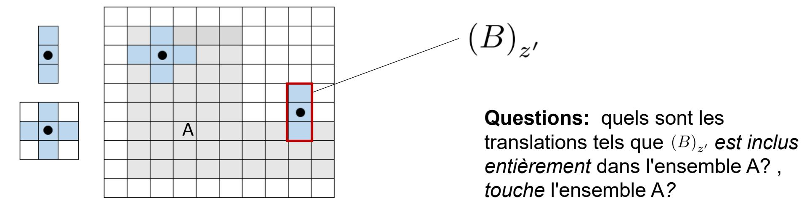

On choisira l'élément structurant en fonction de la tâche à accomplir.

# Opération fondamentale - Erosion

L'érosion d'un ensemble A par un élément structurant B correspond à la recherche de l'ensemble des points z sur lesquels on peut placer l'élément structurant tel que celui-ci soit entièrement contenu dans A:

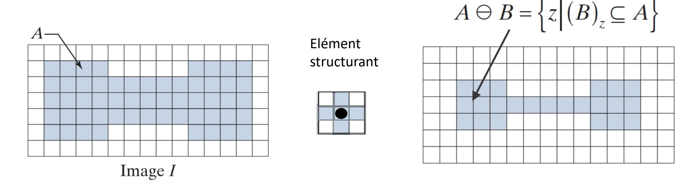

#### Permet *d'amincir* un objet:

- Filtrer: les détails plus petit que SE sont supprimé
- Rétrécir les objets d'une taille selon la taille de l'élément structurant
- Séparer les objets au niveau de leurs étranglements
- On peut éroder plusieurs fois..

#### Exemple d'éléments structurants:

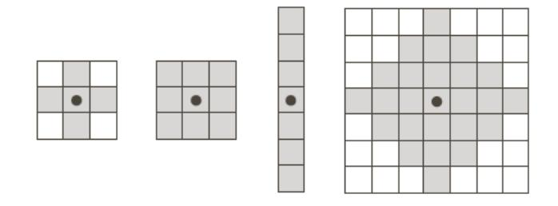

## Erosion - Exemples

Erosion du disque bleu foncé par

un cercle:

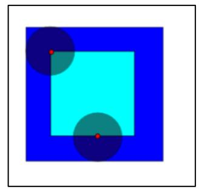

#### Eléments structurants différents:

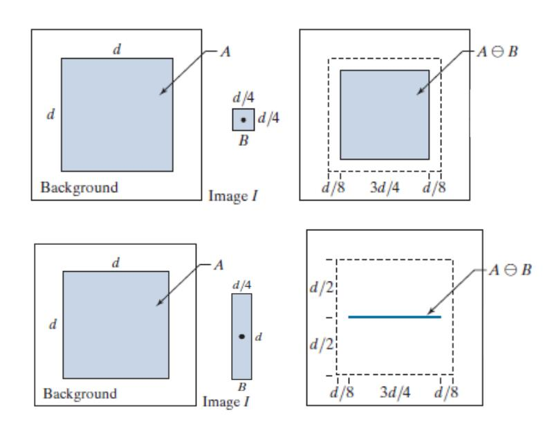

#### Amincir certain éléments d'une image:

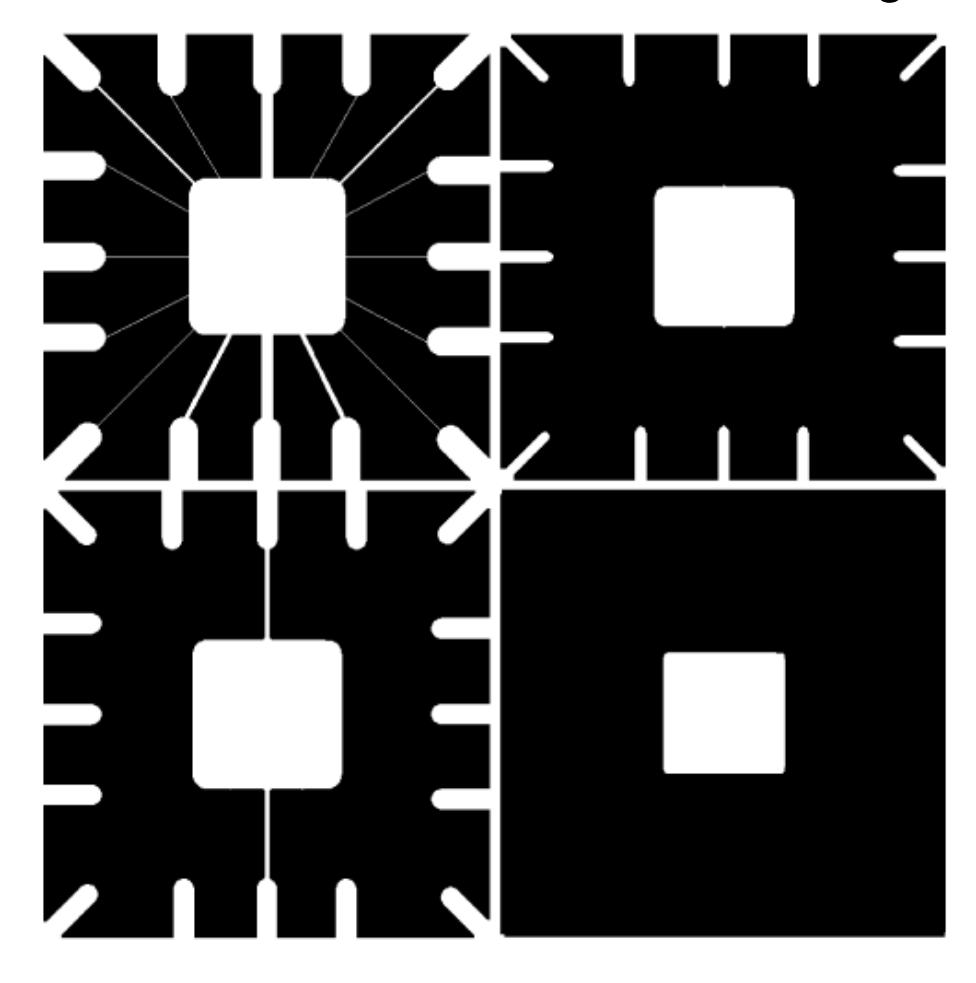

## Opération fondamentale - Dilatation

La dilatation d'un ensemble A par un élément structurant B correspond à la recherche de l'ensemble des points z sur lesquels on peut placer l'élément structurant tel que celui-ci ait au moins un pixel contenu dans A:

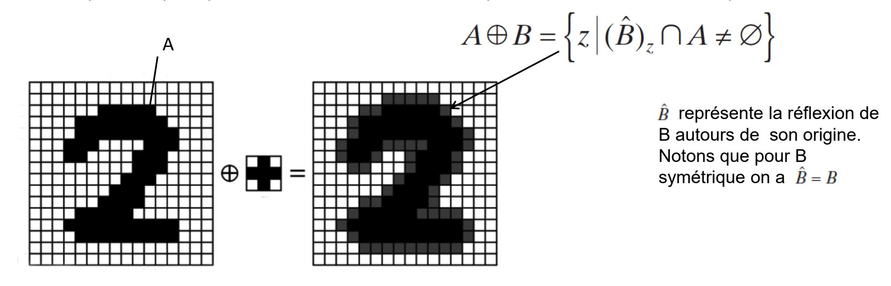

#### Permet *d'épaissir* un objet:

- Elargir les objets d'une taille correspondant à la taille de l'élément structurant.
- Connecter les objets quand ils sont suffisament proches;
- Combler les trous étroits présents dans les objets
- On peut dilater plusieurs fois..

## Dilatation - Exemples

Dilatation du disque bleu foncé par

un cercle:

# Eléments structurants différents:

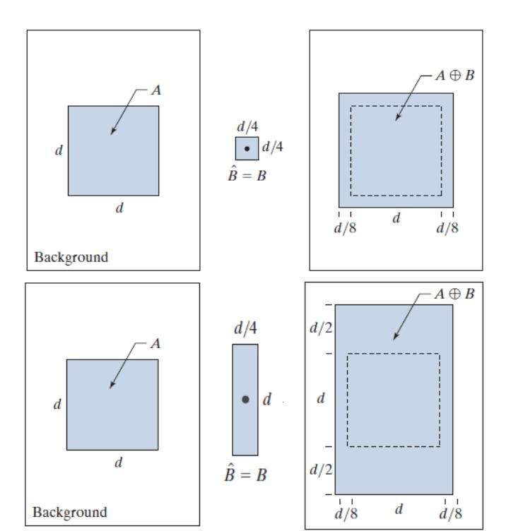

Epaississement des caractères d'un texte:

## Gradient morphologique - Contours

Pour identifier les pixels sur le contour d'un objet on peut effectuer les opérations suivantes

- Gradient externe =Pixels du background ajoutés lors de la dilatation
- Gradient interne = Pixels de l'objet retirés par l'érosion
- Gradient Morphologique =

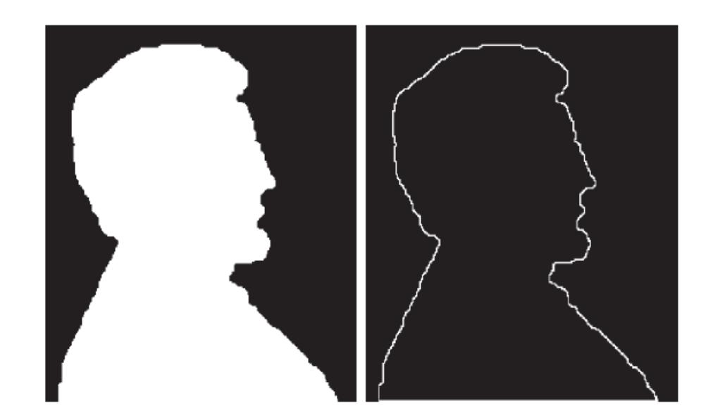

La figure représente un exemple de détection de contour par gradient interne en utilisant un élément structurant 3x3

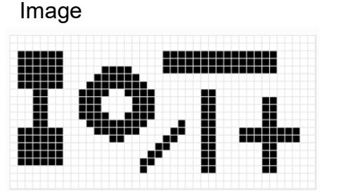

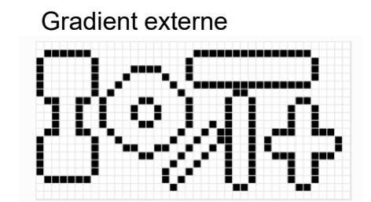

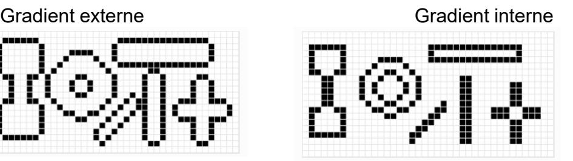

Somme des gradients interne et externe

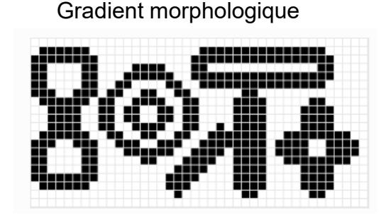

# Idée: combiner érosion et dilatation

**Question**: est-ce qu'érosion et dilatation sont des opérations inverse:

**Réponse**: non. En effet: l'érosion peut créer du vide qui ne pourra plus être rempli alors que la dilatation peut combler des trous qui pourront plus être crée par érosion..

Dualité: Erosion et dilatation sont 2 opérations duales vis-à-vis de la complémentation:

• On obtient le même ensemble en érodant/dilatant A (l'objet) puis en prenant le complémentaire du résutat qu'en dilatant/érodant le complémentaire de A (le *background*)

$$(A \ominus B)^c = A^c \oplus \hat{B}$$
  $(A \oplus B)^c = A^c \ominus \hat{B}$ 

• A strictement parler on pourrait donc n'utiliser qu'un seule des ces opérations + complémentation et inversion de B

# Combinaisons érosion/dilatation

+ Erosion

Dilatation

Pour l'image ci-dessous, avec l'élément structurant B, essayons de combiner érosion et dilatation

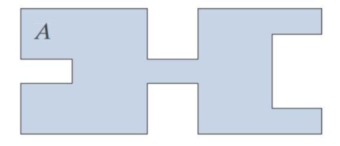

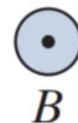

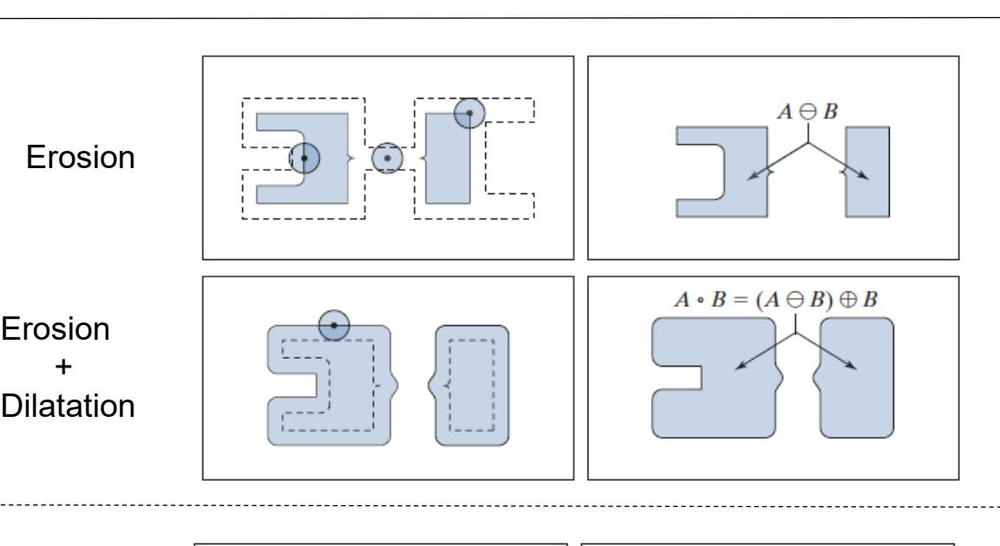

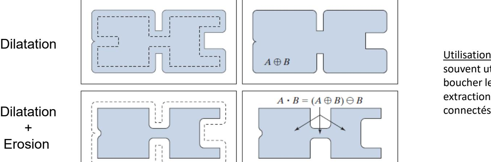

Utilisation: opération souvent utilisée pour boucher les trous, extraction d'éléments

Utilisation: enlever des petits objets ou du bruit ou *séparer des objet*s, filtrer les contours dans l'image

## Ouverture

L'ouverture est définie par une érosion suivie d'une dilatation:

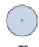

Elément structurant

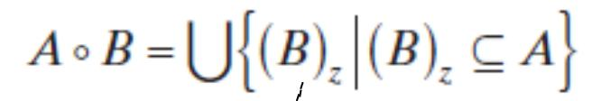

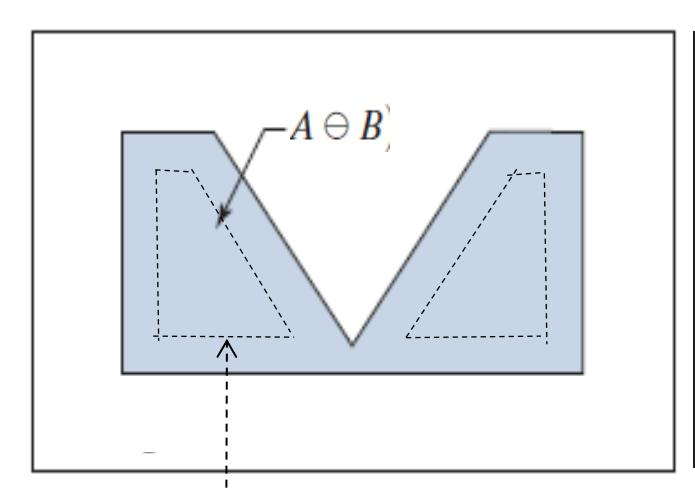

L'érosion identifie les points qui assurent que l'élément structurant est entièrement contenu, mais attenion, l'érosion ne retient que l'origine

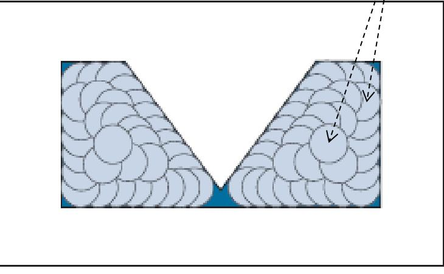

La dilatation de l'érosion revient à prendre l'union des éléments structurants entièrement contenus

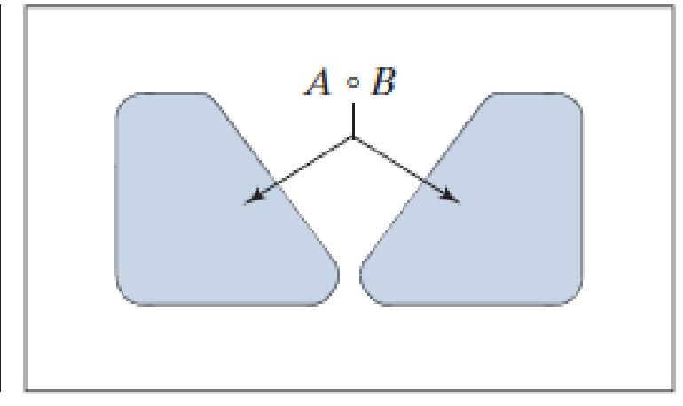

L'ouverture est un sous-ensemble de A

Utilisation: opération souvent utilisée pour lisser les contour, enlever des petits objets ou du bruit ou séparer des objets, filtrer les contours dans l'image; séparer en plusieurs composantes connexes les particules présentant un étranglement assez long et étroit.

## Fermeture

La fermeture est définie par une dilatation suivie d'une érosion:

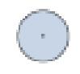

Elément structurant

$$A \bullet B = \left[ \bigcup \left\{ (B)_z \mid (B)_z \cap A = \varnothing \right\} \right]^c$$

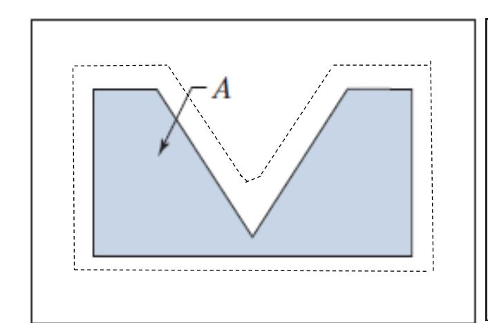

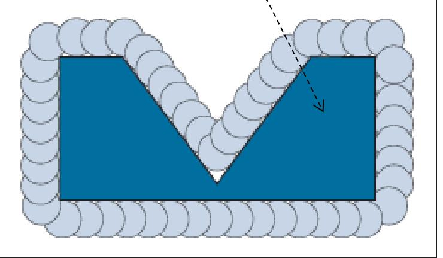

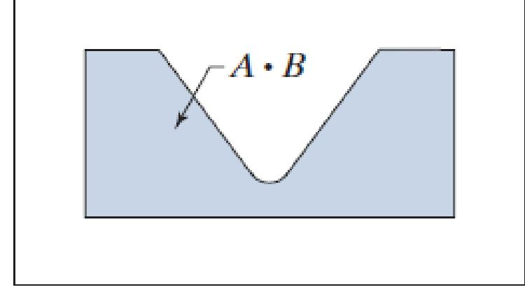

La fermeture correspond à prendre le complément de l'ensemble des translations de l'élément structurant B où B ne superpose pas A. C'est une conséquence de la dualité ouverture/fermeture

A est contenu dans la fermeture

$$(A \cdot B)^c = (A^c \cdot \hat{B})$$

$$(A \cdot B)^c = (A^c \cdot \hat{B})$$
Dualité ouverture/fermeture

Utilisation: opération souvent utilisée pour boucher les trous et les *gaps* étroits, épaissir les connecteurs étroits (extraction d'éléments connectész)

## Exemples

# Image Ouverture

Fermeture Ouverture puis fermeture

#### Ouverture:

- enlever des petits objets ou du bruit
- séparer en plusieurs composantes connexes les particules présentant un étranglement assez long et étroit.
- Repérerage de forme spécifique. Par exemple l'ouverture peut-êre utilisée pour identifier les objets dans lesquels l'élément structurant s'insère.
- Division en partie

#### Fermeture:

- boucher les trous,
- boucher les *gaps* étroits

Ouverture et fermeture sont idempotent:

$$A \bullet B \bullet B = A \bullet B$$

$$A \circ B \circ B = A \circ B$$

## Illustration - Empreinte digitale

IMAGE OUVERTURE OUVERTURE + FERMETURE

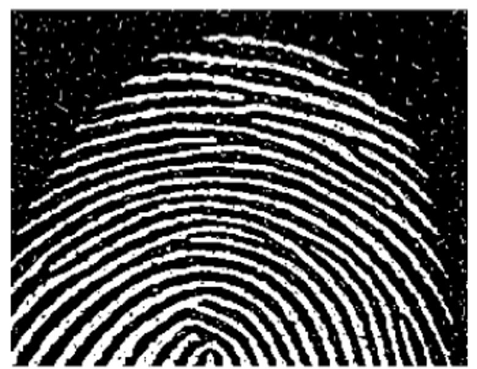

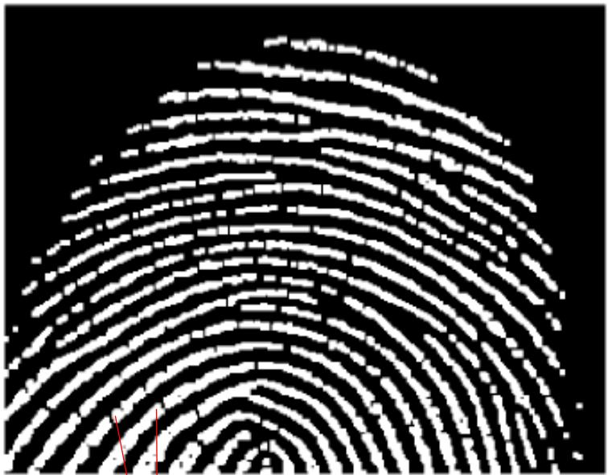

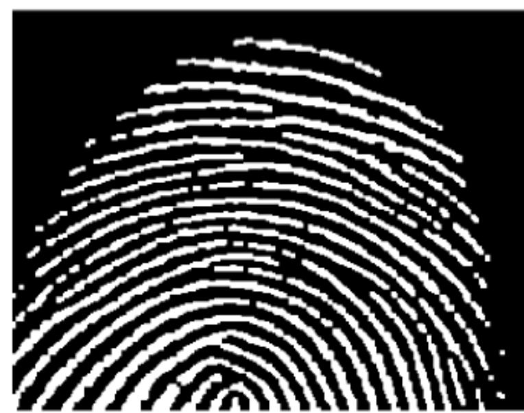

#### Ouverture:

- enlever des petits objets ou du bruit --> ok
- ou séparer des objets --> pas ok

#### Fermeture:

• boucher les couloirs étroits--> ok

# Propriétés

La dilatation est commutative et associative (analogie avec l'addition):

$$(A \oplus B) \oplus C = A \oplus (B \oplus C)$$

Peut s'avérer utile pour décomposer une grande dilatation en succession de dilatations plus petites

L'erosion n'est ni commutative, ni associative (analogie avec la soustraction):

$$(A \ominus B) \ominus C = A \ominus (B \oplus C)$$

On peut remplacer une double érosion par l'érosion de A par la dilatation de B par C.