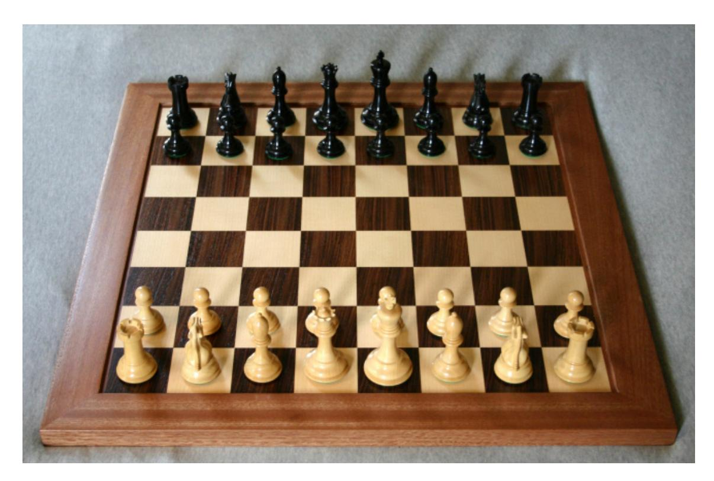
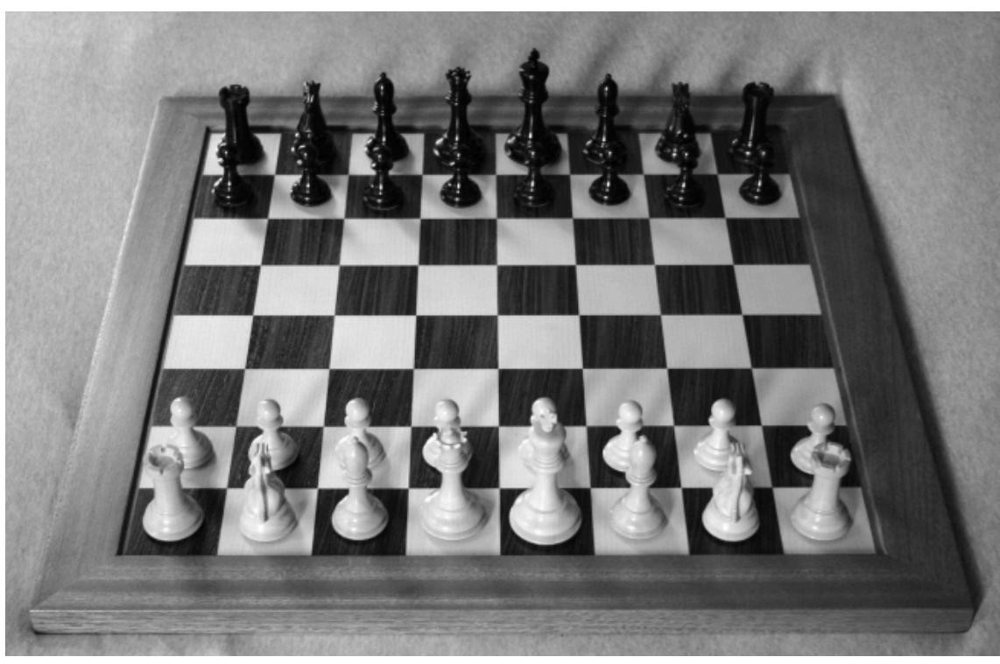
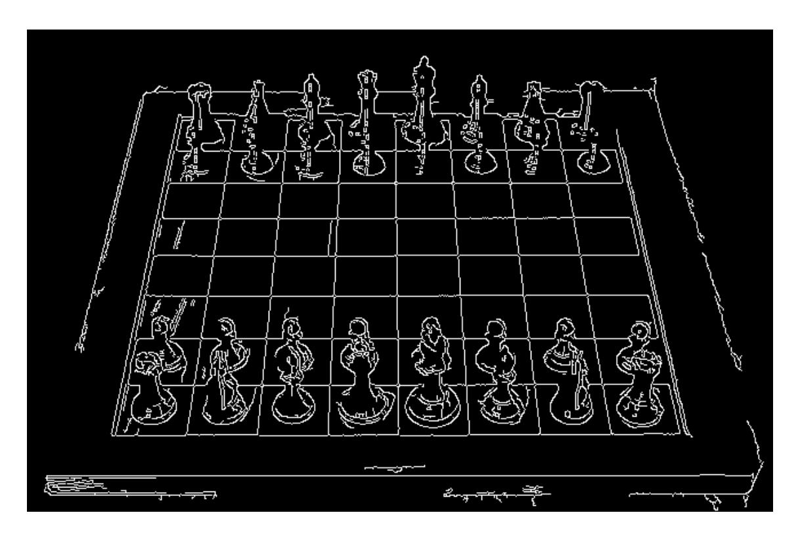
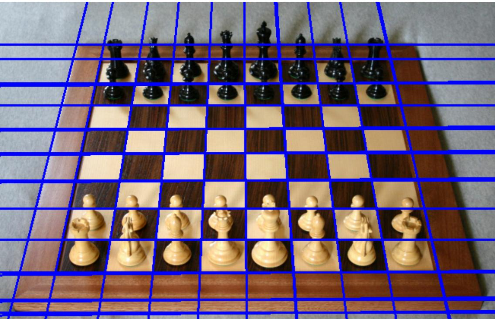

# VISION NUMERIQUE 2025-2026

<tarik.garidi@hesge.ch> <adrien.lescourt@hesge.ch>

# **LABO 7 Transformée de Hough**

## **1 Détection de lignes dans une image**

Le but de ce laboratoire est de détecter les lignes dans une image à l'aide de la transformée de Hough. Pour ceci vous devrez implémenter vous-même les différentes étapes nécessaire à l'application de la transformée de Hough.

On distingue les étapes suivantes dans l'algorithme que vous devez implémenter:

- Lire une image stockée sur le disque
- Prétraiter l'image avant d'appliquer la transformée (changement d'espace de couleur, réduction du bruit, détection de contours…)
- Application de la transformée et identification des paramètres des droites exprimées sous forme normale = ⋅ cos() + ⋅ sin()
- Mise en évidence des droites détectées sur l'image originale

## **2 Travail à accomplir**

Vous utiliserez python3 (avec annotations de types) pour procéder à votre implémentation.

Certaines des étapes citées précédemment pourront être implémentées via l'utilisation d'une librairie, d'autres devront être implémentée de zéro par vousmême.

Le résultat produit par votre application doit être l'affichage de:

- L'image originale
- L'image sur laquelle la transformée est appliquée (le résultat du prétraitement)
- L'accumulateur (espace de Hough)
- L'image originale avec les lignes détectées mise en évidence

Le tout dans une unique fenêtre (un subplot).

### **2.1 Librairies à utiliser**

- pillow pour la lecture
- matplotlib pour l'affichage
- numpy pour la représentation et manipulation de l'image

### **2.2 Fonctionnalités nécessaires**

Voici une listes des différentes fonctionnalités qui **doivent** figurer dans votre projet.

#### **Appel/exécution de votre programme**

Votre application doit se nommer hough.py et prendre à la ligne de commande le chemin de l'image à traiter:

#### \$ python3 hough.py path/to/my/image/lena.png

et affichera dans une unique fenêtre l'image original, l'image prétraitée, l'espace de Hough (i.e. accumulateur) et l'image originale avec les lignes détectées. L'application se termine sur la fermeture de la fenêtre affichée.

#### **Prétraitement et filtres**

- Conversion (si nécessaire) de l'image source en niveau de gris
- Filtre moyenneur pour réduction de bruits
- Détection de contours avec Sobel ou Laplace
- Nettoyage de l'image binaire avec les opérateurs morphologique

Cette partie peut être réalisée à l'aide des fonctions réalisés dans les laboratoires précédents, ainsi qu'avec OpenCV.

#### **Transformée de Hough pour les lignes**

Vous devez ensuite réaliser l'implémentation de la transformée de Hough. Votre application doit contenir les fonctions suivantes:

• La fonction qui calcul l'espace de Hough nommée hough\_space et prend en paramètres le step d'angle permettant de savoir quel est le pas que l'ont utilise pour parcourir les angles de − 2 à 2 .

Cette fonction hough\_lines retourne l'accumulateur (matrice de l'espace de Hough).

```
hough_space(img: Img, angle_step: int = 1) -> HoughAcc:
 ...
```

• La fonction hough\_lines qui prend en paramètre l'accumulateur et qui retourne une liste d'équations de droites (les angles et ).

```
hough_lines(acc: HoughAcc) -> List[Line]:
 ...
```

• La fonction draw\_lines qui dessine un ensemble de droites sur une image.

```
draw_lines(img: Img, lines: List[Line]) -> Img:
 ...
```

- Les fonctions d'affichages pour les différentes images et l'accumulateur.
- Votre logique principale devrait fonctionner similairement à:

```
contour_img = pretraitement(img)
accumulator = hough_space(contour_img)
lines = hough_lines(accumulator)
img_with_lines = draw_lines(img, lines)
show_img(img_with_lines)
```

Pour rappel, le type Img = npt.NDArray[np.uint8]. A vous de définir les types HoughAcc et Line.

Si besoin vous pouvez ajouter des paramètres supplémentaires à ces fonctions. Et vous pouvez évidemment créer d'autres fonctions pour compléter celles-ci.

## **Images de tests et exemples de rendu**







