# **Transformation de Hough**

**Vision Numérique** 

Tarik Garidi & Adrien Lescourt

#### Présentation

 Transformation de Hough (P. Hough 1962 puis Duda/Hart 1972) est une technique d'extraction de formes

- Détection de formes définies analytiquement (avec un nombre de paramètres restreints) dans une image
  - Dans sa forme de base, permet la détection de lignes
  - Dans une forme étendue, permet la détection de cercles, ellipses, segments. . .
- La transformation de Hough généralisée (Ballard 1982) permet la détection de formes arbitraires par template matching

## Exemple d'utilisation

### Objectif: détection des roues (des cercles)

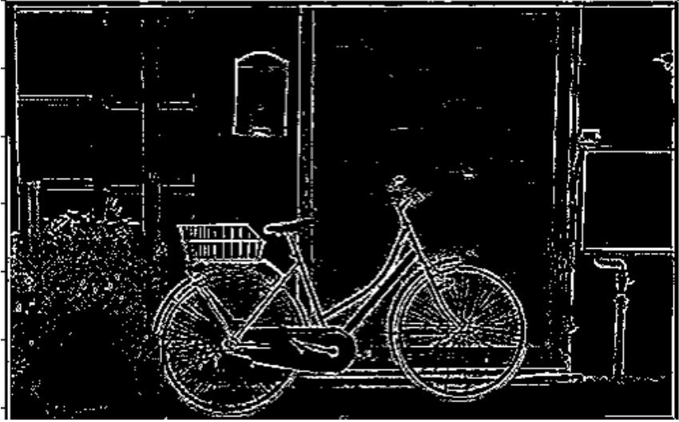

- Données étrangères: comment sélectionner les points de contours pour fitter un cerle?
- Données incomplètes: parties de la roue cachées par la plante
- Bruits dans les contours

## Exemple d'utilisation

### Objectif: détection de lignes (des droites)

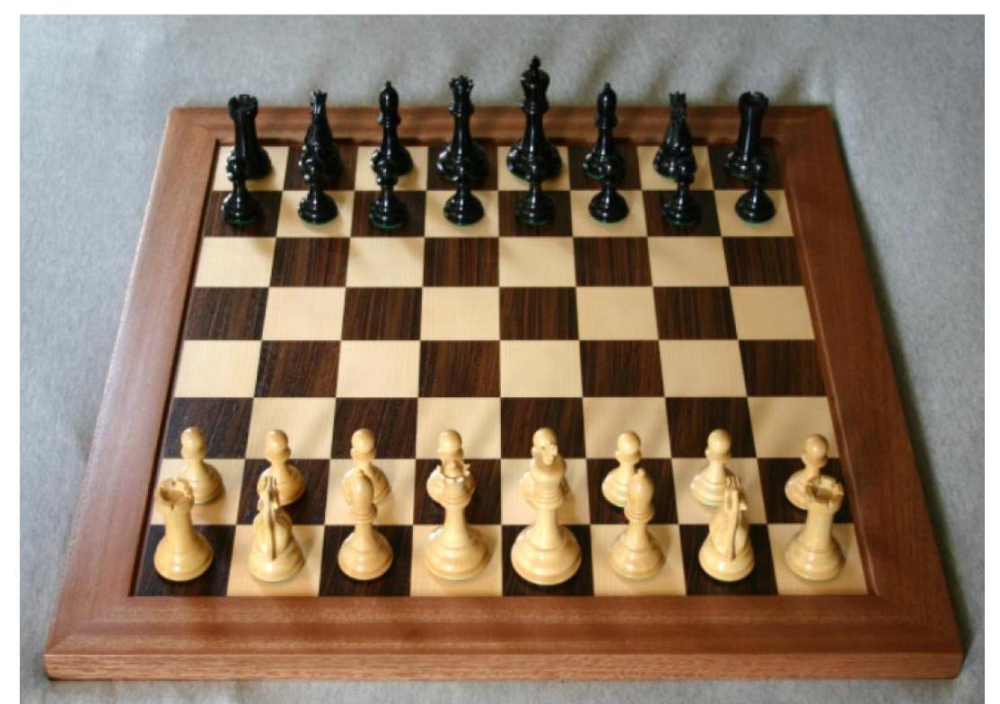

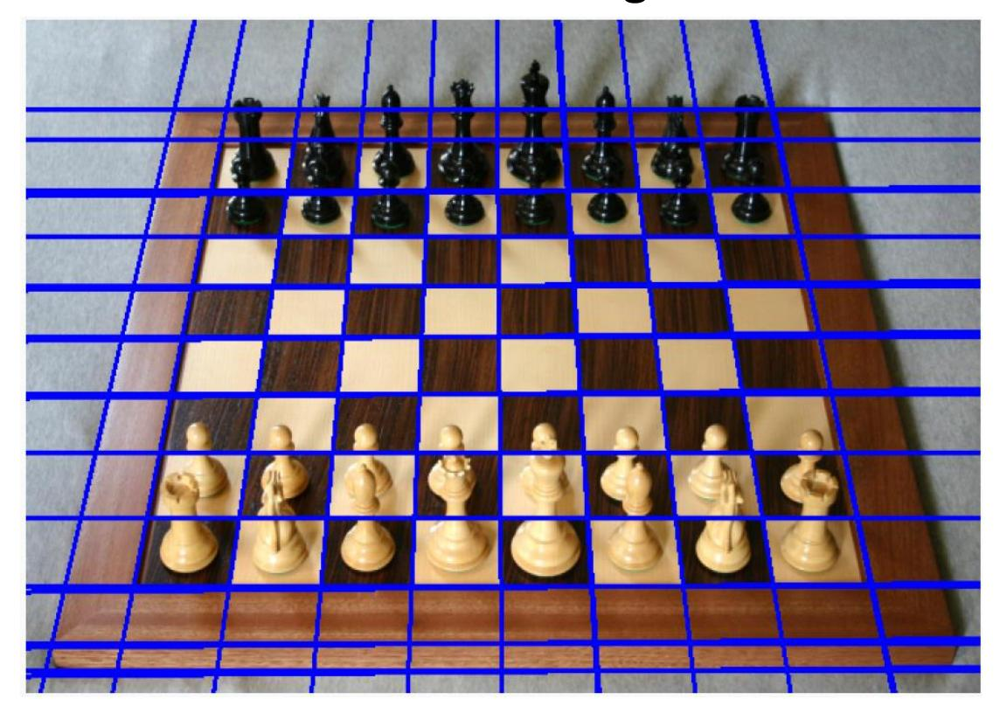

## Etapes et idée

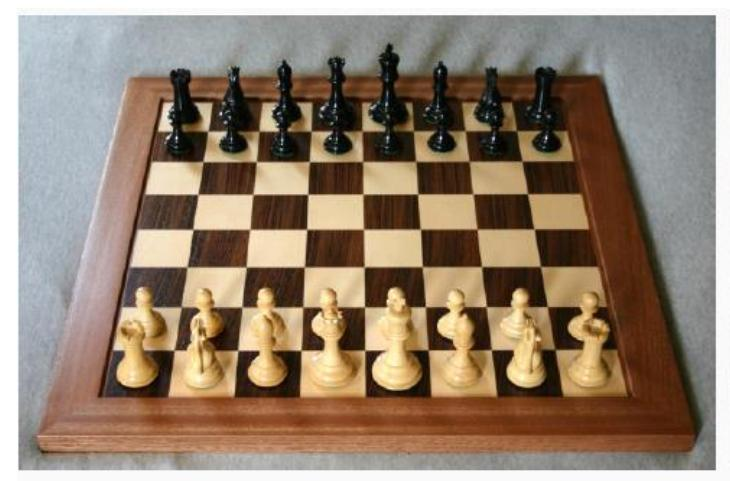

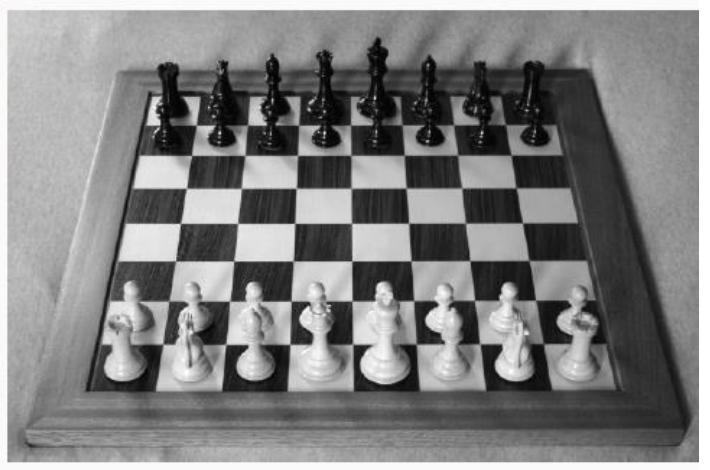

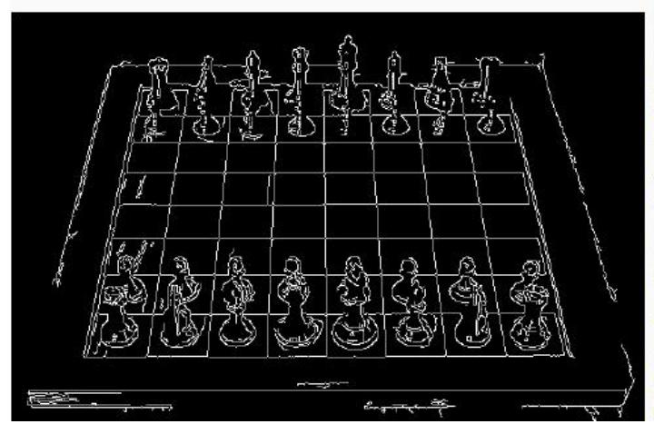

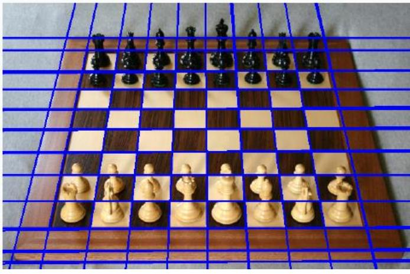

La détection de formes s'appuie sur les contours:

- 1. Détection de contours
  - Greyscale
  - Lissage
  - Contours
  - Seuillage
- 2. Algorithme de Hough: permet d'identifier des formes en identifiant ce qu'il y a de commun aux pixels qui forment le contour.

## Qu'est-ce qui est commun aux pixels sur une droite?

Problème: identifier les points qui se trouve sur un contour de type droite

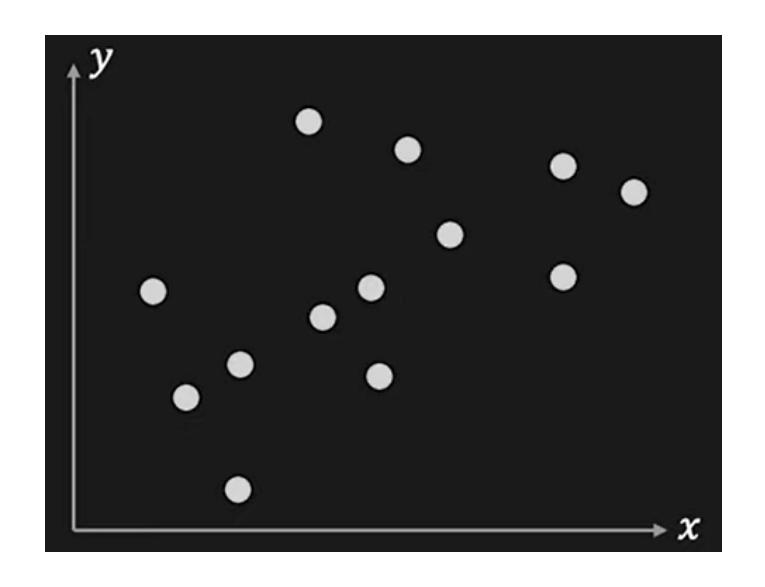

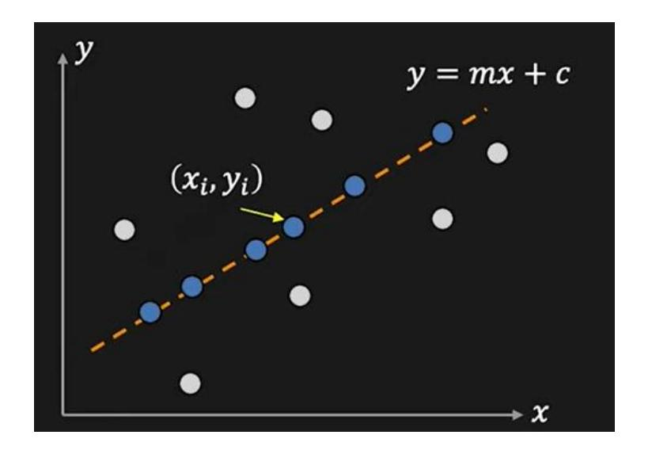

Solution: les points alignés sur la droite orange d'équation ont en commun le fait d'appartenir à une droite avec paramètres m et c.

Un contour émerge lorsque *beaucoup* de points partagent les mêmes paramètres (m,c)

## Espace des paramètres

Puisque que l'on cherche un critère sur les paramètres (m,c), plaçons nous dans l'espace des paramètres:

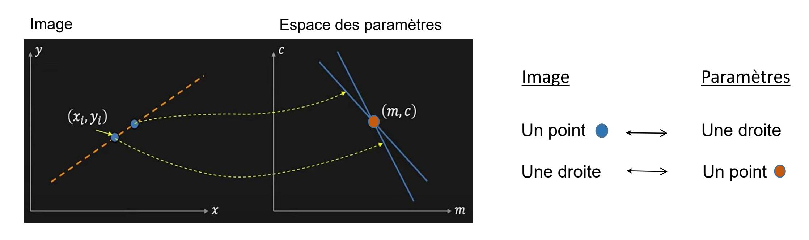

$$y = mx + c c = -mx_i + y$$

## Identifier une droite: compter les points par lesquels elle passe

Une ligne dans l'image correspond à l'intersection d'un maximum de droites dans l'espace des paramètres (car cela veut dire que par ce point (m,c) passe la droite *y = mx + c*

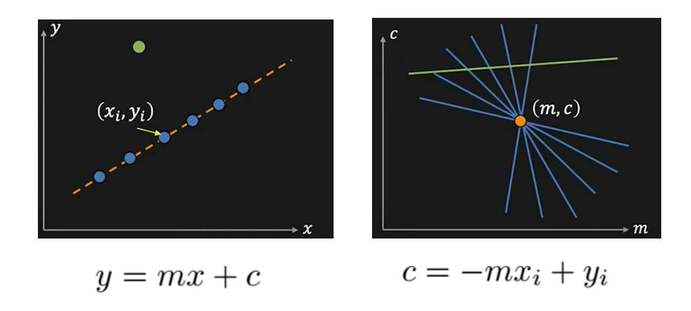

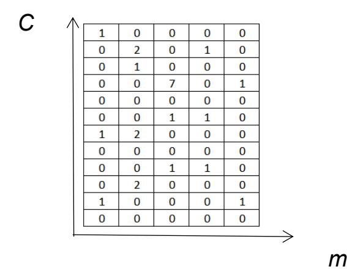

En pratique, pour chaque point (*x*,*y*), on construit toutes les droites qui passe par ce point. Comme elles sont en nombre infini on discretise les paramètres possibles:

Pour chaque point (x,y) on va trouver un certain nombre de paires (m,c) possibles. Si on incrémente une matrice (accumulateur de Hough) pour compter l'occurence de chaque paire (m,c) detectée, on dispose alors d'un moyen d'identifier les droites qui semble contenir un maximum de point (x,y): un coutour.

# Paramètres en coordonnées polaires

Pour discrétiser il est bien plus pratique d'utiliser les coordonnées polaires dans l'espace des paramètres car (m,c) ne sont pas bornés alors que θ et ρ sont bornés ([0,2π] et par la taille de l'image)

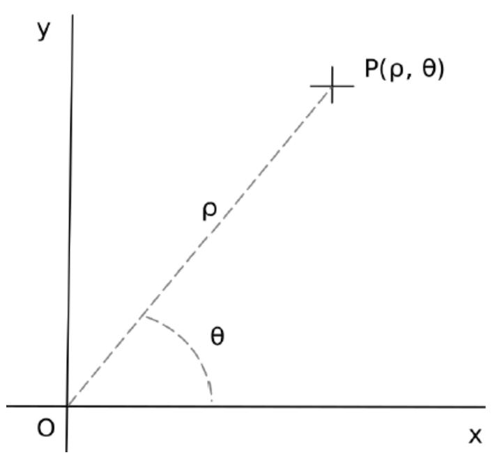

# Equation d'une droite en coordonnées polaire

En coordonnées polaire, une droite *d* doit satisfaire l'équation:

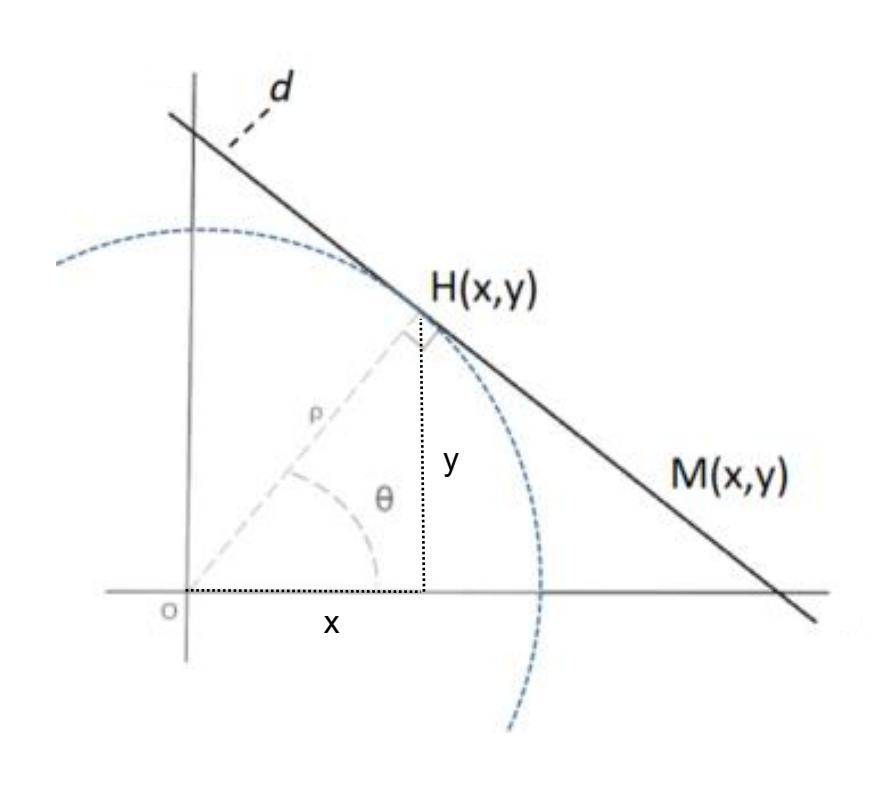

$$x\cos(\theta) + y\sin(\theta) = \rho$$

où (ρ, θ) représente un couple de coordonnées polaires du point H (projeté orthogonal de l'origine O du repère sur la droite). Une telle équation est appelée équation normale de la droite

#### Démonstration:

x la droite normale en H est tangente au cercle

$$x\frac{x}{\rho} + y\frac{y}{\rho} = \rho \qquad \cos(\theta) = \frac{x}{\rho} \quad \text{et} \quad \sin(\theta) = \frac{y}{\rho}$$

### Algorithme de Hough

Fonctionne sur une image binaire (ici pixels noirs sur fond blanc)

- Pour chaque pixel:
  - Calcul de toutes les droites qui passent par le pixel
  - Incrément des équations de ces droites dans un accumulateur

 Seuillage de l'accumulateur pour conserver uniquement les maximums, qui correspondent aux équations des droites détectées dans l'image

## Calculs des droites pour un point **qui passent par un point**

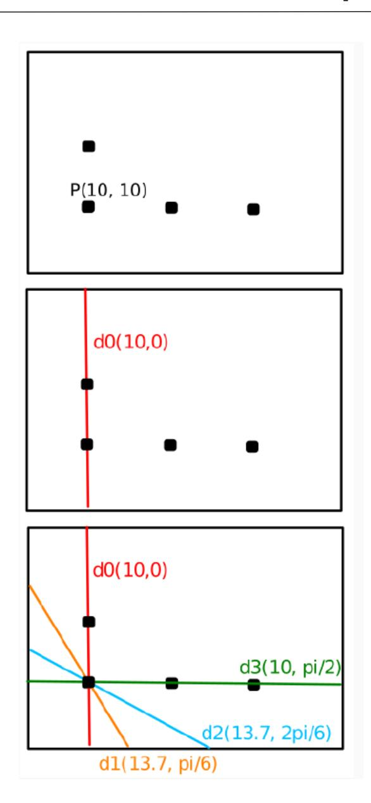

$$\rho = x \cos \theta + y \sin \theta$$
  $\rho_{d0} = 10 \cos(0) + 10 \sin(0)$   $\rho_{d0} = 10$ 

## Identification des paramètres les plus représentés

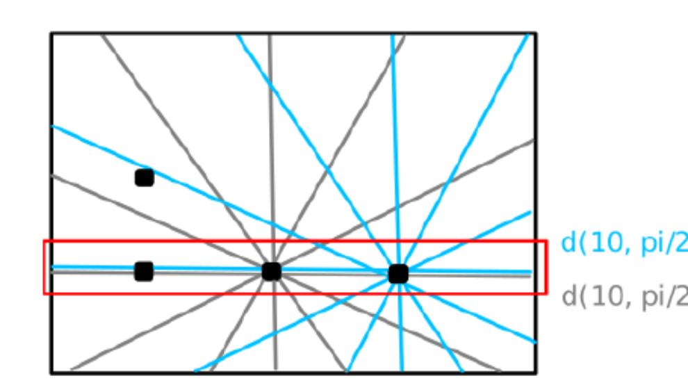

En appliquant le même procédé sur les points suivants, tous les points alignés sur la même droite partagent les mêmes paramètres (ρ,θ).

On remarque aussi que la précision de la détection est directement liée à la résolution choisi pour faire varier θ.

### Accumulateur en coordonées polaires

La transformée de Hough consiste à identifier les points les "plus alignés" en appliquant ce procédé sur tous les pixels noirs de l'image:

- 1. on calcule toutes les droites pour chaque point
- 2. on incrémente une matrice (appelée accumulateur) de 1 à la position  $(\rho,\theta)$  chaque fois qu'une droite calculée partage les paramètres  $(\rho, \theta)$

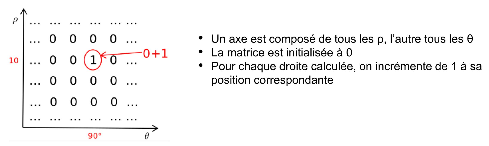

## Interprétation de l'accumulateur

- Plus une valeur est élevé dans l'accumulateur, plus son équation de droite revient souvent dans l'image
- Les droites présentes dans l'image correspondent donc aux maximums locaux de l'accumulateur.
- Les valeurs supérieures à 1 dans l'accumulateur correspondent aux intersections dans l'espace des paramètres (ρ,θ) aussi appellé l'espace de Hough.

# Espace de Hough

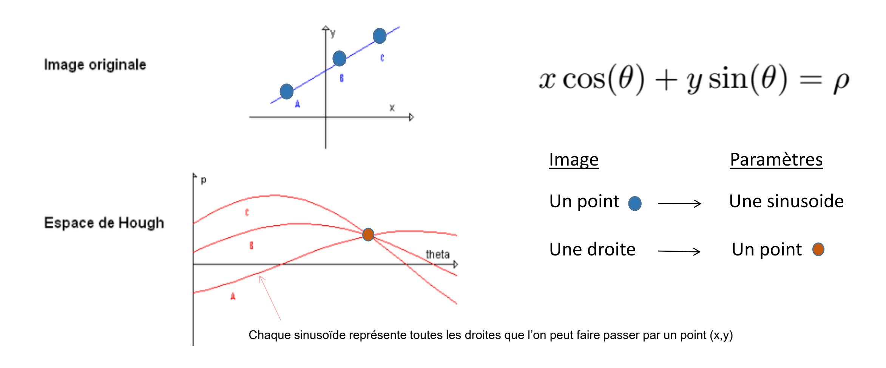

Les intersections dans l'espace de Hough identifient les droites similaires

## Espace de Hough

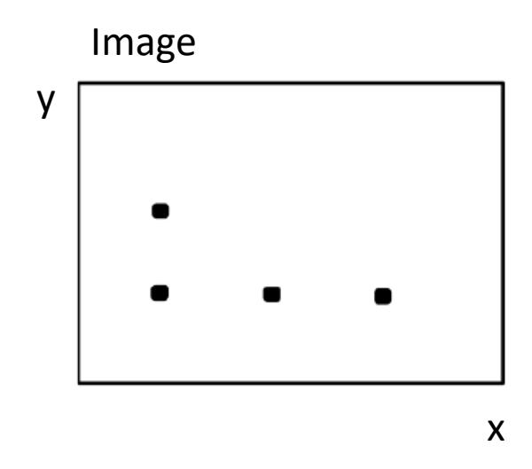

Espace des paramètres (de Hough): chacun des points engendre une sinusoide.

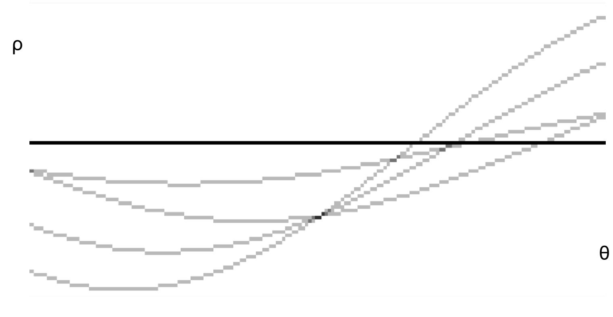

## Exemple

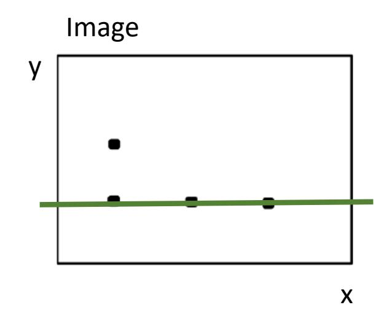

Espace des paramètres (de Hough): en rouge les intersections représentes les droites d'équation commune. Image

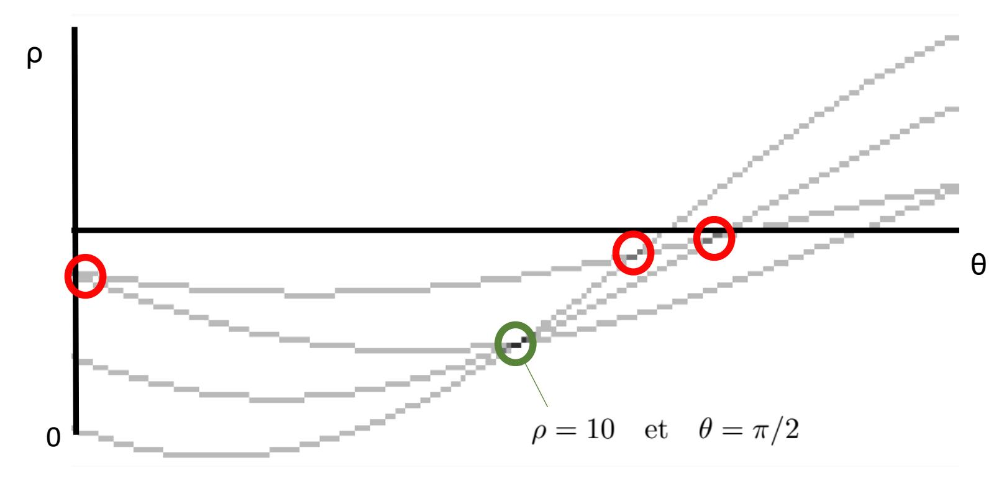

## Exemple

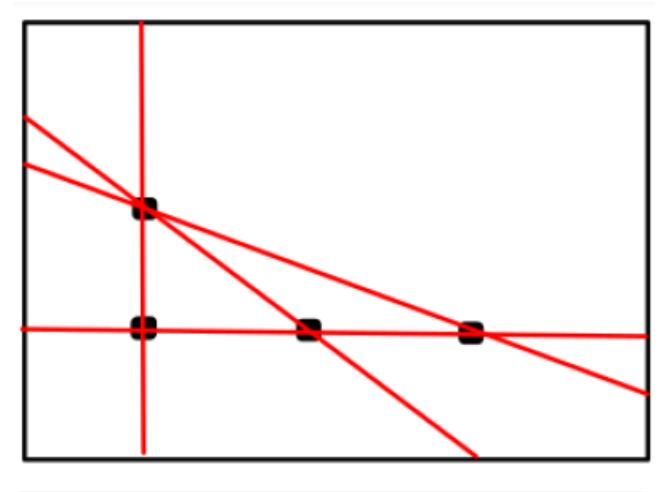

• L'image du haut dessine les droites de tous les maximums locaux trouvés dans l'accumulateur.

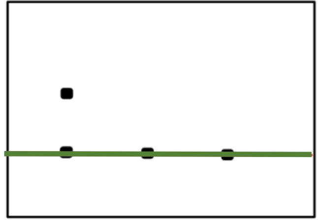

• En dessous uniquement si le maximum local depasse un certain seuil (> 2 ici)

θ